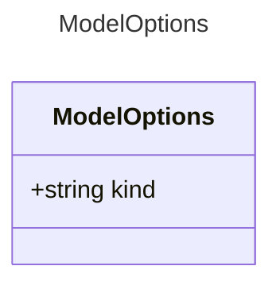

# ModelOptions

Options for configuring the behavior of the AI model.
`kind` is a required property here, but this section can accept additional via options.

## Class Diagram

## Properties

| Name | Type | Description |
| ---- | ---- | ----------- |
| kind | string |   |
