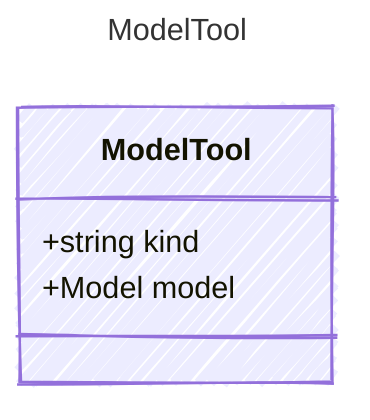

# ModelTool

The MCP Server tool.

## Class Diagram



## Yaml Example

```yaml
kind: model
model:
  id: my-model
  provider: my-provider
  connection:
    kind: provider-connection

```

## Properties

| Name | Type | Description |
| ---- | ---- | ----------- |
| kind | string | The kind identifier for a model connection as a tool  |
| model | [Model](Model.md) | The connection configuration for the model tool  |
