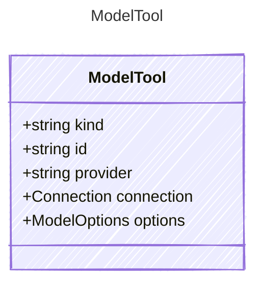

# ModelTool

The MCP Server tool.

## Class Diagram



## Yaml Example

```yaml
kind: mcp
id: gpt-35-turbo
provider: azure
connection:
  authType: key
  endpoint: https://{your-custom-endpoint}.openai.azure.com/
options:
  type: chat
  temperature: 0.7
  maxTokens: 1000

```

## Properties

| Name | Type | Description |
| ---- | ---- | ----------- |
| kind | string | The kind identifier for MCP tools  |
| id | string | The unique identifier of the model - can be used as the single property shorthand  |
| provider | string | The provider of the model (e.g., &#39;openai&#39;, &#39;azure&#39;, &#39;anthropic&#39;)  |
| connection | [Connection](Connection.md) | The connection configuration for the model  |
| options | [ModelOptions](ModelOptions.md) | Additional options for the model  |
