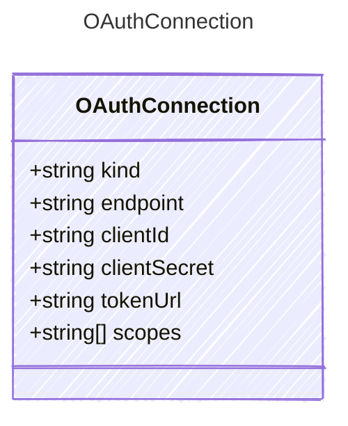

# OAuthConnection

Connection configuration for AI services using OAuth authentication.

## Class Diagram



## Yaml Example

```yaml
kind: oauth
endpoint: https://{your-custom-endpoint}.openai.azure.com/
clientId: your-client-id
clientSecret: your-client-secret
tokenUrl: https://login.microsoftonline.com/{tenant}/oauth2/v2.0/token
scopes:
  - https://cognitiveservices.azure.com/.default

```

## Properties

| Name | Type | Description |
| ---- | ---- | ----------- |
| kind | string | The Authentication kind for the AI service (e.g., &#39;key&#39; for API key, &#39;oauth&#39; for OAuth tokens)  |
| endpoint | string | The endpoint URL for the AI service  |
| clientId | string | The OAuth client ID for authenticating with the AI service  |
| clientSecret | string | The OAuth client secret for authenticating with the AI service  |
| tokenUrl | string | The OAuth token URL for obtaining access tokens  |
| scopes | string[] | The scopes required for the OAuth token  |
