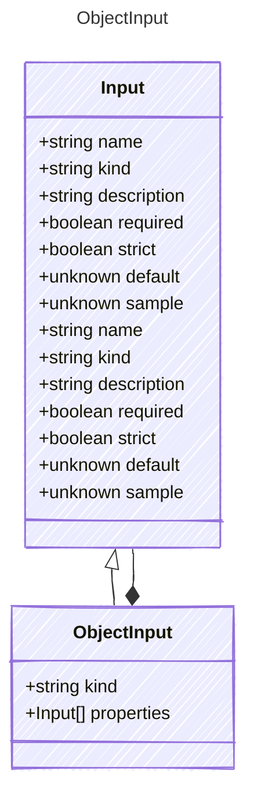

# ObjectInput

Represents an object output property.
This extends the base Output model to represent a structured object.

## Class Diagram



## Yaml Example

```yaml
properties:
  property1:
    kind: string
  property2:
    kind: number

```

## Properties

| Name | Type | Description |
| ---- | ---- | ----------- |
| kind | string |   |
| properties | [Input[]](Input.md) | The properties contained in the object  |

## Composed Types

The following types are composed within `ObjectInput`:

- [Input](Input.md)
