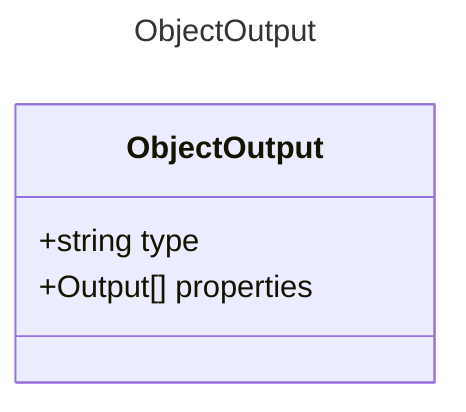

# ObjectOutput

Represents an object output property.
This extends the base Output model to represent a structured object.

## Class Diagram

## Properties

| Name | Type | Description |
| ---- | ---- | ----------- |
| type | string |   |
| properties | [Output Collection](Output.md) | The properties contained in the object  |

