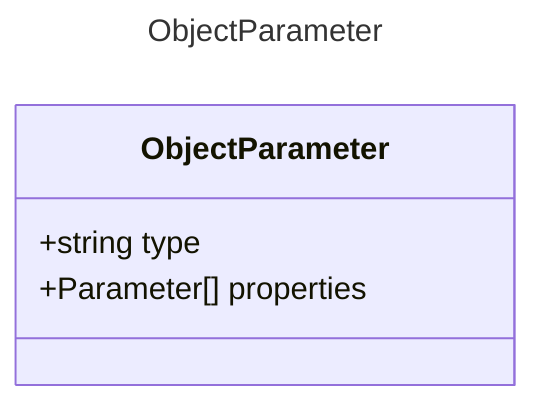

# ObjectParameter

Represents an object parameter for a tool.

## Class Diagram




## Yaml Example
```yaml
properties:
  param1:
    type: string
  param2:
    type: number

```


## Properties

| Name | Type | Description |
| ---- | ---- | ----------- |
| type | string |   |
| properties | [Parameter Collection](Parameter.md) | The properties of the object parameter <p>Related Types:<ul><li>[ArrayParameter](ArrayParameter.md)</li></ul></p> |


