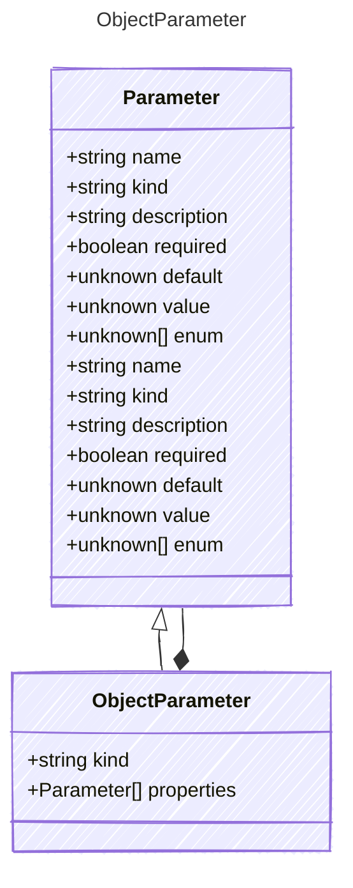

# ObjectParameter

Represents an object parameter for a tool.

## Class Diagram



## Yaml Example

```yaml
properties:
  param1:
    kind: string
  param2:
    kind: number

```

## Properties

| Name | Type | Description |
| ---- | ---- | ----------- |
| kind | string |   |
| properties | [Parameter[]](Parameter.md) | The properties of the object parameter (Related Types: [ArrayParameter](ArrayParameter.md)) |

## Composed Types

The following types are composed within `ObjectParameter`:

- [Parameter](Parameter.md)
