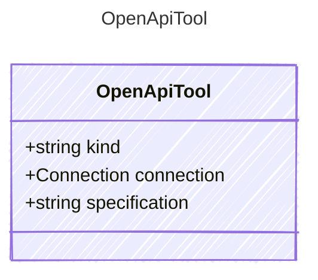

# OpenApiTool

## Class Diagram



## Yaml Example

```yaml
kind: openapi
connection:
  kind: provider-connection
specification: https://api.example.com/openapi.json

```

## Properties

| Name | Type | Description |
| ---- | ---- | ----------- |
| kind | string | The kind identifier for OpenAPI tools  |
| connection | [Connection](Connection.md) | The connection configuration for the OpenAPI tool  |
| specification | string | The URL or relative path to the OpenAPI specification document (JSON or YAML format)  |
