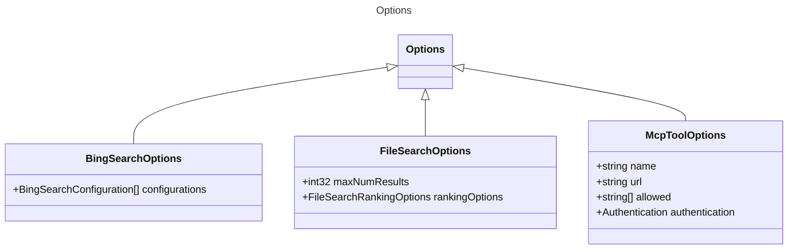

# Options

Generic options available for certain models, configurations, or tools.
This can include additional settings or parameters that are not strictly defined
and are used by various providers to specify custom behavior or metadata.

Example:
```yaml
options:
  customSetting: true
  timeout: 5000
  retryAttempts: 3
 ```

## Class Diagram




## Child Types

The following types extend `Options`:
- [BingSearchOptions](BingSearchOptions.md)
- [FileSearchOptions](FileSearchOptions.md)
- [McpToolOptions](McpToolOptions.md)

