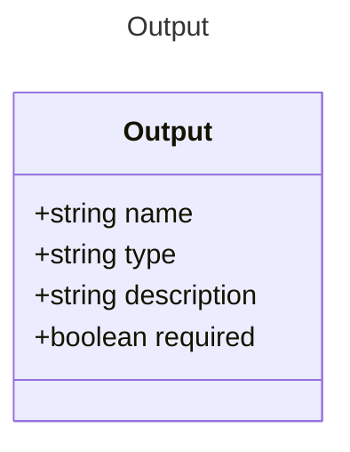

# Output

Represents the output properties of an AI agent.
Each output property can be a simple type, an array, or an object.

## Class Diagram

## Properties

| Name | Type | Description |
| ---- | ---- | ----------- |
| name | string | Name of the output property  |
| type | string | The data type of the output property  |
| description | string | A short description of the output property  |
| required | boolean | Whether the output property is required  |

