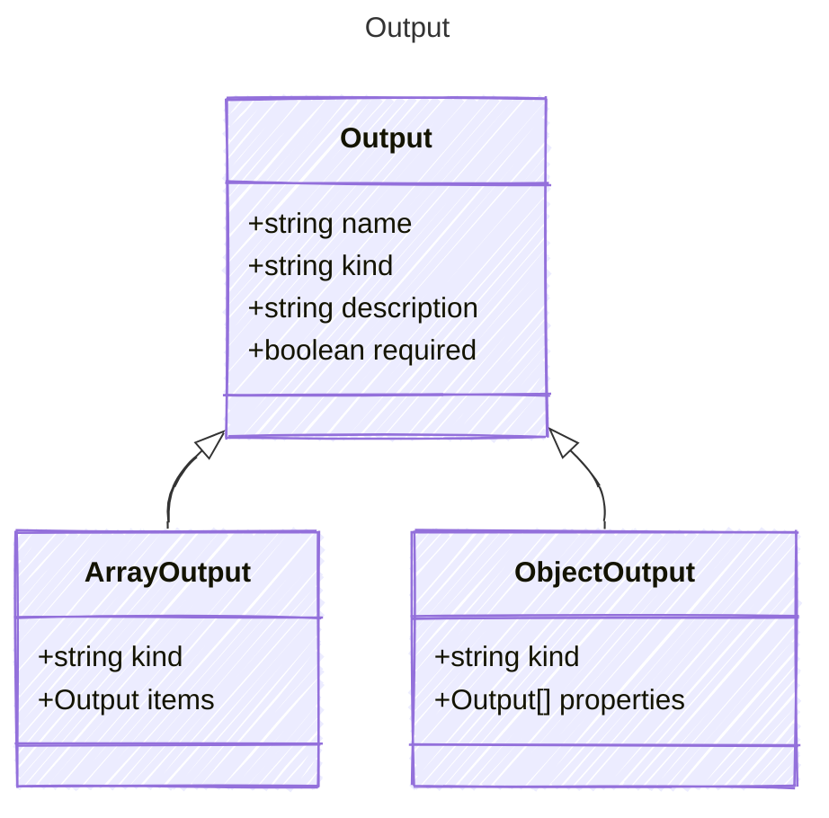

# Output

Represents the output properties of an AI agent.
Each output property can be a simple kind, an array, or an object.

## Class Diagram



## Yaml Example

```yaml
name: my-output
kind: string
description: A description of the output property
required: true

```

## Properties

| Name | Type | Description |
| ---- | ---- | ----------- |
| name | string | Name of the output property  |
| kind | string | The data kind of the output property  |
| description | string | A short description of the output property  |
| required | boolean | Whether the output property is required  |

## Child Types

The following types extend `Output`:

- [ArrayOutput](ArrayOutput.md)
- [ObjectOutput](ObjectOutput.md)
