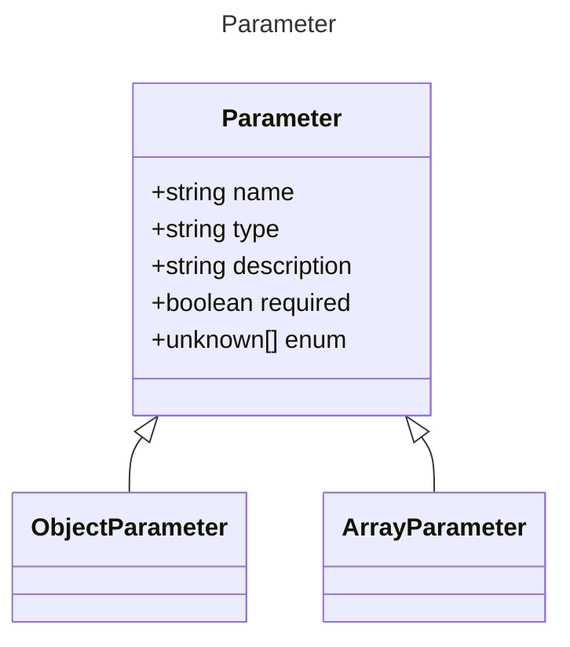

# Parameter

Represents a parameter for a tool.

## Class Diagram

## Properties

| Name | Type | Description |
| ---- | ---- | ----------- |
| name | string | Name of the parameter  |
| type | string | The data type of the tool parameter  |
| description | string | A short description of the property  |
| required | boolean | Whether the tool parameter is required  |
| enum | unknown Collection | Allowed enumeration values for the parameter  |

