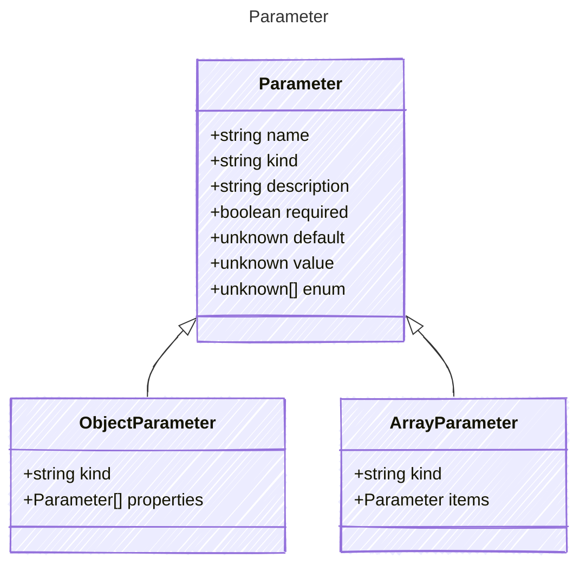

# Parameter

Represents a parameter for a tool.

## Class Diagram



## Yaml Example

```yaml
name: my-parameter
kind: string
description: A description of the parameter
required: true
default: default value
value: sample value
enum:
  - value1
  - value2
  - value3

```

## Properties

| Name | Type | Description |
| ---- | ---- | ----------- |
| name | string | Name of the parameter  |
| kind | string | The data type of the parameter  |
| description | string | A short description of the property  |
| required | boolean | Whether the tool parameter is required  |
| default | unknown | The default value of the parameter - this represents the default value if none is provided  |
| value | unknown | Parameter value used for initializing manifest examples and tooling  |
| enum | unknown[] | Allowed enumeration values for the parameter  |

## Child Types

The following types extend `Parameter`:

- [ObjectParameter](ObjectParameter.md)
- [ArrayParameter](ArrayParameter.md)
