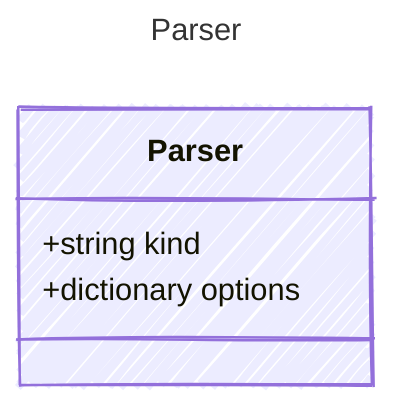

# Parser

## Class Diagram

## Properties

| Name | Type | Description |
| ---- | ---- | ----------- |
| kind | string | Parser used to process the rendered template into API-compatible format  |
| options | dictionary | Options for the parser  |
