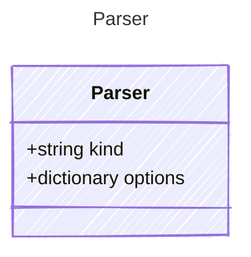

# Parser

Template parser definition

## Class Diagram



## Yaml Example

```yaml
kind: prompty
options:
  key: value

```

## Properties

| Name | Type | Description |
| ---- | ---- | ----------- |
| kind | string | Parser used to process the rendered template into API-compatible format  |
| options | dictionary | Options for the parser  |

## Alternate Constructions

The following alternate constructions are available for `Parser`.
These allow for simplified creation of instances using a single property.

### string parser

Simple construction with just a &quot;kind&quot; string

The following simplified representation can be used:

```yaml
parser: "example"

```

This is equivalent to the full representation:

```yaml
parser:
  kind: "example"

```
