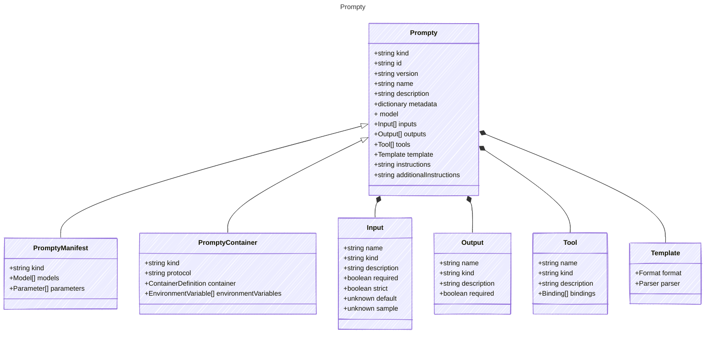

# Prompty

The following is a specification for defining AI agents with structured metadata, inputs, outputs, tools, and templates.
It provides a way to create reusable and composable AI agents that can be executed with specific configurations.
The specification includes metadata about the agent, model configuration, input parameters, expected outputs,
available tools, and template configurations for prompt rendering.

These can be written in a markdown format or in a pure YAML format.

## Class Diagram



## Markdown Example

```markdown
---
kind: prompt
id: unique-agent-id
version: 1.0.0
name: basic-prompt
description: A basic prompt that uses the GPT-3 chat API to answer questions
metadata:
  authors:
    - sethjuarez
    - jietong
  tags:
    - example
    - prompt
model:
  id: gpt-35-turbo
  connection:
    kind: key
    endpoint: https://{your-custom-endpoint}.openai.azure.com/
    key: "{your-api-key}"
inputs:
  firstName:
    kind: string
    sample: Jane
  lastName:
    kind: string
    sample: Doe
  question:
    kind: string
    sample: What is the meaning of life?
outputs:
  answer:
    kind: string
    description: The answer to the user's question.
tools:
  - name: getCurrentWeather
    kind: function
    description: Get the current weather in a given location
    parameters:
      location:
        kind: string
        description: The city and state, e.g. San Francisco, CA
      unit:
        kind: string
        description: The unit of temperature, e.g. Celsius or Fahrenheit
template:
  format: mustache
  parser: prompty
---
system:
You are an AI assistant who helps people find information.
As the assistant, you answer questions briefly, succinctly,
and in a personable manner using markdown and even add some 
personal flair with appropriate emojis.

# Customer
You are helping {{firstName}} {{lastName}} to find answers to 
their questions. Use their name to address them in your responses.
user:
{{question}}
```

## Yaml Example

```yaml
kind: prompt
id: unique-agent-id
version: 1.0.0
name: basic-prompt
description: A basic prompt that uses the GPT-3 chat API to answer questions
metadata:
  authors:
    - sethjuarez
    - jietong
  tags:
    - example
    - prompt
model:
  id: gpt-35-turbo
  connection:
    kind: key
    endpoint: https://{your-custom-endpoint}.openai.azure.com/
    key: "{your-api-key}"
inputs:
  firstName:
    kind: string
    sample: Jane
  lastName:
    kind: string
    sample: Doe
  question:
    kind: string
    sample: What is the meaning of life?
outputs:
  answer:
    kind: string
    description: The answer to the user's question.
tools:
  - name: getCurrentWeather
    kind: function
    description: Get the current weather in a given location
    parameters:
      location:
        kind: string
        description: The city and state, e.g. San Francisco, CA
      unit:
        kind: string
        description: The unit of temperature, e.g. Celsius or Fahrenheit
template:
  format: mustache
  parser: prompty
instructions: |-
  system:
  You are an AI assistant who helps people find information.
  As the assistant, you answer questions briefly, succinctly,
  and in a personable manner using markdown and even add some 
  personal flair with appropriate emojis.

  # Customer
  You are helping {{firstName}} {{lastName}} to find answers to 
  their questions. Use their name to address them in your responses.
  user:
  {{question}}

```

## Properties

| Name | Type | Description |
| ---- | ---- | ----------- |
| kind | string | Kind represented by the document  |
| id | string | Unique identifier for the document  |
| version | string | Document version  |
| name | string | Human-readable name of the agent  |
| description | string | Description of the agent&#39;s capabilities and purpose  |
| metadata | dictionary | Additional metadata including authors, tags, and other arbitrary properties  |
| model | [](.md) | Primary AI model configuration for the agent  |
| inputs | [Input[]](Input.md) | Input parameters that participate in template rendering (Related Types: [ArrayInput](ArrayInput.md), [ObjectInput](ObjectInput.md)) |
| outputs | [Output[]](Output.md) | Expected output format and structure from the agent (Related Types: [ArrayOutput](ArrayOutput.md), [ObjectOutput](ObjectOutput.md)) |
| tools | [Tool[]](Tool.md) | Tools available to the agent for extended functionality (Related Types: [FunctionTool](FunctionTool.md), [ServerTool](ServerTool.md), [BingSearchTool](BingSearchTool.md), [FileSearchTool](FileSearchTool.md), [McpTool](McpTool.md), [ModelTool](ModelTool.md), [OpenApiTool](OpenApiTool.md)) |
| template | [Template](Template.md) | Template configuration for prompt rendering  |
| instructions | string | Give your agent clear directions on what to do and how to do it. Include specific tasks, their order, and any special instructions like tone or engagement style. (can use this for a pure yaml declaration or as content in the markdown format)  |
| additionalInstructions | string | Additional instructions or context for the agent, can be used to provide extra guidance (can use this for a pure yaml declaration)  |

## Child Types

The following types extend `Prompty`:

- [PromptyManifest](PromptyManifest.md)
- [PromptyContainer](PromptyContainer.md)

## Composed Types

The following types are composed within `Prompty`:

- [Input](Input.md)
- [Output](Output.md)
- [Tool](Tool.md)
- [Template](Template.md)
