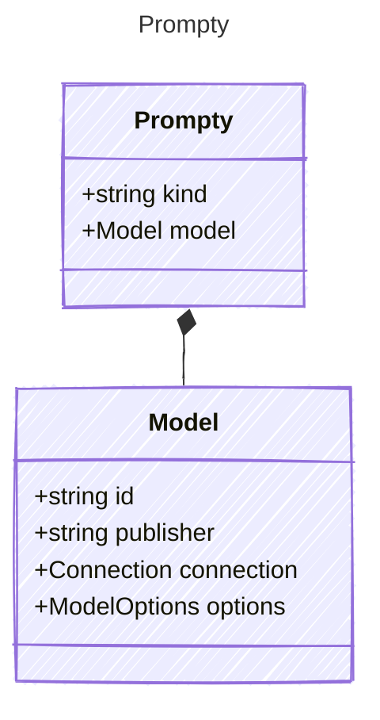

# Prompty

The following is a specification for defining AI agents with structured metadata, inputs, outputs, tools, and templates.
It provides a way to create reusable and composable AI agents that can be executed with specific configurations.
The specification includes metadata about the agent, model configuration, input parameters, expected outputs,
available tools, and template configurations for prompt rendering.

These can be written in a markdown format or in a pure YAML format.

## Class Diagram



## Yaml Example

```yaml
kind: prompt
model:
  id: gpt-35-turbo
  connection:
    kind: key
    endpoint: https://{your-custom-endpoint}.openai.azure.com/
    key: "{your-api-key}"

```

## Properties

| Name | Type | Description |
| ---- | ---- | ----------- |
| kind | string | Type of agent, e.g., &#39;prompt&#39;  |
| model | [Model](Model.md) | Model configuration used for execution  |

## Composed Types

The following types are composed within `Prompty`:

- [Model](Model.md)
