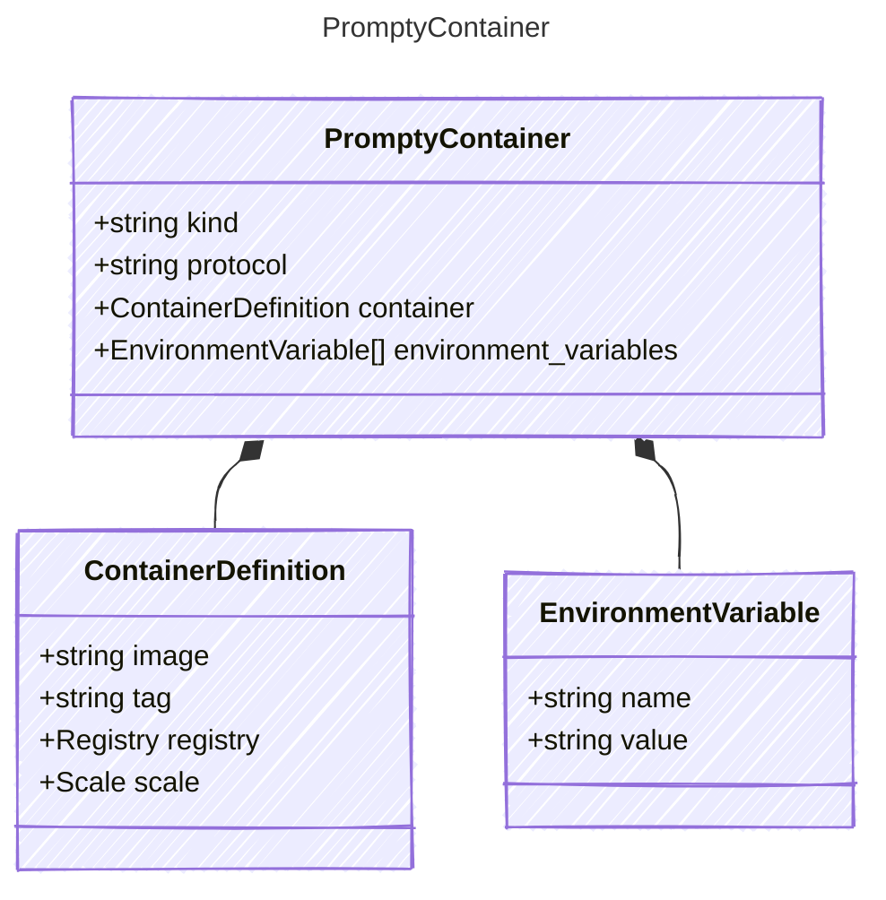

# PromptyContainer

## Class Diagram



## Yaml Example

```yaml
kind: container
protocol: responses
container:
  image: my-container-image
  registry:
    kind: acr
    subscription: my-subscription-id
environment_variables:
  MY_ENV_VAR: my-value

```

## Properties

| Name | Type | Description |
| ---- | ---- | ----------- |
| kind | string | Type of agent, e.g., &#39;prompt&#39; or &#39;container&#39;  |
| protocol | string | Protocol used by the containerized agent  |
| container | [ContainerDefinition](ContainerDefinition.md) | Container definition including registry and scaling information  |
| environment_variables | [EnvironmentVariable[]](EnvironmentVariable.md) | Environment variables to set in the hosted agent container.  |

## Composed Types

The following types are composed within `PromptyContainer`:

- [ContainerDefinition](ContainerDefinition.md)
- [EnvironmentVariable](EnvironmentVariable.md)
