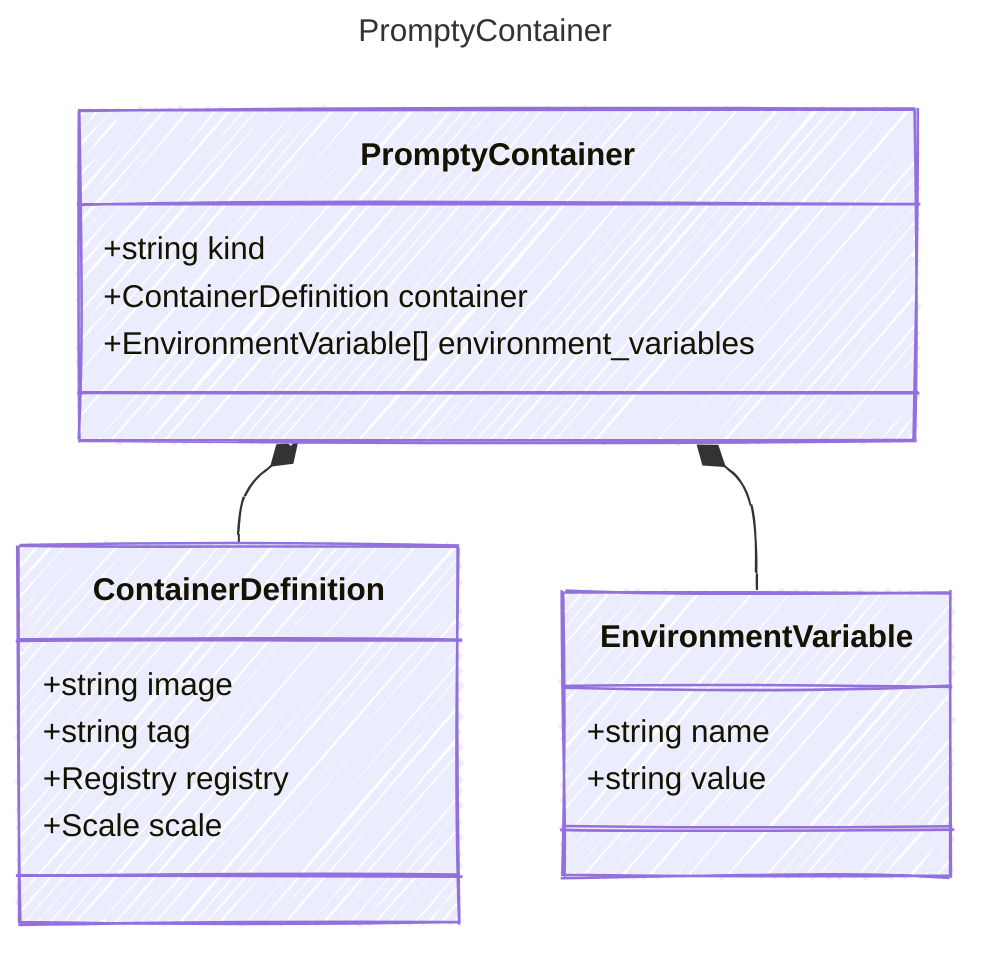

# PromptyContainer

## Class Diagram

## Properties

| Name | Type | Description |
| ---- | ---- | ----------- |
| kind | string | Type of agent, e.g., &#39;prompt&#39; or &#39;container&#39;  |
| container | [ContainerDefinition](ContainerDefinition.md) | Container definition including registry and scaling information  |
| environment_variables | [EnvironmentVariable[]](EnvironmentVariable.md) | Environment variables to set in the hosted agent container.  |
