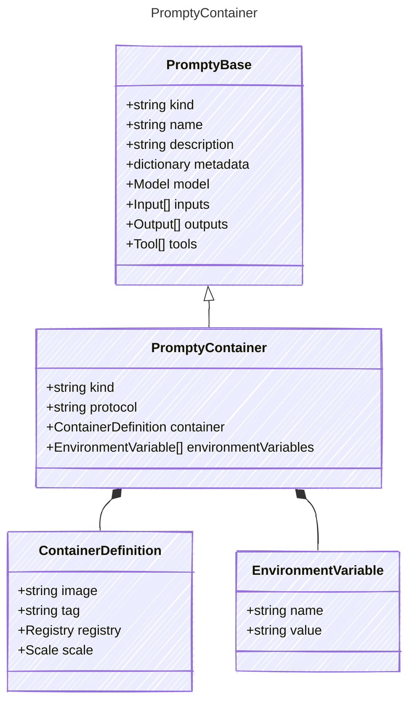

# PromptyContainer

The following represents a containerized agent that can be deployed and hosted.
It includes details about the container image, registry information, and environment variables.
This model allows for the definition of agents that can run in isolated environments,
making them suitable for deployment in various cloud or on-premises scenarios.

The containerized agent can communicate using specified protocols and can be scaled
based on the provided configuration.

This kind of agent represents the users intent to bring their own container specific
app hosting platform that they manage.

## Class Diagram



## Yaml Example

```yaml
kind: container
protocol: responses
container:
  image: my-container-image
  registry:
    kind: acr
    subscription: my-subscription-id
environmentVariables:
  MY_ENV_VAR: my-value

```

## Properties

| Name | Type | Description |
| ---- | ---- | ----------- |
| kind | string | Type of agent, e.g., &#39;container&#39;  |
| protocol | string | Protocol used by the containerized agent  |
| container | [ContainerDefinition](ContainerDefinition.md) | Container definition including registry and scaling information  |
| environmentVariables | [EnvironmentVariable[]](EnvironmentVariable.md) | Environment variables to set in the hosted agent container.  |

## Composed Types

The following types are composed within `PromptyContainer`:

- [ContainerDefinition](ContainerDefinition.md)
- [EnvironmentVariable](EnvironmentVariable.md)
