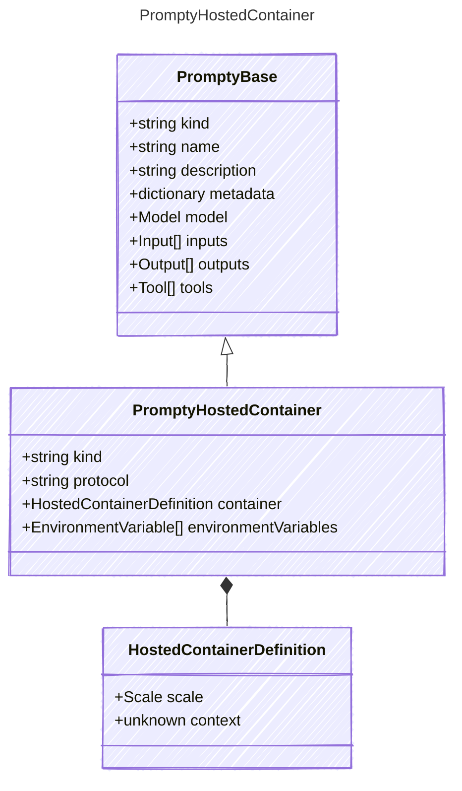

# PromptyHostedContainer

This represents a container based agent hosted by the provider/publisher.
The intent is to represent a container application that the user wants to run
in a hosted environment that the provider manages.

## Class Diagram



## Yaml Example

```yaml
kind: hosted
protocol: responses
container:
  scale:
    minReplicas: 1
    maxReplicas: 5
    cpu: 0.5
    memory: 2
context:
  dockerfile: dockerfile
  buildContext: .
environmentVariables:
  MY_ENV_VAR: my-value

```

## Properties

| Name | Type | Description |
| ---- | ---- | ----------- |
| kind | string | Type of agent, e.g., &#39;hosted&#39;  |
| protocol | string | Protocol used by the containerized agent  |
| container | [HostedContainerDefinition](HostedContainerDefinition.md) | Container definition including registry and scaling information  |
| environmentVariables | [EnvironmentVariable[]](EnvironmentVariable.md) | Environment variables to set in the hosted agent container.  |

## Composed Types

The following types are composed within `PromptyHostedContainer`:

- [HostedContainerDefinition](HostedContainerDefinition.md)
