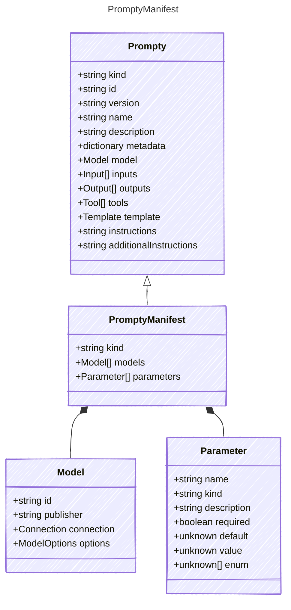

# PromptyManifest

The following represents a manifest that can be used to create agents dynamically.
It includes a list of models that the publisher of the manifest has tested and
has confidence will work with an instantiated prompt agent.
The manifest also includes parameters that can be used to configure the agent&#39;s behavior.
These parameters include values that can be used as publisher parameters that can
be used to describe additional variables that have been tested and are known to work.

Variables described here are then used to project into a prompt agent that can be executed.
Once parameters are provided, these can be referenced in the manifest using the following notation:

`${param:MyParameter}`

This allows for dynamic configuration of the agent based on the provided parameters.
(This notation is used elsewhere, but only the `param` scope is supported here)

## Class Diagram



## Yaml Example

```yaml
kind: manifest
models:
  - id: gpt-35-turbo
  - id: gpt-4o
  - custom-model-id
parameters:
  param1:
    kind: string
  param2:
    kind: number

```

## Properties

| Name | Type | Description |
| ---- | ---- | ----------- |
| kind | string | Type of agent, e.g., &#39;manifest&#39;  |
| models | [Model[]](Model.md) | Additional models that are known to work with this prompt  |
| parameters | [Parameter[]](Parameter.md) | Parameters for configuring the agent&#39;s behavior and execution (Related Types: [ObjectParameter](ObjectParameter.md), [ArrayParameter](ArrayParameter.md)) |

## Composed Types

The following types are composed within `PromptyManifest`:

- [Model](Model.md)
- [Parameter](Parameter.md)
