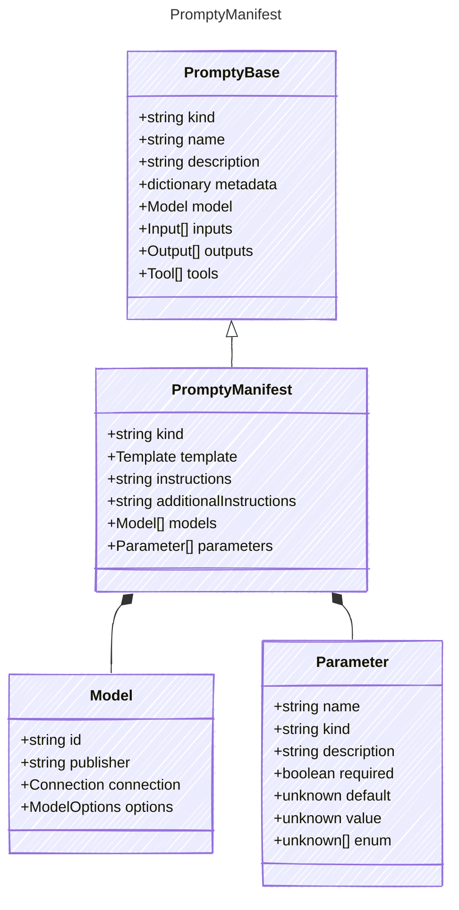

# PromptyManifest

The following represents a manifest that can be used to create agents dynamically.
It includes a list of models that the publisher of the manifest has tested and
has confidence will work with an instantiated prompt agent.
The manifest also includes parameters that can be used to configure the agent&#39;s behavior.
These parameters include values that can be used as publisher parameters that can
be used to describe additional variables that have been tested and are known to work.

Variables described here are then used to project into a prompt agent that can be executed.
Once parameters are provided, these can be referenced in the manifest using the following notation:

`${param:MyParameter}`

This allows for dynamic configuration of the agent based on the provided parameters.
(This notation is used elsewhere, but only the `param` scope is supported here)

## Class Diagram



## Markdown Example

```markdown
---
kind: manifest
template:
  format: mustache
  parser: prompty
models:
  - id: gpt-35-turbo
  - id: gpt-4o
  - custom-model-id
parameters:
  param1:
    kind: string
  param2:
    kind: number
---
system:
You are an AI assistant who helps people find information.
As the assistant, you answer questions briefly, succinctly,
and in a personable manner using markdown and even add some 
personal flair with appropriate emojis.

# Customer
You are helping {{firstName}} {{lastName}} to find answers to 
their questions. Use their name to address them in your responses.
user:
{{question}}
```

## Yaml Example

```yaml
kind: manifest
template:
  format: mustache
  parser: prompty
instructions: |-
  system:
  You are an AI assistant who helps people find information.
  As the assistant, you answer questions briefly, succinctly,
  and in a personable manner using markdown and even add some 
  personal flair with appropriate emojis.

  # Customer
  You are helping {{firstName}} {{lastName}} to find answers to 
  their questions. Use their name to address them in your responses.
  user:
  {{question}}
models:
  - id: gpt-35-turbo
  - id: gpt-4o
  - custom-model-id
parameters:
  param1:
    kind: string
  param2:
    kind: number

```

## Properties

| Name | Type | Description |
| ---- | ---- | ----------- |
| kind | string | Type of agent, e.g., &#39;manifest&#39;  |
| template | [Template](Template.md) | Template configuration for prompt rendering  |
| instructions | string | Give your agent clear directions on what to do and how to do it. Include specific tasks, their order, and any special instructions like tone or engagement style. (can use this for a pure yaml declaration or as content in the markdown format)  |
| additionalInstructions | string | Additional instructions or context for the agent, can be used to provide extra guidance (can use this for a pure yaml declaration)  |
| models | [Model[]](Model.md) | Additional models that are known to work with this prompt  |
| parameters | [Parameter[]](Parameter.md) | Parameters for configuring the agent&#39;s behavior and execution (Related Types: [ObjectParameter](ObjectParameter.md), [ArrayParameter](ArrayParameter.md)) |

## Composed Types

The following types are composed within `PromptyManifest`:

- [Model](Model.md)
- [Parameter](Parameter.md)
