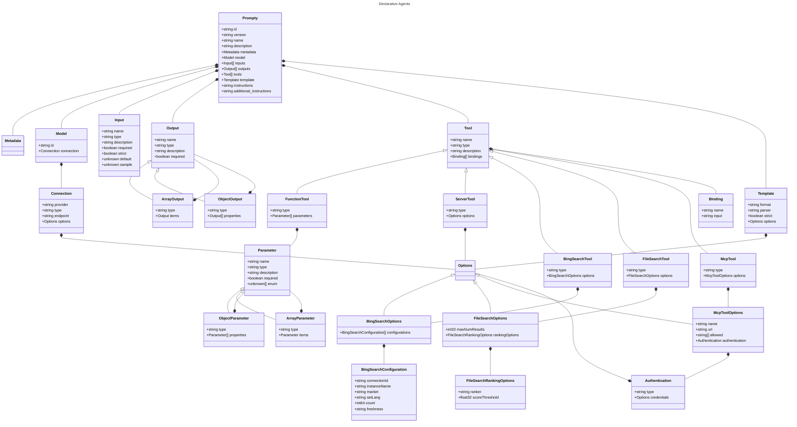

# Class Diagram

The following diagram illustrates the classes and their relationships for declarative agents.
The root [Prompty](Prompty.md) object represents the main entry point for the system.

