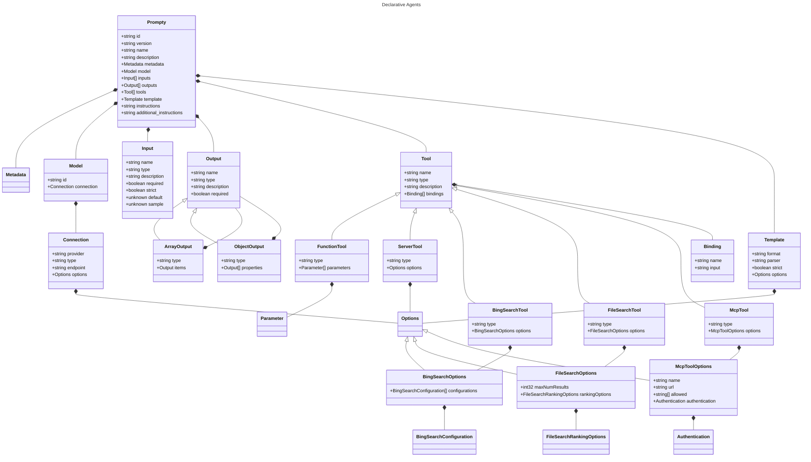

# Class Diagram

The following diagram illustrates the classes and their relationships for declarative agents.

```mermaid
---
title: Declarative Agents
---
classDiagram
    class Metadata {
    }
    class Options {
    }
    class BingSearchOptions {
        +BingSearchConfiguration[] configurations
    }
    class FileSearchOptions {
        +int32 maxNumResults
        +FileSearchRankingOptions rankingOptions
    }
    class McpToolOptions {
        +string name
        +string url
        +string[] allowed
        +Authentication authentication
    }
    class Connection {
        +string provider
        +string type
        +string endpoint
        +Options options
    }
    class Model {
        +string id
        +Connection connection
    }
    class Input {
        +string name
        +string type
        +string description
        +boolean required
        +boolean strict
        +unknown default
        +unknown sample
    }
    class Output {
        +string name
        +string type
        +string description
        +boolean required
    }
    class ArrayOutput {
        +string type
        +Output items
    }
    class ObjectOutput {
        +string type
        +Output[] properties
    }
    class Binding {
        +string name
        +string input
    }
    class Tool {
        +string name
        +string type
        +string description
        +Binding[] bindings
    }
    class FunctionTool {
        +string type
        +Parameter[] parameters
    }
    class ServerTool {
        +string type
        +Options options
    }
    class BingSearchTool {
        +string type
        +BingSearchOptions options
    }
    class FileSearchTool {
        +string type
        +FileSearchOptions options
    }
    class McpTool {
        +string type
        +McpToolOptions options
    }
    class Template {
        +string format
        +string parser
        +boolean strict
        +Options options
    }
    class Prompty {
        +string id
        +string version
        +string name
        +string description
        +Metadata metadata
        +Model model
        +Input[] inputs
        +Output[] outputs
        +Tool[] tools
        +Template template
        +string instructions
        +string additional_instructions
    }
    Options <|-- BingSearchOptions
    Options <|-- FileSearchOptions
    Options <|-- McpToolOptions
    Output <|-- ArrayOutput
    Output <|-- ObjectOutput
    Tool <|-- FunctionTool
    Tool <|-- ServerTool
    Tool <|-- BingSearchTool
    Tool <|-- FileSearchTool
    Tool <|-- McpTool
    BingSearchOptions *-- BingSearchConfiguration
    FileSearchOptions *-- FileSearchRankingOptions
    McpToolOptions *-- Authentication
    Connection *-- Options
    Model *-- Connection
    ArrayOutput *-- Output
    ObjectOutput *-- Output
    Tool *-- Binding
    FunctionTool *-- Parameter
    ServerTool *-- Options
    BingSearchTool *-- BingSearchOptions
    FileSearchTool *-- FileSearchOptions
    McpTool *-- McpToolOptions
    Template *-- Options
    Prompty *-- Metadata
    Prompty *-- Model
    Prompty *-- Input
    Prompty *-- Output
    Prompty *-- Tool
    Prompty *-- Template
```