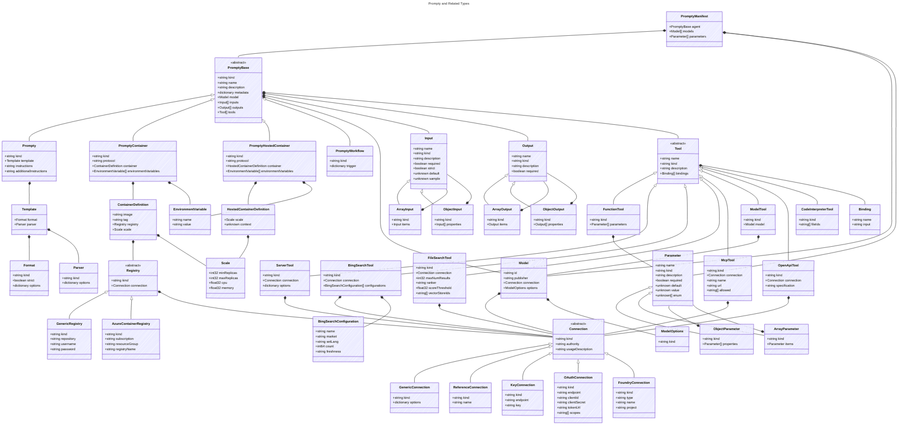

# Class Diagram

The following diagram illustrates the classes and their relationships for declarative agents.
The root [object](Prompty.md) represents the main entry point for the system.

```mermaid
---
title: Prompty and Related Types
config:
  look: handDrawn
  theme: colorful
  class:
    hideEmptyMembersBox: true
---
classDiagram
    class ModelOptions {
      
        +string kind
    }
    class Model {
      
        +string id
        +string publisher
        +Connection connection
        +ModelOptions options
    }
    class Input {
      
        +string name
        +string kind
        +string description
        +boolean required
        +boolean strict
        +unknown default
        +unknown sample
    }
    class ObjectInput {
      
        +string kind
        +Input[] properties
    }
    class ArrayInput {
      
        +string kind
        +Input items
    }
    class Output {
      
        +string name
        +string kind
        +string description
        +boolean required
    }
    class ObjectOutput {
      
        +string kind
        +Output[] properties
    }
    class ArrayOutput {
      
        +string kind
        +Output items
    }
    class Binding {
      
        +string name
        +string input
    }
    class Tool {
      <<abstract>>
        +string name
        +string kind
        +string description
        +Binding[] bindings
    }
    class Parameter {
      
        +string name
        +string kind
        +string description
        +boolean required
        +unknown default
        +unknown value
        +unknown[] enum
    }
    class ArrayParameter {
      
        +string kind
        +Parameter items
    }
    class ObjectParameter {
      
        +string kind
        +Parameter[] properties
    }
    class FunctionTool {
      
        +string kind
        +Parameter[] parameters
    }
    class ServerTool {
      
        +string kind
        +Connection connection
        +dictionary options
    }
    class BingSearchConfiguration {
      
        +string name
        +string market
        +string setLang
        +int64 count
        +string freshness
    }
    class BingSearchTool {
      
        +string kind
        +Connection connection
        +BingSearchConfiguration[] configurations
    }
    class FileSearchTool {
      
        +string kind
        +Connection connection
        +int32 maxNumResults
        +string ranker
        +float32 scoreThreshold
        +string[] vectorStoreIds
    }
    class McpTool {
      
        +string kind
        +Connection connection
        +string name
        +string url
        +string[] allowed
    }
    class ModelTool {
      
        +string kind
        +Model model
    }
    class OpenApiTool {
      
        +string kind
        +Connection connection
        +string specification
    }
    class CodeInterpreterTool {
      
        +string kind
        +string[] fileIds
    }
    class PromptyBase {
      <<abstract>>
        +string kind
        +string name
        +string description
        +dictionary metadata
        +Model model
        +Input[] inputs
        +Output[] outputs
        +Tool[] tools
    }
    class Format {
      
        +string kind
        +boolean strict
        +dictionary options
    }
    class Parser {
      
        +string kind
        +dictionary options
    }
    class Template {
      
        +Format format
        +Parser parser
    }
    class Prompty {
      
        +string kind
        +Template template
        +string instructions
        +string additionalInstructions
    }
    class Connection {
      <<abstract>>
        +string kind
        +string authority
        +string usageDescription
    }
    class GenericConnection {
      
        +string kind
        +dictionary options
    }
    class ReferenceConnection {
      
        +string kind
        +string name
    }
    class KeyConnection {
      
        +string kind
        +string endpoint
        +string key
    }
    class OAuthConnection {
      
        +string kind
        +string endpoint
        +string clientId
        +string clientSecret
        +string tokenUrl
        +string[] scopes
    }
    class FoundryConnection {
      
        +string kind
        +string type
        +string name
        +string project
    }
    class Registry {
      <<abstract>>
        +string kind
        +Connection connection
    }
    class GenericRegistry {
      
        +string kind
        +string repository
        +string username
        +string password
    }
    class AzureContainerRegistry {
      
        +string kind
        +string subscription
        +string resourceGroup
        +string registryName
    }
    class Scale {
      
        +int32 minReplicas
        +int32 maxReplicas
        +float32 cpu
        +float32 memory
    }
    class ContainerDefinition {
      
        +string image
        +string tag
        +Registry registry
        +Scale scale
    }
    class EnvironmentVariable {
      
        +string name
        +string value
    }
    class PromptyContainer {
      
        +string kind
        +string protocol
        +ContainerDefinition container
        +EnvironmentVariable[] environmentVariables
    }
    class HostedContainerDefinition {
      
        +Scale scale
        +unknown context
    }
    class PromptyHostedContainer {
      
        +string kind
        +string protocol
        +HostedContainerDefinition container
        +EnvironmentVariable[] environmentVariables
    }
    class PromptyWorkflow {
      
        +string kind
        +dictionary trigger
    }
    class PromptyManifest {
      
        +PromptyBase agent
        +Model[] models
        +Parameter[] parameters
    }
    Input <|-- ArrayInput
    Input <|-- ObjectInput
    Output <|-- ArrayOutput
    Output <|-- ObjectOutput
    Tool <|-- FunctionTool
    Tool <|-- ServerTool
    Tool <|-- BingSearchTool
    Tool <|-- FileSearchTool
    Tool <|-- McpTool
    Tool <|-- ModelTool
    Tool <|-- OpenApiTool
    Tool <|-- CodeInterpreterTool
    Parameter <|-- ObjectParameter
    Parameter <|-- ArrayParameter
    PromptyBase <|-- Prompty
    PromptyBase <|-- PromptyContainer
    PromptyBase <|-- PromptyHostedContainer
    PromptyBase <|-- PromptyWorkflow
    Connection <|-- GenericConnection
    Connection <|-- ReferenceConnection
    Connection <|-- KeyConnection
    Connection <|-- OAuthConnection
    Connection <|-- FoundryConnection
    Registry <|-- GenericRegistry
    Registry <|-- AzureContainerRegistry
    Model *-- Connection
    Model *-- ModelOptions
    ObjectInput *-- Input
    ArrayInput *-- Input
    ObjectOutput *-- Output
    ArrayOutput *-- Output
    Tool *-- Binding
    ArrayParameter *-- Parameter
    ObjectParameter *-- Parameter
    FunctionTool *-- Parameter
    ServerTool *-- Connection
    BingSearchTool *-- Connection
    BingSearchTool *-- BingSearchConfiguration
    FileSearchTool *-- Connection
    McpTool *-- Connection
    ModelTool *-- Model
    OpenApiTool *-- Connection
    PromptyBase *-- Model
    PromptyBase *-- Input
    PromptyBase *-- Output
    PromptyBase *-- Tool
    Template *-- Format
    Template *-- Parser
    Prompty *-- Template
    Registry *-- Connection
    ContainerDefinition *-- Registry
    ContainerDefinition *-- Scale
    PromptyContainer *-- ContainerDefinition
    PromptyContainer *-- EnvironmentVariable
    HostedContainerDefinition *-- Scale
    PromptyHostedContainer *-- HostedContainerDefinition
    PromptyHostedContainer *-- EnvironmentVariable
    PromptyManifest *-- PromptyBase
    PromptyManifest *-- Model
    PromptyManifest *-- Parameter
```
