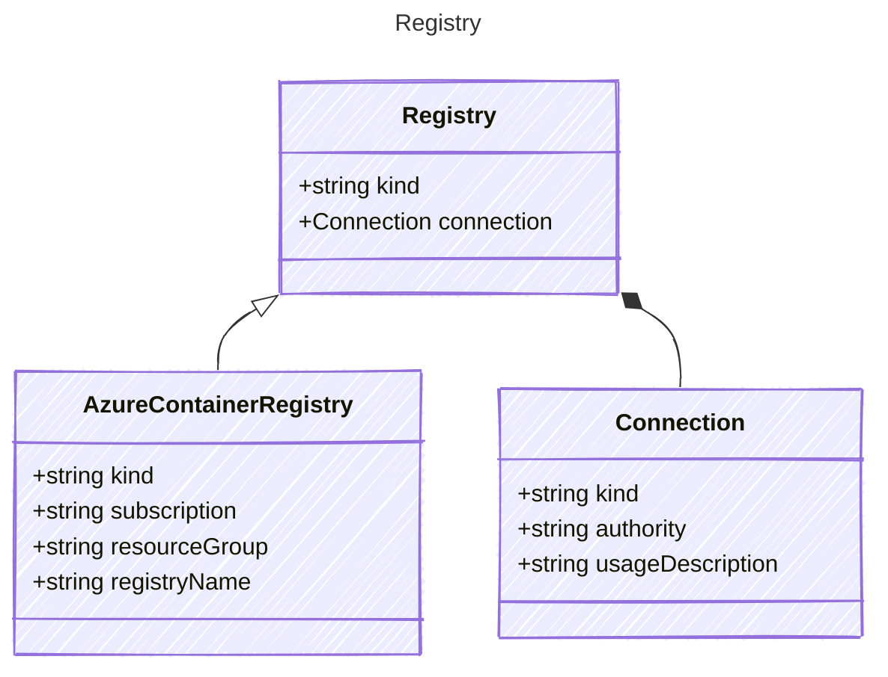

# Registry

## Class Diagram

## Properties

| Name | Type | Description |
| ---- | ---- | ----------- |
| kind | string |   |
| connection | [Connection](Connection.md) |  (Related Types: [GenericConnection](GenericConnection.md), [ReferenceConnection](ReferenceConnection.md), [KeyConnection](KeyConnection.md), [OAuthConnection](OAuthConnection.md), [FoundryConnection](FoundryConnection.md)) |

## Child Types

The following types extend `Registry`:

- [AzureContainerRegistry](AzureContainerRegistry.md)

## Composed Types

The following types are composed within `Registry`:

- [Connection](Connection.md)
