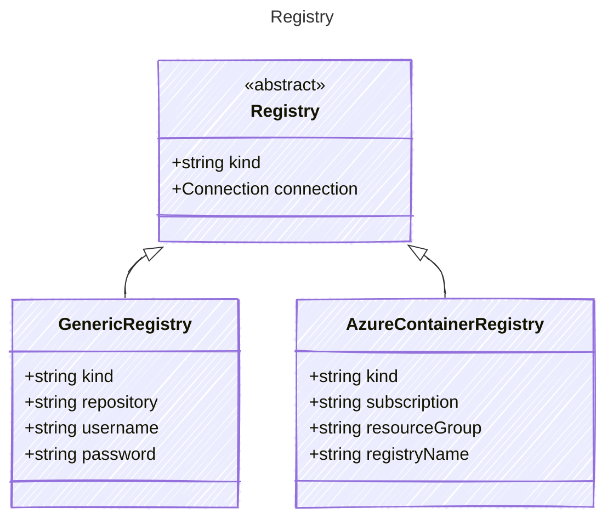

# Registry

Definition for a container image registry.

## Class Diagram



## Yaml Example

```yaml
kind: docker
connection:
  kind: key
  authority: system
  usageDescription: Access to the container registry

```

## Properties

| Name | Type | Description |
| ---- | ---- | ----------- |
| kind | string | The kind of container registry  |
| connection | [Connection](Connection.md) | The connection configuration for accessing the container registry  |

## Child Types

The following types extend `Registry`:

- [GenericRegistry](GenericRegistry.md)
- [AzureContainerRegistry](AzureContainerRegistry.md)
