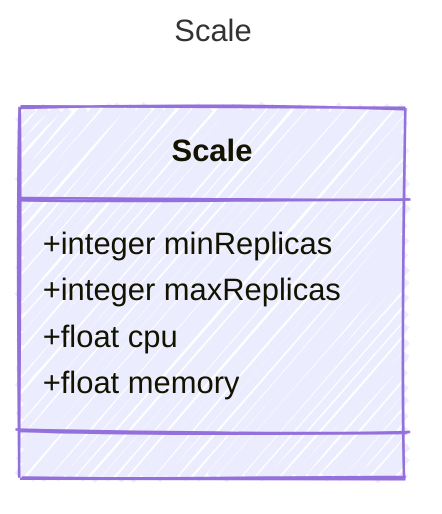

# Scale

## Class Diagram



## Yaml Example

```yaml
minReplicas: 1
maxReplicas: 5
cpu: 0.5
memory: 2

```

## Properties

| Name | Type | Description |
| ---- | ---- | ----------- |
| minReplicas | integer | Minimum number of container instances to run  |
| maxReplicas | integer | Maximum number of container instances to run  |
| cpu | float | CPU allocation per instance (in cores)  |
| memory | float | Memory allocation per instance (in GB)  |
