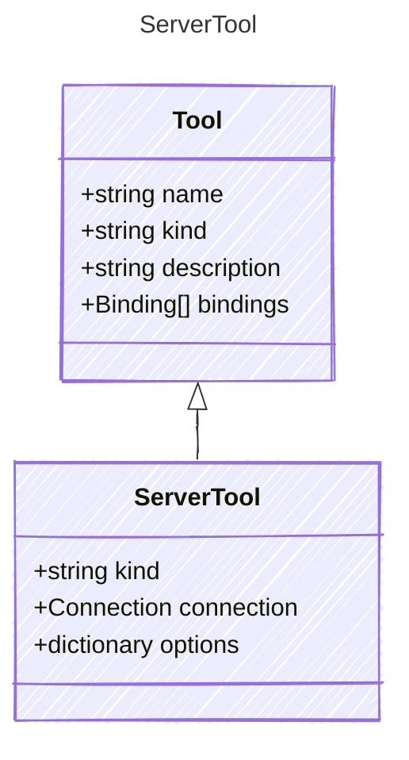

# ServerTool

Represents a generic server tool that runs on a server
This tool kind is designed for operations that require server-side execution
It may include features such as authentication, data storage, and long-running processes
This tool kind is ideal for tasks that involve complex computations or access to secure resources
Server tools can be used to offload heavy processing from client applications

## Class Diagram



## Yaml Example

```yaml
connection:
  kind: provider-connection
options:
  timeout: 30
  retries: 3

```

## Properties

| Name | Type | Description |
| ---- | ---- | ----------- |
| kind | string | The kind identifier for server tools. This is a wildcard and can represent any server tool type not explicitly defined.  |
| connection | [Connection](Connection.md) | Connection configuration for the server tool  |
| options | dictionary | Configuration options for the server tool  |
