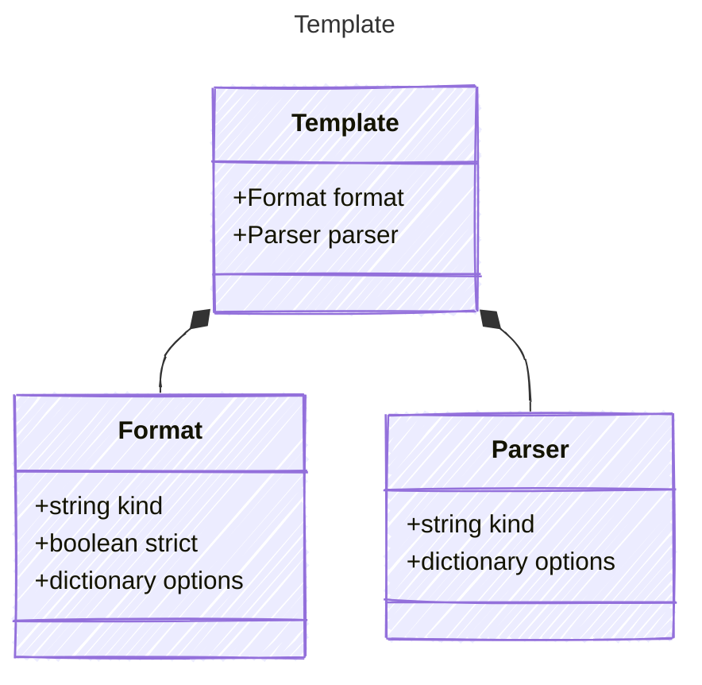

# Template

Template model for defining prompt templates.

This model specifies the rendering engine used for slot filling prompts,
the parser used to process the rendered template into API-compatible format,
and additional options for the template engine.

It allows for the creation of reusable templates that can be filled with dynamic data
and processed to generate prompts for AI models.

## Class Diagram



## Yaml Example

```yaml
format:
  kind: mustache
parser:
  kind: mustache

```

## Properties

| Name | Type | Description |
| ---- | ---- | ----------- |
| format | [Format](Format.md) | Template rendering engine used for slot filling prompts (e.g., mustache, jinja2)  |
| parser | [Parser](Parser.md) | Parser used to process the rendered template into API-compatible format  |

## Composed Types

The following types are composed within `Template`:

- [Format](Format.md)
- [Parser](Parser.md)
