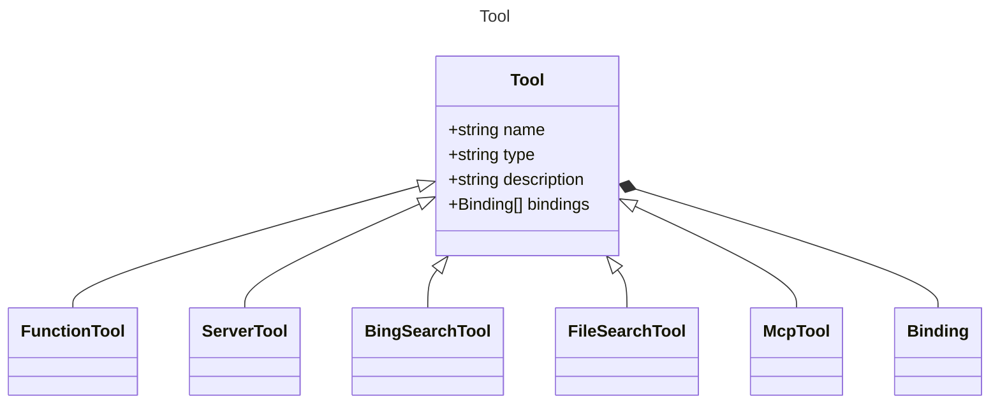

# Tool

Represents a tool that can be used in prompts.

## Class Diagram

## Properties

| Name | Type | Description |
| ---- | ---- | ----------- |
| name | string | Name of the item  |
| type | string | The type identifier for the tool  |
| description | string | A short description of the tool for metadata purposes  |
| bindings | [Binding Collection](Binding.md) | Tool argument bindings to input properties  |

