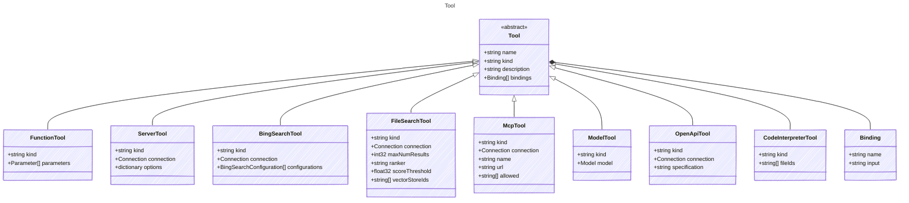

# Tool

Represents a tool that can be used in prompts.

## Class Diagram



## Yaml Example

```yaml
name: my-tool
kind: function
description: A description of the tool
bindings:
  input: value

```

## Properties

| Name | Type | Description |
| ---- | ---- | ----------- |
| name | string | Name of the tool. If a function tool, this is the function name, otherwise it is the type  |
| kind | string | The kind identifier for the tool  |
| description | string | A short description of the tool for metadata purposes  |
| bindings | [Binding[]](Binding.md) | Tool argument bindings to input properties  |

## Child Types

The following types extend `Tool`:

- [FunctionTool](FunctionTool.md)
- [ServerTool](ServerTool.md)
- [BingSearchTool](BingSearchTool.md)
- [FileSearchTool](FileSearchTool.md)
- [McpTool](McpTool.md)
- [ModelTool](ModelTool.md)
- [OpenApiTool](OpenApiTool.md)
- [CodeInterpreterTool](CodeInterpreterTool.md)

## Composed Types

The following types are composed within `Tool`:

- [Binding](Binding.md)
