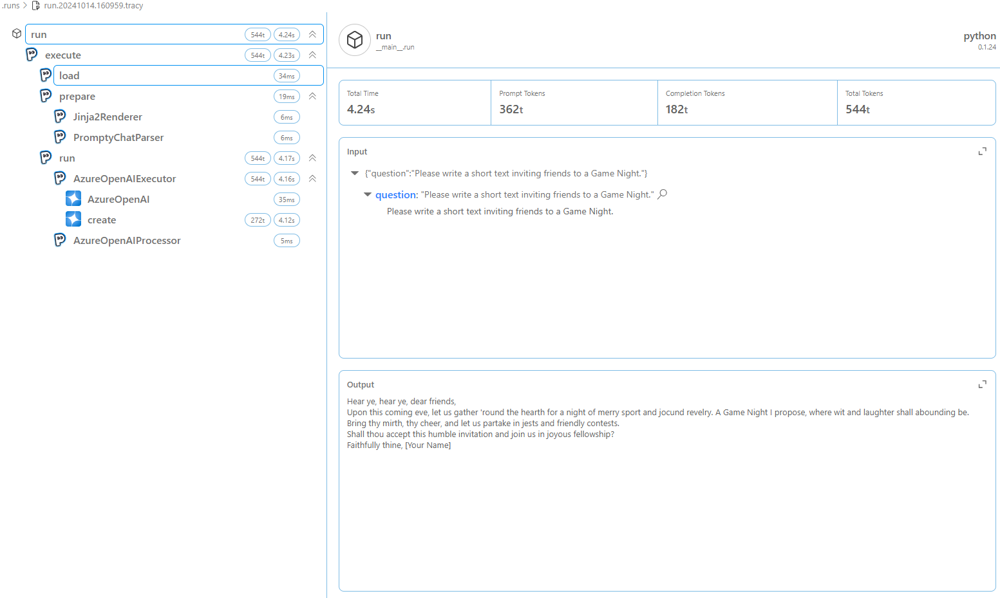

_In the last section, we converted our Prompty asset into code and successfully executed the application. In this section, we will cover how we can use Observability in Prompty to debug our application._

<br/>

## 1. What is Observability?

Observability refers to the ability to monitor and understand the behavior of a system based on the data it produces such as logs, metrics and traces. In Prompty, you can easily trace and visualize flow, which helps you to understand and debug your code using the built-in tracer. You can create your own tracer by adding your own hook. By default, Prompty has two traces built-in:

- **Console Tracer**: This tracer logs the output to the console.
- **Prompty Tracer**: This tracer logs the output to a JSON file.

<br/>

TODO
<br/>

## 2. Updating our Prompty

<details>
<summary>☑ **Function that executes the Prompty asset** (click to expand)</summary>
```markdown
---
name: Shakespearean Writing Prompty
description: A prompt that answers questions in Shakespearean style using Cohere Command-R model from GitHub Marketplace.
authors:
  - Bethany Jepchumba
model:
  api: chat
  configuration:
    type: azure_openai
    azure_endpoint: ${env:AZURE_OPENAI_ENDPOINT}
    azure_deployment: gpt-4o
  parameters:
    max_tokens: 30
sample:
  question: Please write a short text inviting friends to a Game Night.
---

system:
You are a Shakespearean writing assistant who speaks in a` Shakespearean style. You help people come up with creative ideas and content like stories, poems, and songs that use Shakespearean style of writing style, including words like "thou" and "hath”.
Here are some example of Shakespeare's style:
- Romeo, Romeo! Wherefore art thou Romeo?
- Love looks not with the eyes, but with the mind; and therefore is winged Cupid painted blind.
- Shall I compare thee to a summer's day? Thou art more lovely and more temperate.

example:
user: Please write a short text turning down an invitation to dinner.
assistant: Dearest,
  Regretfully, I must decline thy invitation.
  Prior engagements call me hence. Apologies.

user:
{{question}}
```
</details>

## 3. Adding Prompty to your code
To add a tracer, we have the following code snippet:

```python
from prompty.tracer import trace, Tracer, console_tracer, PromptyTracer

Tracer.add("console", console_tracer)
json_tracer = PromptyTracer()
Tracer.add("PromptyTracer", json_tracer.tracer)
```
<br/>

The output from the tracer is displayed in the console and in a `.tracy` file. A new `.tracy` file is created in a new `.runs` folder. 
The trace output is divided into three: _load, prepare_ and _run_. Load refers to the loading of the Prompty asset, prepare refers to the preparation of the Prompty asset, and run refers to the execution of the Prompty asset. Below is a sample of the trace output showing the inputs, outputs and metrics i.e. time to execute the prompt and tokens:




<br/>

## 2. Additional supported runtimes

The Prompty runtime supports additional runtimes, including frameworks such as LangChain, and Semantic Kernel. In the tutorials section, we will cover how to generate code from Prompty assets using these runtimes. (coming soon)


---
<br/>
[Want to Contribute To the Project?](/docs/contributing/) - _Updated Guidance Coming Soon_.
