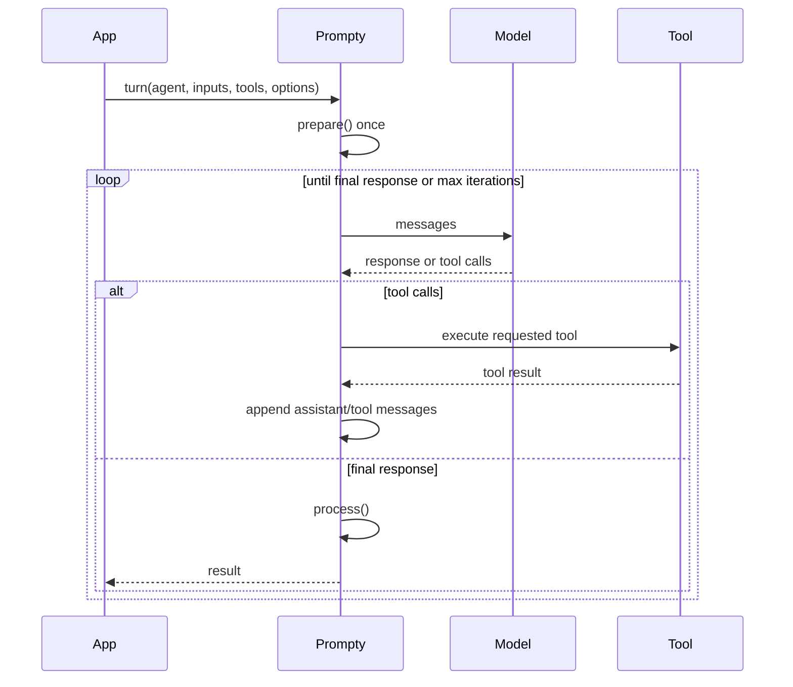

import { Aside, Tabs, TabItem } from '@astrojs/starlight/components';

The **agent loop** is the runtime behavior behind `turn()`. It lets a model ask
for tools, lets Prompty execute those tools, and sends the results back to the
model until the model returns a final answer.

## Turn lifecycle

One call to `turn()` represents one external user turn.



`prepare()` is called once at the start of the turn. The template body is not
re-rendered for each internal tool iteration. Instead, the runtime appends the
model's tool-call response and the tool-result messages to the same message
array.

<Aside type="note">
  If your application calls `turn()` again for the next user message, Prompty
  prepares the prompt again. That is the expected boundary between external user
  turns. Inside a single tool-calling turn, Prompty keeps the prepared messages in
  memory.
</Aside>

## When the loop starts

The loop runs when you call `turn()` with tools or loop controls. Without tools
or controls, `turn()` behaves like a single `prepare → execute → process` call.

Tools usually come from two places:

- The `.prompty` file declares tool schemas in frontmatter.
- Your application binds runtime functions that implement those tool names.

The model sees the tool schemas. When it asks for a tool call, Prompty looks up
the matching runtime function, calls it, formats the result in the provider's
wire format, and appends it to the message array.

## Minimal shape

<Tabs>
<TabItem label="Python">

```python
from prompty import load, turn, bind_tools, tool

@tool
def get_weather(city: str) -> str:
    return f"72°F and sunny in {city}"

agent = load("agent.prompty")
tools = bind_tools(agent, [get_weather])

result = turn(
    agent,
    inputs={"question": "What is the weather in Seattle?"},
    tools=tools,
    max_iterations=10,
)
```

</TabItem>
<TabItem label="TypeScript">

```ts
import { bindTools, load, tool, turn } from "@prompty/core";

const getWeather = tool(
  (city: string) => `72°F and sunny in ${city}`,
  {
    name: "get_weather",
    description: "Get the current weather",
    parameters: [{ name: "city", kind: "string", required: true }],
  },
);

const agent = await load("agent.prompty");
const tools = bindTools(agent, [getWeather]);

const result = await turn(
  agent,
  { question: "What is the weather in Seattle?" },
  { tools, maxIterations: 10 },
);
```

</TabItem>
<TabItem label="C#">

```csharp
using Prompty.Core;

var agent = PromptyLoader.Load("agent.prompty");
var tools = ToolAttribute.BindTools(agent, new WeatherTools());

var result = await Pipeline.TurnAsync(
    agent,
    new() { ["question"] = "What is the weather in Seattle?" },
    tools: tools,
    maxIterations: 10
);
```

</TabItem>
<TabItem label="Rust">

```rust
use prompty::TurnOptions;
use serde_json::json;

prompty::register_tool_handler("get_weather", |args| {
    Box::pin(async move {
        let city = args["city"].as_str().unwrap_or("unknown");
        Ok(json!(format!("72°F and sunny in {city}")))
    })
});

let agent = prompty::load("agent.prompty")?;
let result = prompty::turn(
    &agent,
    Some(&json!({"question": "What is the weather in Seattle?"})),
    Some(TurnOptions::default()),
).await?;
```

</TabItem>
</Tabs>

## Stop conditions

The loop stops when:

- the model returns a response with no tool calls;
- `maxIterations` / `max_iterations` is exceeded;
- a cancellation token or signal is triggered;
- an input/output guardrail denies the operation;
- an LLM/provider failure exceeds the configured retry policy;
- an unrecoverable dispatch failure occurs.

Many tool failures are returned to the model as synthetic tool-result text, so
the model can decide whether to recover or ask for something else. Cancellation,
max-iteration failures, and some unrecoverable dispatch failures still stop the
turn.

## What is not automatic

The loop does not invent tool implementations. A `.prompty` file can declare
tool schemas, but your application still supplies the functions or provider
implementations that execute them.

The loop also does not automatically persist memory. Conversation history is
passed by the application, usually through a `kind: thread` input. See
[Conversation History](/core-concepts/conversation-history/) for the thread
pattern.
