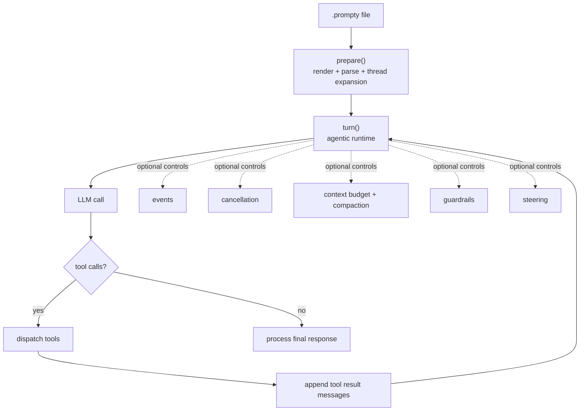

Prompty agents are still Prompty prompts: a `.prompty` file renders and parses
into messages. The agentic layer starts when you run a conversational **turn**
with tools or runtime controls.

This section is for application developers who need to build, debug, or govern
tool-using agents. After reading it, you should be able to answer:

- where the boundary is between a `.prompty` file and host runtime code;
- how a single `turn()` differs from a full chat session;
- when messages are prepared, appended, trimmed, compacted, or steered;
- where to enforce policy with guardrails instead of prompt instructions;
- how to observe and stop a long-running tool loop.

## Mental model

The key distinction is:

- **`prepare()`** renders the template and parses role-marked text into messages.
- **`turn()`** runs one user turn and, if needed, loops internally for tool calls.
- **Tool-loop iterations do not re-render the template.** They mutate the prepared
  message array by appending assistant/tool messages.
- **External user turns call `turn()` again.** If you pass conversation history as
  a thread input, that thread is expanded during the next `prepare()` call.

## What belongs here

| Concept | What it controls | Start here |
|---|---|---|
| Agent loop | How tool calls are executed and fed back to the model | [Agent Loop](/agentic-concepts/agent-loop/) |
| Runtime controls | The per-iteration order for cancellation, steering, context, guardrails, model calls, and tools | [Runtime Controls](/agentic-concepts/runtime-controls/) |
| Guardrails | Validate or rewrite inputs, outputs, and tool arguments | [Guardrails](/agentic-concepts/guardrails/) |
| Context budget | Trim messages before model calls | [Context & Compaction](/agentic-concepts/context-compaction/) |
| Compaction | Replace dropped-message summaries with a custom summary | [Context & Compaction](/agentic-concepts/context-compaction/) |
| Steering | Inject messages between loop iterations | [Steering](/agentic-concepts/steering/) |
| Events | Observe status, tool calls, message updates, completion, errors | [Events & Cancellation](/agentic-concepts/events-cancellation/) |
| Cancellation | Stop a running loop cooperatively | [Events & Cancellation](/agentic-concepts/events-cancellation/) |
| Parallel tools | Run multiple tool calls concurrently | [Tool Execution](/agentic-concepts/tool-execution/) |
| Retries | Retry transient LLM failures inside the loop | [Tool Execution](/agentic-concepts/tool-execution/#llm-retries) |

## Runtime coverage

The agentic controls are runtime API options, not frontmatter fields. They are
available in the v2 runtimes:

| Runtime | Agent loop | Guardrails | Compaction | Steering |
|---|---:|---:|---:|---:|
| Python | Yes | Yes | Yes | Yes |
| TypeScript | Yes | Yes | Yes | Yes |
| C# | Yes | Yes | Yes | Yes |
| Rust | Yes | Yes | Yes | Yes |

## Related docs

- [Agent tool calling guide](/how-to/agent-tool-calling/) for a hands-on walkthrough
- [Tools](/core-concepts/tools/) for `.prompty` tool declarations
- [Conversation history](/core-concepts/conversation-history/) for thread inputs
- [Tracing](/core-concepts/tracing/) for observing runtime execution
- [Agent loop specification](/specification/agent-loop/) for the lower-level contract
