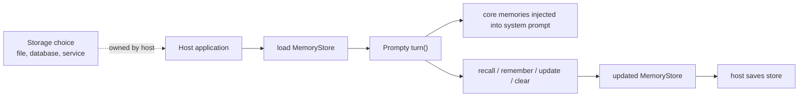
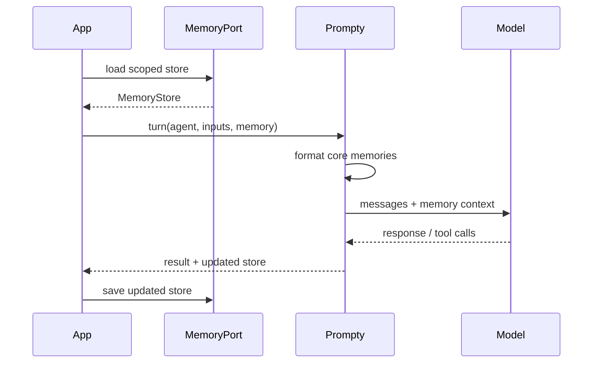

import { Aside, Tabs, TabItem } from '@astrojs/starlight/components';

Prompty memory is a **portable runtime contract**, not a hosted database. The
runtimes know how to work with memory once a store is available; your
application decides where that store lives and when to load or save it.

That split keeps memory behavior consistent across runtimes without forcing
every app into the same storage, privacy, or lifecycle model.

## Mental model



Prompty owns the portable behavior:

- `MemoryStore`, `MemoryEntry`, and `MemoryCategory`;
- deterministic `recall` scoring and formatting;
- `remember`, `update`, `remove`, `clear`, and cap-based eviction;
- core-memory formatting for model-visible system context;
- conformance vectors that keep those semantics aligned across runtimes.

Your host owns the integration:

- persistence location: file, database, profile service, project store, or
  tenant-scoped service;
- scoping: user, project, agent, session, organization, or some combination;
- lifecycle policy: when to remember, summarize, update, expire, or ask for
  permission;
- privacy and security boundaries: consent, audit, tenant isolation, encryption,
  and deletion;
- wiring the store into the turn loop through the runtime's memory port or
  equivalent load/save adapter.

<Aside type="note">
  The promise is: Prompty can run against a memory store consistently once your
  host plugs one in. Prompty does not ship a universal managed memory backend.
</Aside>

## Categories

Memory entries are tiered so runtimes agree on what each entry means.

| Category | Meaning | Runtime behavior |
|---|---|---|
| `core` | Persistent facts or preferences that should be model-visible by default | Injected into the system prompt, boosted during recall, and deduplicated by tag set on write |
| `archival` | Summaries or older context that should be available through recall | Not injected by default; preferred for eviction when the store exceeds its cap |
| `insight` | Saved reflections or derived observations | Available through recall; not injected by default |

Only `core` memories are formatted directly into the model-visible system prompt:

```text
## Memory
- User prefers concise answers
- Deploys on Friday afternoons
```

Archival and insight memories stay out of the prompt unless your app recalls
them and chooses to include the recall results.

## Runtime shape

<Tabs>
<TabItem label="Python">

```python
from prompty import MemoryEntry, MemoryStore, format_for_system_prompt, recall, remember

store = MemoryStore.load({"entries": []})
remember(
    store,
    MemoryEntry.load(
        {
            "content": "User prefers concise answers",
            "category": "core",
            "tags": ["preference", "tone"],
        }
    ),
)

system_context = format_for_system_prompt(store)
results = recall(store, "tone", limit=3)
```

</TabItem>
<TabItem label="TypeScript">

```ts
import {
  MemoryEntry,
  MemoryStore,
  formatForSystemPrompt,
  recall,
  remember,
} from "@prompty/core";

const store = MemoryStore.load({ entries: [] });
remember(
  store,
  MemoryEntry.load({
    content: "User prefers concise answers",
    category: "core",
    tags: ["preference", "tone"],
  }),
);

const systemContext = formatForSystemPrompt(store);
const results = recall(store, "tone", 3);
```

</TabItem>
<TabItem label="C#">

```csharp
using Prompty.Core;

var store = MemoryStore.Load(new Dictionary<string, object?> { ["entries"] = new List<object>() });

Memory.Remember(
    store,
    MemoryEntry.Load(new Dictionary<string, object?>
    {
        ["content"] = "User prefers concise answers",
        ["category"] = "core",
        ["tags"] = new[] { "preference", "tone" },
    })
);

var systemContext = Memory.FormatForSystemPrompt(store);
var results = Memory.Recall(store, "tone", limit: 3);
```

</TabItem>
<TabItem label="Rust">

```rust
use prompty::{MemoryCategory, MemoryEntry, MemoryStore};

let mut store = MemoryStore { entries: vec![] };
store.remember(
    MemoryEntry {
        content: "User prefers concise answers".to_string(),
        category: MemoryCategory::Core,
        created_at: None,
        tags: Some(vec!["preference".to_string(), "tone".to_string()]),
    },
    0,
);

let system_context = store.format_for_system_prompt();
let results = store.recall("tone", 3);
```

</TabItem>
</Tabs>

## Persistence boundary

Each flagship runtime exposes a memory port shape: load a whole `MemoryStore`
snapshot, let Prompty apply deterministic behavior, then save the updated
snapshot. A host can back that port with any storage system.



Prompty deliberately does not decide when a model response should become a
memory. Many apps should ask for user permission, apply policy, or summarize
conversation history before writing. Those choices depend on the host's product
requirements, not the `.prompty` file.

## Conformance

Memory is covered by shared vectors, so flagship runtimes benefit equally from
the same semantics. The vectors assert:

- recall ranking by weighted lexical score;
- tag matches and core-memory boosts;
- empty-query behavior and result limits;
- stable tie ordering;
- core deduplication by tags;
- archival-first eviction;
- clear, update, and out-of-range behavior;
- system-prompt formatting;
- snapshot round-trip behavior;
- model-visible memory context in a turn.

If a runtime changes any of those behaviors, its generated conformance suite
goes red.

## Related docs

- [Agent Loop](/agentic-concepts/agent-loop/) for where memory context appears
  in a turn
- [Context & Compaction](/agentic-concepts/context-compaction/) for trimming and
  summarizing conversation history
- [MemoryStore reference](/reference/memorystore/) for the generated store shape
- [MemoryEntry reference](/reference/memoryentry/) for entry fields and category
  metadata
