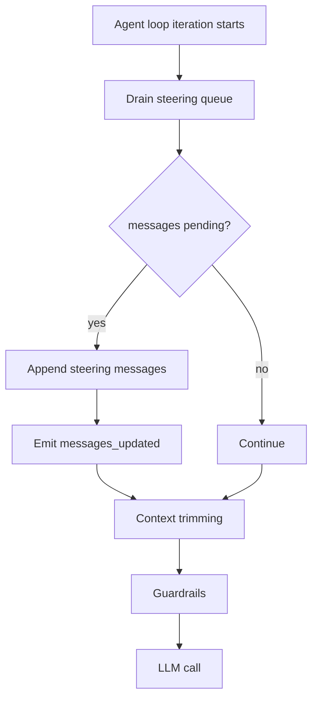

import { Aside, Tabs, TabItem } from '@astrojs/starlight/components';

Steering is a runtime queue for messages that should be added to the current
agent turn after it has started. The loop drains steering messages at the start
of each iteration before context trimming, guardrails, and the next model call.

## Why use steering

Use steering when guidance arrives while a tool-calling turn is still running:

- a user adds guidance for the next model call;
- an operator adds a correction;
- a monitor detects stale assumptions;
- your app wants to provide additional state after a tool result.

Steering is different from editing the prompt. It does not re-render the
template. It appends messages to the in-memory message array for the active
turn.

<Aside type="caution">
  Steering cannot affect a model call or tool call that is already in flight. If
  the turn completes before another loop iteration starts, the steered message
  may never be observed. Use cancellation or tool guardrails when you need to
  enforce a hard stop or prevent a tool from running.
</Aside>

## Lifecycle



## Example shape

<Tabs>
<TabItem label="Python">

```python
import threading
from prompty.core import Steering

steering = Steering()

def run_agent_turn():
    return turn(
        agent,
        inputs={"question": question},
        tools=tools,
        steering=steering,
    )

thread = threading.Thread(target=run_agent_turn)
thread.start()

# From another thread/task while the turn is running:
steering.send("Use the cached deployment list on the next model call.")
thread.join()
```

</TabItem>
<TabItem label="TypeScript">

```ts
import { Steering, turn } from "@prompty/core";

const steering = new Steering();

const resultPromise = turn(agent, { question }, {
  tools,
  steering,
});

// From UI code while the turn is running:
steering.send("Use the cached deployment list on the next model call.");

const result = await resultPromise;
```

</TabItem>
<TabItem label="C#">

```csharp
var steering = new Steering();

var turnTask = Pipeline.TurnAsync(
    agent,
    inputs,
    tools: tools,
    steering: steering
);

// From UI code while the turn is running:
steering.Send("Use the cached deployment list on the next model call.");

var result = await turnTask;
```

</TabItem>
<TabItem label="Rust">

```rust
let steering = Steering::new();
let steering_for_ui = steering.clone();

let options = TurnOptions {
    steering: Some(steering),
    ..Default::default()
};

let turn_task = tokio::spawn(async move {
    prompty::turn(&agent, Some(&inputs), Some(options)).await
});

// From another task while the turn is running:
steering_for_ui.send("Use the cached deployment list on the next model call.");

let result = turn_task.await??;
```

</TabItem>
</Tabs>

## Design guidance

Use steering for short, actionable messages. If the host needs to change a large
amount of context, prefer updating the thread input and starting the next
external turn, or use context compaction to summarize older state.

<Aside type="caution">
  Steering messages still become model context. Apply input guardrails after
  steering if those messages can come from users or external systems.
</Aside>
