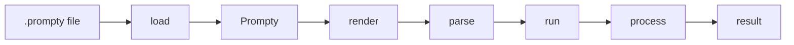

import { Tabs, TabItem } from '@astrojs/starlight/components';

Pipeline functions move a `.prompty` file from source text to model-ready
messages and then to a processed result.



## Function summary

| Function | Purpose | Output |
| --- | --- | --- |
| `load(path)` | Parse a `.prompty` file into a typed `Prompty` object | `Prompty` |
| `render(agent, inputs)` | Render `instructions` with input values | rendered text |
| `parse(agent, rendered)` | Convert rendered role-marked text into messages | `Message[]` |
| `prepare(agent, inputs)` | Validate inputs, render, parse, and expand thread markers | `Message[]` |
| `run(agent, messages)` | Execute prepared messages and process the response | provider-specific result |
| `invoke(pathOrAgent, inputs)` | One-shot load/prepare/run flow | provider-specific result |
| `process(agent, response)` | Convert a raw provider response into a clean result | text, object, vector, image, stream, or tool call |
| `validateInputs(agent, inputs)` | Apply defaults and enforce required inputs | validated inputs or error |

## `load(path)`

Parse a `.prompty` file into a typed `Prompty` object.

<Tabs>
  <TabItem label="Python">
    ```python
    agent = prompty.load("chat.prompty")
    print(agent.name)
    print(agent.model.id)
    ```
  </TabItem>
  <TabItem label="TypeScript">
    ```typescript
    import { load } from "@prompty/core";

    const agent = await load("chat.prompty");
    ```
  </TabItem>
  <TabItem label="C#">
    ```csharp
    using Prompty.Core;

    var agent = PromptyLoader.Load("chat.prompty");
    Console.WriteLine(agent.Name);
    Console.WriteLine(agent.Model.Id);
    ```
  </TabItem>
  <TabItem label="Rust">
    ```rust
    let agent = prompty::load("chat.prompty")?;
    println!("{}", agent.name());
    println!("{}", agent.model().id());
    ```
  </TabItem>
</Tabs>

## `render(agent, inputs)`

Render the prompt template with input values. This returns the raw rendered text
before role markers are parsed into messages.

<Tabs>
  <TabItem label="Python">
    ```python
    rendered = prompty.render(agent, inputs={"q": "Hi"})
    ```
  </TabItem>
  <TabItem label="TypeScript">
    ```typescript
    import { render } from "@prompty/core";

    const rendered = await render(agent, { q: "Hi" });
    ```
  </TabItem>
  <TabItem label="C#">
    ```csharp
    var rendered = await Pipeline.RenderAsync(agent, new() { ["q"] = "Hi" });
    ```
  </TabItem>
  <TabItem label="Rust">
    ```rust
    let rendered = prompty::render(&agent, Some(&json!({ "q": "Hi" }))).await?;
    ```
  </TabItem>
</Tabs>

## `parse(agent, rendered)`

Parse rendered text with role markers into structured messages.

<Tabs>
  <TabItem label="Python">
    ```python
    messages = prompty.parse(agent, rendered)
    ```
  </TabItem>
  <TabItem label="TypeScript">
    ```typescript
    import { parse } from "@prompty/core";

    const messages = await parse(agent, rendered);
    ```
  </TabItem>
  <TabItem label="C#">
    ```csharp
    var messages = await Pipeline.ParseAsync(agent, rendered);
    ```
  </TabItem>
  <TabItem label="Rust">
    ```rust
    let messages = prompty::parse(&agent, &rendered).await?;
    ```
  </TabItem>
</Tabs>

## `prepare(agent, inputs)`

Validate inputs, render the template, parse messages, and expand thread markers.
Use this when you want model-ready messages without calling a provider.

<Tabs>
  <TabItem label="Python">
    ```python
    messages = prompty.prepare(agent, inputs={"q": "Hi"})
    ```
  </TabItem>
  <TabItem label="TypeScript">
    ```typescript
    import { prepare } from "@prompty/core";

    const messages = await prepare(agent, { q: "Hi" });
    ```
  </TabItem>
  <TabItem label="C#">
    ```csharp
    var messages = await Pipeline.PrepareAsync(agent, new() { ["q"] = "Hi" });
    ```
  </TabItem>
  <TabItem label="Rust">
    ```rust
    let messages = prompty::prepare(&agent, Some(&json!({ "q": "Hi" }))).await?;
    ```
  </TabItem>
</Tabs>

## `run(agent, messages)`

Execute prepared messages with the configured provider and process the response.
Most runtimes also expose a raw option for callers that need the provider SDK
response.

<Tabs>
  <TabItem label="Python">
    ```python
    result = prompty.run(agent, messages)
    response = prompty.run(agent, messages, raw=True)
    ```
  </TabItem>
  <TabItem label="TypeScript">
    ```typescript
    import { run } from "@prompty/core";

    const result = await run(agent, messages);
    ```
  </TabItem>
  <TabItem label="C#">
    ```csharp
    var result = await Pipeline.RunAsync(agent, messages);
    var response = await Pipeline.RunAsync(agent, messages, raw: true);
    ```
  </TabItem>
  <TabItem label="Rust">
    ```rust
    let result = prompty::run(&agent, &messages).await?;
    let response = prompty::run_raw(&agent, &messages).await?;
    ```
  </TabItem>
</Tabs>

## `invoke(pathOrAgent, inputs)`

Run the full one-shot pipeline: load, prepare, execute, and process.

<Tabs>
  <TabItem label="Python">
    ```python
    result = prompty.invoke("chat.prompty", inputs={"q": "Hi"})
    ```
  </TabItem>
  <TabItem label="TypeScript">
    ```typescript
    import { invoke } from "@prompty/core";

    const result = await invoke("chat.prompty", { q: "Hi" });
    ```
  </TabItem>
  <TabItem label="C#">
    ```csharp
    var result = await Pipeline.InvokeAsync("chat.prompty", new() { ["q"] = "Hi" });
    ```
  </TabItem>
  <TabItem label="Rust">
    ```rust
    let result = prompty::invoke_from_path(
        "chat.prompty",
        Some(&json!({ "q": "Hi" })),
    ).await?;
    ```
  </TabItem>
</Tabs>

## `process(agent, response)`

Extract clean content from a raw provider response. Processing behavior depends
on `model.apiType`, `outputs`, streaming options, and provider response shape.

<Tabs>
  <TabItem label="Python">
    ```python
    result = prompty.process(agent, response)
    ```
  </TabItem>
  <TabItem label="TypeScript">
    ```typescript
    import { process } from "@prompty/core";

    const result = await process(agent, response);
    ```
  </TabItem>
  <TabItem label="C#">
    ```csharp
    var result = await Pipeline.ProcessAsync(agent, response);
    ```
  </TabItem>
  <TabItem label="Rust">
    ```rust
    let result = prompty::process(&agent, &response).await?;
    ```
  </TabItem>
</Tabs>

## `validateInputs(agent, inputs)`

Apply defaults and raise an error when required inputs are missing.

<Tabs>
  <TabItem label="Python">
    ```python
    prompty.validate_inputs(agent, {"name": "Jane"})
    ```
  </TabItem>
  <TabItem label="TypeScript">
    ```typescript
    import { validateInputs } from "@prompty/core";

    validateInputs(agent, { name: "Jane" });
    ```
  </TabItem>
  <TabItem label="C#">
    ```csharp
    Pipeline.ValidateInputs(agent, new() { ["name"] = "Jane" });
    ```
  </TabItem>
  <TabItem label="Rust">
    ```rust
    prompty::validate_inputs(&agent, &json!({ "name": "Jane" }))?;
    ```
  </TabItem>
</Tabs>

## Async naming

| Runtime | Convention |
| --- | --- |
| Python | Sync functions plus `_async` variants, such as `prepare_async()` |
| TypeScript | Async-first APIs returning `Promise<T>` where I/O or provider calls are involved |
| C# | Async methods use the `Async` suffix, such as `PrepareAsync()` |
| Rust | Pipeline functions that call renderers/providers are async and return `Result<T>` |
