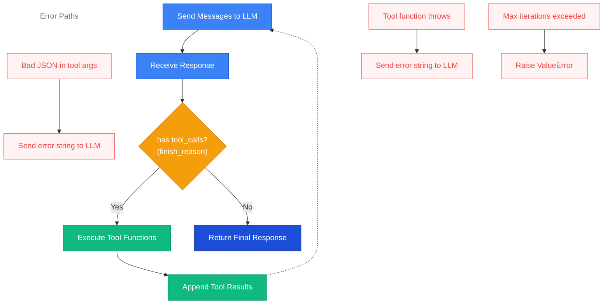

import { Aside, Tabs, TabItem } from '@astrojs/starlight/components';

## Overview

Agent mode provides an **automatic tool-calling loop**. Instead of returning a
single completion, the LLM can request one or more _tool calls_ — function
invocations that Prompty executes on its behalf. The results are appended to the
conversation and the LLM is called again. This cycle repeats until the model
produces a final text response (or a safety limit is hit).

This lets you build agents that can query databases, call APIs, search files, or
perform any action you expose as a Python function — all driven by the LLM's
reasoning.



## Basic Usage

Define one or more Python functions, then pass them to `execute_agent()` along
with a loaded agent. The executor calls the LLM, dispatches any tool requests to
your functions, and loops until the model is done.

<Tabs>
<TabItem label="Python">
```python
import prompty

# 1. Define tool functions
def get_weather(city: str) -> str:
    """Get the current weather for a city."""
    # In reality this would call an API
    return f"72°F and sunny in {city}"

def get_time(timezone: str) -> str:
    """Get the current time in a timezone."""
    return f"3:42 PM in {timezone}"

# 2. Load the agent prompt
agent = prompty.load("agent.prompty")

# 3. Run the agent loop
result = prompty.execute_agent(
    agent,
    inputs={"question": "What's the weather in Seattle?"},
    tools={"get_weather": get_weather, "get_time": get_time},
    max_iterations=10,
)

print(result)  # "It's currently 72°F and sunny in Seattle!"
```
</TabItem>
</Tabs>

<Aside type="tip">
  The `tools` dict maps **tool names** (matching the `name` field in your
  `.prompty` frontmatter) to **callable Python functions**. Names must match
  exactly.
</Aside>

## The `.prompty` File

Agent prompts declare their tools in the frontmatter using `FunctionTool`
entries. The LLM sees these as available functions it can call.

```prompty title="agent.prompty"
---
name: weather-agent
description: An agent that can check weather and time
model:
  id: gpt-4o
  provider: openai
  apiType: chat
  connection:
    kind: key
    endpoint: ${env:OPENAI_API_ENDPOINT:https://api.openai.com/v1}
    apiKey: ${env:OPENAI_API_KEY}
  options:
    temperature: 0
inputSchema:
  properties:
    question:
      kind: string
      description: The user's question
      default: What's the weather?
tools:
  - name: get_weather
    kind: function
    description: Get the current weather for a city
    parameters:
      properties:
        - name: city
          kind: string
          description: City name, e.g. "Seattle"
          required: true
    strict: true
  - name: get_time
    kind: function
    description: Get the current time in a timezone
    parameters:
      properties:
        - name: timezone
          kind: string
          description: IANA timezone, e.g. "America/Los_Angeles"
          required: true
template:
  format:
    kind: jinja2
  parser:
    kind: prompty
---
system:
You are a helpful assistant with access to weather and time tools.
Answer the user's question using the available tools.

user:
{{question}}
```

<Aside type="note">
  The `.prompty` file uses `apiType: chat` — it's a normal chat prompt that
  happens to declare tools. Agent behavior is activated by your calling code:
  use `execute_agent()` (Python) or `executeAgent()` (TypeScript) to enable the
  automatic tool-calling loop. If you use `execute()` instead, tools are sent to
  the LLM but Prompty will **not** automatically execute them — you receive the
  raw `tool_calls` in the response.
</Aside>

## Async Agent Mode

For async applications, use `execute_agent_async()`. Your tool functions can be
either sync or async — the executor detects coroutine functions automatically
and `await`s them.

```python
import asyncio
import prompty

async def get_weather(city: str) -> str:
    """Async weather lookup."""
    # Imagine an async HTTP call here
    return f"72°F and sunny in {city}"

async def main():
    agent = await prompty.load_async("agent.prompty")
    result = await prompty.execute_agent_async(
        agent,
        inputs={"question": "Weather in Tokyo?"},
        tools={"get_weather": get_weather},
        max_iterations=10,
    )
    print(result)

asyncio.run(main())
```

<Aside type="caution">
  In **sync** mode (`execute_agent`), passing an async function raises a
  `ValueError`. Use `execute_agent_async` when any of your tool functions are
  coroutines.
</Aside>

## Error Recovery

The agent loop is designed to be resilient. Instead of crashing on tool
execution errors, it feeds error information back to the LLM so the model can
retry or adjust its approach.

### Bad JSON in Tool Arguments

If the LLM returns malformed JSON in a tool call's `arguments` field, Prompty
catches the `json.JSONDecodeError` and sends the error string back as the tool
result. The model typically corrects the JSON on the next attempt.

```
tool message → "Error parsing arguments: Expecting ',' delimiter: line 1 column 42"
```

### Tool Function Throws an Exception

If your tool function raises any exception, Prompty catches it and sends the
error message back to the LLM as the tool result. This lets the model decide
whether to retry with different arguments or inform the user.

```
tool message → "Error executing get_weather: ConnectionTimeout: API unreachable"
```

### Missing Tool Name

If the LLM requests a tool that doesn't exist in the `tools` dict, an error
message is returned instead of crashing:

```
tool message → "Error: tool 'unknown_tool' not found in tools dict"
```

### Max Iterations Exceeded

If the loop runs for more than `max_iterations` cycles without the model
producing a final response, a `ValueError` is raised. This prevents infinite
loops when the model gets stuck in a tool-calling cycle.

```python
try:
    result = prompty.execute_agent(agent, inputs, tools, max_iterations=5)
except ValueError as e:
    print(e)  # "Agent loop exceeded max_iterations (5)"
```

<Aside type="tip">
  Start with `max_iterations=10` for most use cases. Complex multi-step tasks
  may need 20+. Set it lower in production to bound cost and latency.
</Aside>

## TypeScript Example

<Tabs>
<TabItem label="TypeScript">
```typescript
import { load, executeAgent } from "prompty";

function getWeather(city: string): string {
  return `72°F and sunny in ${city}`;
}

const agent = await load("agent.prompty");
const result = await executeAgent(agent, {
  inputs: { question: "What's the weather in London?" },
  tools: { get_weather: getWeather },
  maxIterations: 10,
});

console.log(result);
```
</TabItem>
</Tabs>

## How It Works Internally

Under the hood, the agent loop in the executor follows these steps:

1. **Collect the full response** — the agent loop works with both streaming and
   non-streaming requests. When streaming is enabled, the loop consumes the
   stream and accumulates tool calls from the streamed chunks. When streaming is
   off, it reads tool calls directly from the response. Either way, tool calls
   are fully collected before any are executed.

2. **Call the LLM** — send the current message list plus tool definitions via
   the chat completions API.

3. **Check `finish_reason`** — if the response's `finish_reason` is
   `"tool_calls"`, the model wants to invoke tools. If it's `"stop"`, the model
   is done.

4. **Extract tool calls** — each tool call has an `id`, a `function.name`, and
   `function.arguments` (a JSON string).

5. **Look up & execute** — for each tool call, find the matching function in the
   `tools` dict (or `agent.metadata["tool_functions"]`), parse the arguments,
   and call the function.

6. **Append results** — add the assistant's tool-call message and one `tool`
   role message per call result back to the conversation.

7. **Repeat** — go back to step 2 with the updated message list.

8. **Return** — when the model produces a final response (no tool calls), pass
   it through the processor and return the result.

```python
# Simplified pseudocode of the agent loop
messages = prepare(agent, inputs)
for i in range(max_iterations):
    response = client.chat.completions.create(
        model=agent.model.id,
        messages=messages,
        tools=tool_definitions,
    )
    if response.finish_reason != "tool_calls":
        return process(response)

    # Execute each tool call
    messages.append(response.message)
    for tool_call in response.tool_calls:
        result = tools[tool_call.function.name](**tool_call.args)
        messages.append({"role": "tool", "tool_call_id": tool_call.id, "content": result})

raise ValueError(f"Agent loop exceeded max_iterations ({max_iterations})")
```

## Tips

- **Keep tool descriptions clear and concise.** The LLM uses the `description`
  field to decide when to call a tool. Vague descriptions lead to incorrect or
  missed tool calls.

- **Use `strict: true` on `FunctionTool`.** This enables OpenAI's structured
  output mode for tool parameters, ensuring the model produces valid JSON
  matching your schema. It requires all parameters to be `required` and adds
  `additionalProperties: false` automatically.

- **Set a reasonable `max_iterations`.** Most tool-using conversations complete
  in 2–5 iterations. Setting the limit too high risks runaway costs; setting it
  too low may cut off legitimate multi-step reasoning.

- **Return structured strings from tools.** The LLM processes your tool's return
  value as text. Returning well-formatted data (JSON, key-value pairs) helps the
  model extract information accurately.

- **Test with mocked tools first.** Use simple stub functions that return
  hardcoded data while developing your prompt. Switch to real implementations
  once the agent's reasoning flow is solid.
