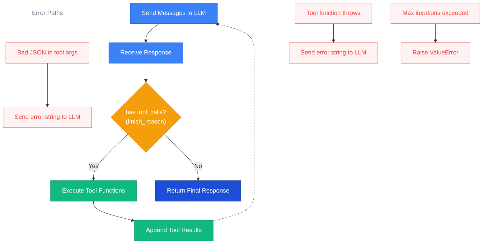

import { Aside, Tabs, TabItem } from '@astrojs/starlight/components';

## Overview

Agent mode provides an **automatic tool-calling loop**. Instead of returning a
single completion, the LLM can request one or more _tool calls_ — function
invocations that Prompty executes on its behalf. The results are appended to the
conversation and the LLM is called again. This cycle repeats until the model
produces a final text response (or a safety limit is hit).

This lets you build agents that can query databases, call APIs, search files, or
perform any action you expose as a Python function — all driven by the LLM's
reasoning.



## Basic Usage

Define one or more tool functions, then pass them to `turn()` along
with a loaded agent. The executor calls the LLM, dispatches any tool requests to
your functions, and loops until the model is done.

<Tabs>
<TabItem label="Python">
```python
from prompty import load, turn, tool, bind_tools

# 1. Define tool functions with @tool
@tool
def get_weather(city: str) -> str:
    """Get the current weather for a city."""
    return f"72°F and sunny in {city}"

@tool
def get_time(timezone: str) -> str:
    """Get the current time in a timezone."""
    return f"3:42 PM in {timezone}"

# 2. Load the agent prompt
agent = load("agent.prompty")

# 3. Validate handlers against the .prompty declarations
tools = bind_tools(agent, [get_weather, get_time])

# 4. Run the agent loop
result = turn(
    agent,
    inputs={"question": "What's the weather in Seattle?"},
    tools=tools,
    max_iterations=10,
    max_llm_retries=3,
)

print(result)  # "It's currently 72°F and sunny in Seattle!"
```
</TabItem>
<TabItem label="TypeScript">
```typescript
import { load, turn, tool, bindTools } from "@prompty/core";

// 1. Define tool functions with tool()
const getWeather = tool(
  (city: string) => `72°F and sunny in ${city}`,
  {
    name: "get_weather",
    description: "Get the current weather for a city",
    parameters: [{ name: "city", kind: "string", required: true }],
  },
);

const getTime = tool(
  (timezone: string) => `3:42 PM in ${timezone}`,
  {
    name: "get_time",
    description: "Get the current time in a timezone",
    parameters: [{ name: "timezone", kind: "string", required: true }],
  },
);

// 2. Load the agent prompt
const agent = await load("agent.prompty");

// 3. Validate handlers against the .prompty declarations
const tools = bindTools(agent, [getWeather, getTime]);

// 4. Run the agent loop
const result = await turn(
  agent,
  { question: "What's the weather in Seattle?" },
  { tools, maxIterations: 10, maxLlmRetries: 3 },
);

console.log(result); // "It's currently 72°F and sunny in Seattle!"
```
</TabItem>
<TabItem label="C#">
```csharp
using Prompty.Core;

// 1. Define tool functions with [Tool]
public class AssistantTools
{
    [Tool(Name = "get_weather", Description = "Get the current weather")]
    public string GetWeather(string city)
    {
        return $"72°F and sunny in {city}";
    }

    [Tool(Name = "get_time", Description = "Get the current time")]
    public string GetTime(string timezone)
    {
        return $"3:42 PM in {timezone}";
    }
}

// 2. Load the agent prompt
var agent = PromptyLoader.Load("agent.prompty");

// 3. Validate [Tool] methods against agent.Tools declarations
var service = new AssistantTools();
var tools = ToolAttribute.BindTools(agent, service);

// 4. Run the agent loop
var result = await Pipeline.TurnAsync(
    agent,
    new() { ["question"] = "What's the weather in Seattle?" },
    tools: tools,
    maxIterations: 10,
    maxLlmRetries: 3
);

Console.WriteLine(result); // "It's currently 72°F and sunny in Seattle!"
```
</TabItem>
<TabItem label="Rust">
```rust
use prompty::TurnOptions;
use serde_json::json;

// 1. Register tool handlers
prompty::register_tool_handler("get_weather", |args| {
    Box::pin(async move {
        let city = args["city"].as_str().unwrap_or("unknown");
        Ok(json!(format!("72°F and sunny in {city}")))
    })
});

prompty::register_tool_handler("get_time", |args| {
    Box::pin(async move {
        let tz = args["timezone"].as_str().unwrap_or("unknown");
        Ok(json!(format!("3:42 PM in {tz}")))
    })
});

// 2. Load the agent prompt
let agent = prompty::load("agent.prompty")?;

// 3. Run the agent loop
let options = TurnOptions {
    max_iterations: Some(10),
    max_llm_retries: Some(3),
    ..Default::default()
};

let result = prompty::turn(
    &agent,
    Some(&json!({"question": "What's the weather in Seattle?"})),
    Some(options),
).await?;

println!("{result}"); // "It's currently 72°F and sunny in Seattle!"
```
</TabItem>
</Tabs>

<Aside type="tip">
  `bind_tools` validates that each handler name matches a `kind: "function"` tool
  declared in the `.prompty` frontmatter. If names don't match, you get an immediate
  error instead of a silent runtime failure.
</Aside>

## The `.prompty` File

Agent prompts declare their tools in the frontmatter using `FunctionTool`
entries. The LLM sees these as available functions it can call.

```prompty title="agent.prompty"
---
name: weather-agent
description: An agent that can check weather and time
model:
  id: gpt-4o
  provider: openai
  apiType: chat
  connection:
    kind: key
    endpoint: ${env:OPENAI_API_ENDPOINT:https://api.openai.com/v1}
    apiKey: ${env:OPENAI_API_KEY}
  options:
    temperature: 0
inputs:
  question:
    kind: string
    description: The user's question
    default: What's the weather?
tools:
  - name: get_weather
    kind: function
    description: Get the current weather for a city
    parameters:
      - name: city
        kind: string
        description: City name, e.g. "Seattle"
        required: true
    strict: true
  - name: get_time
    kind: function
    description: Get the current time in a timezone
    parameters:
      - name: timezone
        kind: string
        description: IANA timezone, e.g. "America/Los_Angeles"
        required: true
---
system:
You are a helpful assistant with access to weather and time tools.
Answer the user's question using the available tools.

user:
{{question}}
```

<Aside type="note">
  The `.prompty` file uses `apiType: chat` — it's a normal chat prompt that
  happens to declare tools. Agent behavior is activated by your calling code:
  use `turn()` (Python) or `turn()` (TypeScript) to enable the automatic
  tool-calling loop — it runs prepare + the agent loop with tools + process.
  If you use `invoke()` instead, it runs the one-shot pipeline
  (load → prepare → execute → process) — tools are sent to the LLM but
  Prompty will **not** automatically execute them, and you receive the raw
  `tool_calls` in the response.
</Aside>

## Async Agent Mode

For async applications, use `turn_async()`. Your tool functions can be
either sync or async — the executor detects coroutine functions automatically
and `await`s them.

```python
import asyncio
import prompty

async def get_weather(city: str) -> str:
    """Async weather lookup."""
    # Imagine an async HTTP call here
    return f"72°F and sunny in {city}"

async def main():
    agent = await prompty.load_async("agent.prompty")
    result = await prompty.turn_async(
        agent,
        inputs={"question": "Weather in Tokyo?"},
        tools={"get_weather": get_weather},
        max_iterations=10,
    )
    print(result)

asyncio.run(main())
```

<Aside type="caution">
  In **sync** mode (`turn`), passing an async function raises a
  `ValueError`. Use `turn_async` when any of your tool functions are
  coroutines.
</Aside>

## Error Recovery & Resilience

The agent loop is designed to be resilient at three levels: malformed tool
arguments, tool execution failures, and transient LLM errors. Instead of
crashing, the loop recovers and feeds error information back to the LLM so
the model can retry or adjust its approach.

### §9.8 — Resilient Argument Parsing

LLMs sometimes return malformed JSON in tool call arguments — markdown code
fences wrapping JSON, trailing commas, or JSON embedded in prose. Prompty
uses a four-strategy fallback chain before giving up:

1. **Direct parse** — try `JSON.parse` as-is
2. **Strip markdown fences** — remove `` ```json ... ``` `` wrappers
3. **Extract first JSON block** — find the first `{` to its matching `}`
4. **Strip trailing commas** — remove `,` before `}` or `]`

If all four strategies fail, the parse error is sent back to the LLM as a
tool result string (never a silent empty `{}`). The model typically corrects
the JSON on the next attempt.

```
tool message → "Error: Invalid JSON in tool arguments: Expecting ',' delimiter: line 1 column 42"
```

### §9.9 — Tool Execution Error Safety

If your tool function raises any exception (or panics in Rust), Prompty
catches it and sends the error message back to the LLM as the tool result.
The agent loop **never** terminates due to a tool handler failure — the
model decides whether to retry with different arguments or inform the user.

```
tool message → "Error: Tool 'get_weather' failed: ConnectionTimeout: API unreachable"
```

### §9.10 — LLM Call Retry

Transient LLM failures (429 rate limits, 500 server errors) can derail a
long and expensive agent loop. Prompty retries the LLM call with exponential
backoff before giving up — preserving the conversation state accumulated
across iterations.

| Parameter | Default | Description |
|-----------|---------|-------------|
| `max_llm_retries` | `3` | Maximum retry attempts per LLM call |

The backoff formula is `min(2^attempt + jitter, 60s)` — exponential with
random jitter, capped at 60 seconds.

When all retries are exhausted, Prompty raises an `ExecuteError` that
**includes the full conversation history**. This lets you resume a failed
agent loop without losing work:

<Tabs>
<TabItem label="Python">
```python
from prompty import turn, ExecuteError

try:
    result = turn(
        "agent.prompty",
        inputs={"question": "Plan my trip"},
        tools=tools,
        max_llm_retries=3,
    )
except ExecuteError as e:
    print(f"Failed after retries: {e}")
    # e.messages contains the full conversation — resume later
    saved_messages = e.messages
```
</TabItem>
<TabItem label="TypeScript">
```typescript
import { turn, ExecuteError } from "@prompty/core";

try {
  const result = await turn(agent, inputs, {
    tools,
    maxLlmRetries: 3,
  });
} catch (e) {
  if (e instanceof ExecuteError) {
    console.log(`Failed after retries: ${e.message}`);
    // e.messages contains the full conversation — resume later
    const savedMessages = e.messages;
  }
}
```
</TabItem>
<TabItem label="C#">
```csharp
try
{
    var result = await Pipeline.TurnAsync(
        agent, inputs, tools: tools, maxLlmRetries: 3);
}
catch (ExecuteError e)
{
    Console.WriteLine($"Failed after retries: {e.Message}");
    // e.Messages contains the full conversation — resume later
    var savedMessages = e.Messages;
}
```
</TabItem>
<TabItem label="Rust">
```rust
use prompty::{TurnOptions, InvokerError};

let options = TurnOptions {
    max_llm_retries: Some(3),
    ..Default::default()
};

match prompty::turn(&agent, Some(&inputs), Some(options)).await {
    Ok(result) => println!("{result}"),
    Err(InvokerError::ExecuteRetryExhausted { message, messages }) => {
        eprintln!("Failed after retries: {message}");
        // messages contains the full conversation — resume later
    }
    Err(e) => eprintln!("Other error: {e}"),
}
```
</TabItem>
</Tabs>

### Missing Tool Name

If the LLM requests a tool that doesn't exist in the `tools` dict, an error
message is returned instead of crashing:

```
tool message → "Error: tool 'unknown_tool' not found in tools dict"
```

### Max Iterations Exceeded

If the loop runs for more than `max_iterations` cycles without the model
producing a final response, a `ValueError` is raised. This prevents infinite
loops when the model gets stuck in a tool-calling cycle.

```python
try:
    result = prompty.turn(agent, inputs, tools, max_iterations=5)
except ValueError as e:
    print(e)  # "Agent loop exceeded max_iterations (5)"
```

<Aside type="tip">
  Start with `max_iterations=10` for most use cases. Complex multi-step tasks
  may need 20+. Set it lower in production to bound cost and latency.
</Aside>

## TypeScript Example

<Tabs>
<TabItem label="TypeScript">
```typescript
import { load, turn, tool, bindTools } from "@prompty/core";

const getWeather = tool(
  (city: string) => `72°F and sunny in ${city}`,
  {
    name: "get_weather",
    description: "Get the current weather",
    parameters: [{ name: "city", kind: "string", required: true }],
  },
);

const agent = await load("agent.prompty");
const tools = bindTools(agent, [getWeather]);

const result = await turn(agent, {
  question: "What's the weather in London?",
}, { tools, maxIterations: 10, maxLlmRetries: 3 });

console.log(result);
```
</TabItem>
<TabItem label="C#">
```csharp
using Prompty.Core;

public class WeatherTools
{
    [Tool(Name = "get_weather", Description = "Get the current weather")]
    public string GetWeather(string city) => $"72°F and sunny in {city}";
}

var agent = PromptyLoader.Load("agent.prompty");
var service = new WeatherTools();
var tools = ToolAttribute.BindTools(agent, service);

var result = await Pipeline.TurnAsync(
    agent,
    new() { ["question"] = "What's the weather in London?" },
    tools: tools,
    maxIterations: 10,
    maxLlmRetries: 3
);

Console.WriteLine(result);
```
</TabItem>
<TabItem label="Rust">
```rust
use prompty::TurnOptions;
use serde_json::json;

prompty::register_tool_handler("get_weather", |args| {
    Box::pin(async move {
        let city = args["city"].as_str().unwrap_or("unknown");
        Ok(json!(format!("72°F and sunny in {city}")))
    })
});

let agent = prompty::load("agent.prompty")?;

let options = TurnOptions {
    max_iterations: Some(10),
    max_llm_retries: Some(3),
    ..Default::default()
};

let result = prompty::turn(
    &agent,
    Some(&json!({"question": "What's the weather in London?"})),
    Some(options),
).await?;

println!("{result}");
```
</TabItem>
</Tabs>

## How It Works Internally

Under the hood, the agent loop in the executor follows these steps:

1. **Collect the full response** — the agent loop works with both streaming and
   non-streaming requests. When streaming is enabled, the loop consumes the
   stream and accumulates tool calls from the streamed chunks. When streaming is
   off, it reads tool calls directly from the response. Either way, tool calls
   are fully collected before any are executed.

2. **Call the LLM (with retry)** — send the current message list plus tool
   definitions via the chat completions API. If the call fails, retry with
   exponential backoff up to `max_llm_retries` times (§9.10).

3. **Check `finish_reason`** — if the response's `finish_reason` is
   `"tool_calls"`, the model wants to invoke tools. If it's `"stop"`, the model
   is done.

4. **Extract tool calls** — each tool call has an `id`, a `function.name`, and
   `function.arguments` (a JSON string).

5. **Parse arguments (resilient)** — parse the JSON arguments using the
   four-strategy fallback chain (§9.8). If all strategies fail, send the
   error back to the LLM as a tool result.

6. **Execute (with error safety)** — for each tool call, find the matching
   function and call it. If the function throws, catch the error and send it
   back to the LLM as a tool result (§9.9) — the loop continues.

7. **Append results** — add the assistant's tool-call message and one `tool`
   role message per call result back to the conversation.

8. **Repeat** — go back to step 2 with the updated message list.

9. **Return** — when the model produces a final response (no tool calls), pass
   it through the processor and return the result.

```python
# Simplified pseudocode of the agent loop (with resilience)
from prompty import ExecuteError
from prompty.core.tool_dispatch import resilient_json_parse

messages = prepare(agent, inputs)
for i in range(max_iterations):
    # LLM call with retry (§9.10)
    for attempt in range(max_llm_retries):
        try:
            response = client.chat.completions.create(
                model=agent.model.id, messages=messages, tools=tool_defs)
            break
        except Exception as e:
            if attempt + 1 >= max_llm_retries:
                raise ExecuteError(str(e), messages=messages)
            time.sleep(min(2 ** (attempt + 1) + random(), 60))

    if response.finish_reason != "tool_calls":
        return process(response)

    messages.append(response.message)
    for tool_call in response.tool_calls:
        # Resilient parsing (§9.8)
        args = resilient_json_parse(tool_call.function.arguments)
        try:
            # Error safety (§9.9) — catch tool failures
            result = tools[tool_call.function.name](**args)
        except Exception as e:
            result = f"Error: Tool '{tool_call.function.name}' failed: {e}"
        messages.append({"role": "tool", "tool_call_id": tool_call.id, "content": str(result)})

raise ValueError(f"Agent loop exceeded max_iterations ({max_iterations})")
```

## Tips

- **Keep tool descriptions clear and concise.** The LLM uses the `description`
  field to decide when to call a tool. Vague descriptions lead to incorrect or
  missed tool calls.

- **Use `strict: true` on `FunctionTool`.** This enables OpenAI's structured
  output mode for tool parameters, ensuring the model produces valid JSON
  matching your schema. It requires all parameters to be `required` and adds
  `additionalProperties: false` automatically.

- **Set a reasonable `max_iterations`.** Most tool-using conversations complete
  in 2–5 iterations. Setting the limit too high risks runaway costs; setting it
  too low may cut off legitimate multi-step reasoning.

- **Return structured strings from tools.** The LLM processes your tool's return
  value as text. Returning well-formatted data (JSON, key-value pairs) helps the
  model extract information accurately.

- **Test with mocked tools first.** Use simple stub functions that return
  hardcoded data while developing your prompt. Switch to real implementations
  once the agent's reasoning flow is solid.
