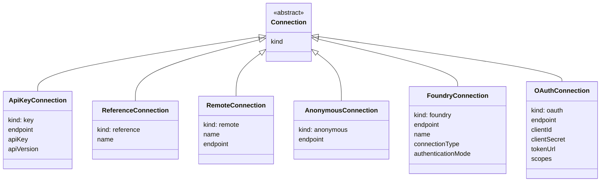
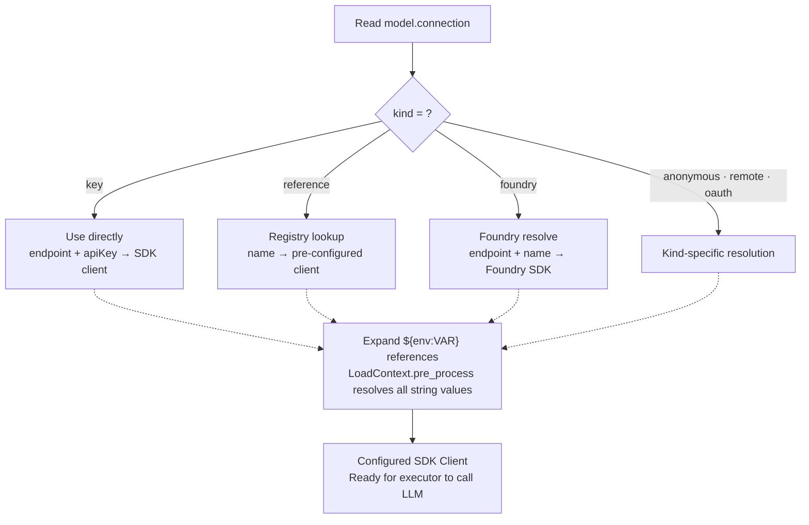

import { Aside, Tabs, TabItem } from '@astrojs/starlight/components';

## Overview

Connections define **how Prompty authenticates with LLM providers**. Every
`.prompty` file can specify a connection inside its `model.connection`
frontmatter block. The connection tells the runtime where to send requests and
how to authenticate.

```yaml
model:
  id: gpt-4o
  provider: foundry
  connection:          # ← this section
    kind: key
    endpoint: https://my-resource.services.ai.azure.com/api/projects/my-project
    apiKey: ${env:AZURE_AI_PROJECT_KEY}
```

Prompty ships six connection types — each backed by a corresponding AgentSchema
class — so you can match the auth strategy to your environment.

---

## Connection Types at a Glance



---

## ApiKeyConnection — `kind: key`

The simplest connection: provide an endpoint and an API key. Ideal for **local
development** and quick experiments.

```yaml
model:
  id: gpt-4o
  provider: openai
  connection:
    kind: key
    endpoint: https://api.openai.com/v1
    apiKey: ${env:OPENAI_API_KEY}
```

For **Microsoft Foundry**, set the endpoint to your Foundry project or classic Azure resource:

```yaml
model:
  id: gpt-4o
  provider: foundry
  connection:
    kind: key
    endpoint: ${env:AZURE_AI_PROJECT_ENDPOINT}
    apiKey: ${env:AZURE_AI_PROJECT_KEY}
```

You can also use a classic Azure OpenAI endpoint with the Foundry provider:

```yaml
model:
  id: gpt-4o
  provider: foundry
  connection:
    kind: key
    endpoint: ${env:AZURE_OPENAI_ENDPOINT}
    apiKey: ${env:AZURE_OPENAI_API_KEY}
```

For **Anthropic**, use `provider: anthropic` with your Anthropic API key:

```yaml
model:
  id: claude-sonnet-4-20250514
  provider: anthropic
  connection:
    kind: key
    endpoint: https://api.anthropic.com
    apiKey: ${env:ANTHROPIC_API_KEY}
```

<Aside type="tip">
  Always use `${env:VAR}` references instead of hardcoding secrets. The runtime
  resolves them from your environment (or a `.env` file) at load time.
</Aside>

---

## ReferenceConnection — `kind: reference`

References a **pre-registered SDK client** by name. This is the recommended
pattern for **production** because it supports Azure AD, managed identity,
custom retry policies, and any authentication method the SDK supports.

```yaml
model:
  id: gpt-4o
  provider: foundry
  connection:
    kind: reference
    name: my-foundry-client
```

Register the client at application startup:

<Tabs>
  <TabItem label="Python">
    ```python
    from openai import AzureOpenAI
    import prompty

    prompty.register_connection("my-foundry-client", client=AzureOpenAI(
        azure_endpoint="https://my-resource.services.ai.azure.com/api/projects/my-project",
        api_key="...",
    ))
    ```
  </TabItem>
  <TabItem label="TypeScript">
    ```typescript
    import { AzureOpenAI } from "openai";
    import { registerConnection } from "@prompty/core";
    import "@prompty/foundry";

    registerConnection("my-azure-client", new AzureOpenAI({
      endpoint: "https://my-resource.openai.azure.com/",
      apiKey: "...",
    }));
    ```
  </TabItem>
</Tabs>

The executor looks up `"my-azure-client"` in the connection registry and uses
the pre-configured SDK client directly — no additional auth logic is needed in
the `.prompty` file.

<Aside type="note">
  Because the client is constructed in application code, you have full control
  over authentication, retries, timeouts, and custom headers — things that can't
  be expressed in YAML alone.
</Aside>

---

## RemoteConnection — `kind: remote`

A named endpoint reference for **remote model-serving services**. Useful when
you have a separate inference service behind a gateway.

```yaml
model:
  id: my-fine-tuned-model
  provider: openai
  connection:
    kind: remote
    name: my-service
    endpoint: https://my-model.azurewebsites.net
```

---

## AnonymousConnection — `kind: anonymous`

Endpoint only — **no authentication**. Perfect for self-hosted models like
[Ollama](https://ollama.com/) or [vLLM](https://vllm.ai/) running locally.

```yaml
model:
  id: llama3
  provider: openai
  connection:
    kind: anonymous
    endpoint: http://localhost:11434/v1
```

<Aside type="caution">
  Only use anonymous connections with trusted local endpoints. Never expose
  unauthenticated model endpoints to the public internet.
</Aside>

---

## FoundryConnection — `kind: foundry`

Integrates with **Microsoft Foundry** for managed model deployments, including
serverless and managed-compute endpoints.

```yaml
model:
  id: gpt-4o
  provider: foundry
  connection:
    kind: foundry
    endpoint: ${env:FOUNDRY_ENDPOINT}
    name: my-deployment
    connectionType: serverless
```

| Field              | Description                                              |
| ------------------ | -------------------------------------------------------- |
| `endpoint`         | Foundry project endpoint                                 |
| `name`             | Deployment name within the Foundry project               |
| `connectionType`   | `serverless` or `managedCompute`                         |
| `authenticationMode` | Optional — override default Foundry authentication     |

---

## OAuthConnection — `kind: oauth`

OAuth 2.0 **client credentials flow** for services that require token-based
authentication.

```yaml
model:
  id: my-model
  provider: openai
  connection:
    kind: oauth
    endpoint: https://api.example.com
    clientId: ${env:CLIENT_ID}
    clientSecret: ${env:CLIENT_SECRET}
    tokenUrl: https://auth.example.com/token
    scopes:
      - api.read
```

| Field          | Description                                 |
| -------------- | ------------------------------------------- |
| `clientId`     | OAuth 2.0 client identifier                 |
| `clientSecret` | OAuth 2.0 client secret                     |
| `tokenUrl`     | Token endpoint URL                          |
| `scopes`       | List of scopes to request                   |
| `endpoint`     | The model-serving endpoint to call          |

---

## Connection Resolution Flow

The following diagram shows how the runtime resolves a connection when a
`.prompty` file is loaded and executed.



---

## Connection Registry

For production workloads you'll typically use `kind: reference` combined with a
**connection registry** configured at application startup. This keeps secrets
and complex auth logic in application code — not in YAML.

<Tabs>
  <TabItem label="Python">
    ```python
    import os
    import prompty
    from openai import AzureOpenAI
    from azure.identity import DefaultAzureCredential, get_bearer_token_provider

    # Build a client with Azure AD token-based auth
    client = AzureOpenAI(
        azure_endpoint=os.environ["AZURE_ENDPOINT"],
        azure_ad_token_provider=get_bearer_token_provider(
            DefaultAzureCredential(),
            "https://cognitiveservices.azure.com/.default",
        ),
    )

    # Register it by name — .prompty files reference this name
    prompty.register_connection("foundry-prod", client=client)
    ```
  </TabItem>
  <TabItem label="TypeScript">
    ```typescript
    import { AzureOpenAI } from "openai";
    import { DefaultAzureCredential, getBearerTokenProvider } from "@azure/identity";
    import { registerConnection } from "@prompty/core";
    import "@prompty/foundry";

    // Build a client with Azure AD token-based auth
    const credential = new DefaultAzureCredential();
    const scope = "https://cognitiveservices.azure.com/.default";
    const azureADTokenProvider = getBearerTokenProvider(credential, scope);

    const client = new AzureOpenAI({
      endpoint: process.env.AZURE_ENDPOINT!,
      azureADTokenProvider,
    });

    // Register it by name — .prompty files reference this name
    registerConnection("foundry-prod", client);
    ```
  </TabItem>
</Tabs>

Then in your `.prompty` file:

```yaml
model:
  id: gpt-4o
  provider: foundry
  connection:
    kind: reference
    name: foundry-prod
```

<Aside type="tip">
  The connection registry is an in-process dictionary. Register connections once
  at startup (e.g., in your FastAPI `lifespan`, Django `AppConfig.ready()`, or
  `__main__` block) before calling `prompty.run()`.
</Aside>

---

## Environment Variable Resolution

All string values in the frontmatter support `${env:VAR}` references. The
runtime resolves them at load time via `LoadContext.pre_process`.

| Syntax                  | Behavior                                              |
| ----------------------- | ----------------------------------------------------- |
| `${env:VAR}`            | Reads `VAR` from the environment. Raises `ValueError` if unset. |
| `${env:VAR:default}`    | Falls back to `default` when `VAR` is unset.          |

```yaml
model:
  connection:
    kind: key
    endpoint: ${env:OPENAI_ENDPOINT:https://api.openai.com/v1}
    apiKey: ${env:OPENAI_API_KEY}
```

Environment variables are loaded from a `.env` file (via `python-dotenv`) if one
exists alongside the `.prompty` file or in a parent directory.

---

## Which Connection Should I Use?

<Tabs>
  <TabItem label="Local Development">
    Use **`kind: key`** with environment variables. It's the fastest way to get
    started and keeps secrets out of source control.

    ```yaml
    model:
      connection:
        kind: key
        endpoint: ${env:OPENAI_ENDPOINT:https://api.openai.com/v1}
        apiKey: ${env:OPENAI_API_KEY}
    ```
  </TabItem>
  <TabItem label="Production (Azure AD)">
    Use **`kind: reference`** with the connection registry. Register an
    `AzureOpenAI` client backed by `DefaultAzureCredential` at startup.

    ```yaml
    model:
      connection:
        kind: reference
        name: foundry-prod
    ```
  </TabItem>
  <TabItem label="Microsoft Foundry">
    Use **`kind: foundry`** to connect directly to a Foundry-managed
    deployment — serverless or managed compute.

    ```yaml
    model:
      connection:
        kind: foundry
        endpoint: ${env:FOUNDRY_ENDPOINT}
        name: my-deployment
    ```
  </TabItem>
  <TabItem label="Self-Hosted Models">
    Use **`kind: anonymous`** for local inference servers like Ollama or vLLM
    that don't require authentication.

    ```yaml
    model:
      connection:
        kind: anonymous
        endpoint: http://localhost:11434/v1
    ```
  </TabItem>
  <TabItem label="OAuth Services">
    Use **`kind: oauth`** for services that require an OAuth 2.0 client
    credentials flow.

    ```yaml
    model:
      connection:
        kind: oauth
        endpoint: https://api.example.com
        clientId: ${env:CLIENT_ID}
        clientSecret: ${env:CLIENT_SECRET}
        tokenUrl: https://auth.example.com/token
        scopes:
          - api.read
    ```
  </TabItem>
</Tabs>

### Quick Decision Guide

| Scenario                      | Connection Kind | Why                                       |
| ----------------------------- | --------------- | ----------------------------------------- |
| Local dev with API key        | `key`           | Simplest setup, env-var-based secrets     |
| Anthropic (Claude)            | `key`           | API key auth with `provider: anthropic`   |
| Production with Azure AD      | `reference`     | Full SDK control, managed identity        |
| Microsoft Foundry deployments  | `foundry`       | Native Foundry service integration        || Self-hosted (Ollama, vLLM)    | `anonymous`     | No auth needed for local endpoints        |
| OAuth 2.0 services            | `oauth`         | Client credentials token flow             |
| Remote gateway / proxy        | `remote`        | Named endpoint reference                  |
