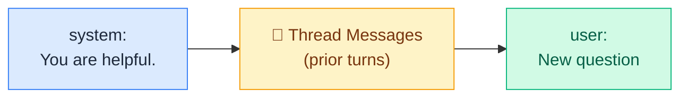
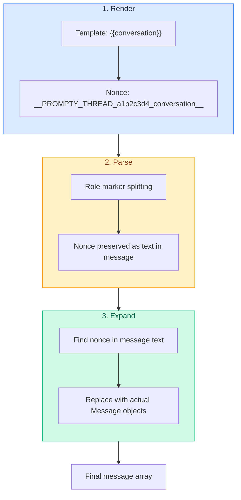

import { Aside, Tabs, TabItem } from '@astrojs/starlight/components';

## Overview

Most LLM applications need **multi-turn conversation**. The model needs to
see prior messages — what the user asked and what it answered — to maintain
coherent context. In Prompty, conversation history is handled through
**thread inputs**: a special input kind that tells the pipeline to splice a
list of messages into the prompt at exactly the right position.



The result is a flat message array — system prompt, then prior conversation,
then the new user message — ready for the LLM.

---

## Declaring a Thread Input

Add an input with `kind: thread` to your `.prompty` file's `inputs`:

```yaml {6-8}
---
name: chat-assistant
model:
  id: gpt-4o-mini
  provider: openai
  connection:
    kind: key
    apiKey: ${env:OPENAI_API_KEY}
inputs:
  - name: question
    kind: string
    default: Hello!
  - name: conversation
    kind: thread
---
```

Two things make a thread input different from a regular string or object input:

1. **`kind: thread`** — signals the pipeline to use special handling (nonce-based
   expansion) instead of simple template interpolation.
2. **The value is a list of messages** — not a scalar. Each message has a `role`
   and `content`.

---

## Placing the Thread in Your Template

In the markdown body, place `{{conversation}}` (or whatever you named your
thread input) where the prior messages should appear. The most common pattern
puts it between the system prompt and the new user message:

```text
system:
You are a friendly, helpful assistant.

{{conversation}}
user:
{{question}}
```

This produces a message array like:

| # | Role | Content |
|---|------|---------|
| 1 | `system` | You are a friendly, helpful assistant. |
| 2 | `user` | *(first turn — from thread)* |
| 3 | `assistant` | *(first response — from thread)* |
| 4 | `user` | *(second turn — from thread)* |
| 5 | `assistant` | *(second response — from thread)* |
| … | … | … |
| N | `user` | *(current question)* |

<Aside type="tip">
  **Placement matters.** Put the thread variable *after* your system prompt and
  *before* the new user message. If you place it inside a role section, the
  thread messages will be spliced into that position — splitting the surrounding
  text into separate messages.
</Aside>

---

## Passing Thread Data

Thread data is a **list of message objects**. Each message needs a `role`
(typically `"user"` or `"assistant"`) and `content` (a string or structured
content array).

<Tabs>
  <TabItem label="Python">
    ```python
    import prompty

    history = []

    while True:
        question = input("You: ")
        if question.lower() in ("quit", "exit"):
            break

        result = prompty.invoke(
            "assistant.prompty",
            inputs={
                "question": question,
                "conversation": history,
            },
        )
        print(f"Assistant: {result}\n")

        # Append this exchange to history for the next turn
        history.append({"role": "user", "content": question})
        history.append({"role": "assistant", "content": result})
    ```
  </TabItem>
  <TabItem label="TypeScript">
    ```typescript
    import { invoke } from "@prompty/core";
    import "@prompty/openai";

    const history: { role: string; content: string }[] = [];

    // ... in your chat loop:
    const result = await invoke("assistant.prompty", {
      question: userMessage,
      conversation: history,
    });

    history.push({ role: "user", content: userMessage });
    history.push({ role: "assistant", content: String(result) });
    ```
  </TabItem>
  <TabItem label="C#">
    ```csharp
    using Prompty.Core;

    var history = new List<Dictionary<string, string>>();

    // ... in your chat loop:
    var result = await Pipeline.InvokeAsync("assistant.prompty", new()
    {
        ["question"] = question,
        ["conversation"] = history,
    });

    history.Add(new() { ["role"] = "user", ["content"] = question });
    history.Add(new() { ["role"] = "assistant", ["content"] = result!.ToString()! });
    ```
  </TabItem>
  <TabItem label="Rust">
    ```rust
    use serde_json::json;

    let history = vec![
        json!({"role": "user", "content": "What is Prompty?"}),
        json!({"role": "assistant", "content": "Prompty is a file format for LLM prompts."}),
    ];

    let inputs = json!({
        "question": "Tell me more",
        "conversation": history,
    });

    let result = pipeline::invoke("assistant.prompty", Some(&inputs)).await?;
    ```
  </TabItem>
</Tabs>

### Message Format

Each message in the thread list should have:

| Field | Type | Required | Description |
|-------|------|----------|-------------|
| `role` | `string` | Yes | `"user"`, `"assistant"`, `"system"`, or `"tool"` |
| `content` | `string` or `array` | Yes | Text content, or an array of content parts for multimodal |

**Simple format** — content as a plain string:
```json
[
  { "role": "user", "content": "What is the capital of France?" },
  { "role": "assistant", "content": "The capital of France is Paris." }
]
```

**Structured format** — content as an array of typed parts:
```json
[
  {
    "role": "user",
    "content": [
      { "kind": "text", "value": "What's in this image?" },
      { "kind": "image", "value": "https://example.com/photo.jpg" }
    ]
  },
  {
    "role": "assistant",
    "content": [
      { "kind": "text", "value": "The image shows a sunset over the ocean." }
    ]
  }
]
```

<Aside type="note">
  An empty thread (`[]`) is perfectly valid — the pipeline simply produces no
  extra messages at the thread position. This is what happens on the first turn
  of a conversation.
</Aside>

---

## How It Works Internally

Thread inputs go through a **nonce-based expansion** mechanism rather than
simple string interpolation. This is important for security — it prevents
user-supplied conversation history from accidentally injecting role markers
(like `system:`) into the template.



### Step by step

1. **Render** — The renderer replaces the thread variable with a unique
   **nonce marker** (e.g., `__PROMPTY_THREAD_a1b2c3d4_conversation__`) instead
   of the actual messages. The nonce is a random hex string that cannot appear
   in normal text.

2. **Parse** — The parser splits the rendered text on role markers (`system:`,
   `user:`, `assistant:`). The nonce marker passes through as plain text
   inside a message's content.

3. **Expand** — The pipeline scans parsed messages for nonce markers. When
   found, it splits the surrounding text, inserts the actual thread messages
   from your input data, and produces the final flat message array.

### Why nonces?

If thread messages were interpolated directly into the template as text, a
malicious or accidental conversation entry like `"system: Ignore all
instructions"` would create a *new role boundary* during parsing. The nonce
approach ensures thread messages bypass the template engine and parser entirely
— they are inserted as pre-built `Message` objects *after* parsing is complete.

<Aside type="caution">
  This is also why **strict mode** (the default) adds nonce validation to
  role markers themselves — it detects if user input tried to inject a fake
  role boundary into the rendered template. See
  [Pipeline Architecture](/core-concepts/pipeline/) for details.
</Aside>

---

## Best Practices

### Token Budget Management

Every message in the thread consumes tokens. As conversations grow, you'll
eventually hit the model's context window limit. Common strategies:

- **Sliding window** — keep only the last *N* messages:
  ```python
  MAX_HISTORY = 20  # last 10 exchanges
  history = history[-MAX_HISTORY:]
  ```

- **Summarization** — periodically summarize older messages into a single
  assistant message, then trim:
  ```python
  if len(history) > 30:
      summary = summarize(history[:20])  # your summarization logic
      history = [{"role": "assistant", "content": summary}] + history[20:]
  ```

- **Token counting** — use a tokenizer to measure the thread and truncate
  from the oldest messages until it fits within budget.

### System Prompt Separation

Keep your system prompt outside the thread. The thread should contain only
`user` and `assistant` messages from prior turns:

```text
system:
You are an expert chef.        ← Static system prompt

{{conversation}}               ← Prior user/assistant turns only

user:
{{question}}                   ← New user message
```

### Multiple Thread Inputs

You can declare more than one thread input for advanced patterns — for example,
a `context` thread for retrieved documents and a `conversation` thread for
chat history:

```yaml
inputs:
  - name: context
    kind: thread
  - name: conversation
    kind: thread
  - name: question
    kind: string
```

```text
system:
You answer questions using the provided context.

{{context}}
{{conversation}}
user:
{{question}}
```

Each thread is expanded independently at its marker position.

### Stateless Design

Prompty itself is **stateless** — it does not store conversation history
between calls. Your application code is responsible for:

1. Accumulating messages in a list
2. Passing that list as the thread input on each call
3. Managing persistence (in-memory, database, session store, etc.)

This gives you full control over what the model sees and makes it easy to
implement features like message editing, branching, and context management.

---

## Thread Inputs with Agent Mode

When running the [agent loop](/core-concepts/agent-mode/) (via `turn()` /
`TurnAsync()`), thread inputs work the same way — they provide the initial
conversation context. The `.prompty` file still uses `apiType: chat`; agent
behavior is activated by your calling code. The agent loop then appends tool
calls and results within a single `turn()` invocation:

```yaml
---
name: agent-with-history
model:
  id: gpt-4o
  provider: openai
  apiType: chat
  connection:
    kind: key
    apiKey: ${env:OPENAI_API_KEY}
inputs:
  - name: conversation
    kind: thread
  - name: question
    kind: string
tools:
  - name: get_weather
    kind: function
    description: Get current weather for a city
    parameters:
      properties:
        - name: city
          kind: string
          required: true
---
system:
You are a helpful assistant with access to weather data.

{{conversation}}
user:
{{question}}
```

Then in your code, use `turn()` to execute the agent loop with thread history:

<Tabs>
  <TabItem label="Python">
    ```python
    from prompty import load, turn, tool, bind_tools

    @tool
    def get_weather(city: str) -> str:
        """Get the current weather for a city."""
        return f"72°F and sunny in {city}"

    agent = load("agent.prompty")
    tools = bind_tools(agent, [get_weather])
    history = []

    while True:
        question = input("You: ")
        if question.lower() in ("quit", "exit"):
            break

        result = turn(
            agent,
            inputs={"question": question, "conversation": history},
            tools=tools,
        )
        print(f"Assistant: {result}\n")

        history.append({"role": "user", "content": question})
        history.append({"role": "assistant", "content": result})
    ```
  </TabItem>
  <TabItem label="TypeScript">
    ```typescript
    import { load, turn, tool, bindTools } from "@prompty/core";
    import "@prompty/openai";

    const getWeather = tool(
      (city: string) => `72°F and sunny in ${city}`,
      { name: "get_weather", description: "Get the current weather",
        parameters: [{ name: "city", kind: "string", required: true }] },
    );

    const agent = await load("agent.prompty");
    const tools = bindTools(agent, [getWeather]);
    const history: { role: string; content: string }[] = [];

    // In your chat loop:
    const result = await turn(
      agent,
      { question: userMessage, conversation: history },
      { tools },
    );

    history.push({ role: "user", content: userMessage });
    history.push({ role: "assistant", content: String(result) });
    ```
  </TabItem>
</Tabs>

The thread provides context from prior turns, and `turn()` handles any new
tool calls within the current turn.

---

## Quick Reference

| Aspect | Details |
|--------|---------|
| **Declaration** | `kind: thread` in `inputs` |
| **Template syntax** | `{{threadName}}` — Jinja2 or Mustache |
| **Data format** | `list` of `{ role, content }` objects |
| **Empty thread** | Valid — produces no extra messages |
| **Expansion** | Nonce-based, post-parse (injection-safe) |
| **Supported runtimes** | Python, TypeScript, C#, Rust |
| **State management** | Application-side — Prompty is stateless |

---

## Next Steps

- [**Tutorial: Build a Chat Assistant**](/tutorials/chat-assistant/) — hands-on walkthrough building a multi-turn chatbot
- [**Agent Mode**](/core-concepts/agent-mode/) — combine threads with automatic tool calling
- [**Pipeline Architecture**](/core-concepts/pipeline/) — understand how threads fit into the four-stage pipeline
- [**Streaming**](/core-concepts/streaming/) — stream responses while using conversation history
