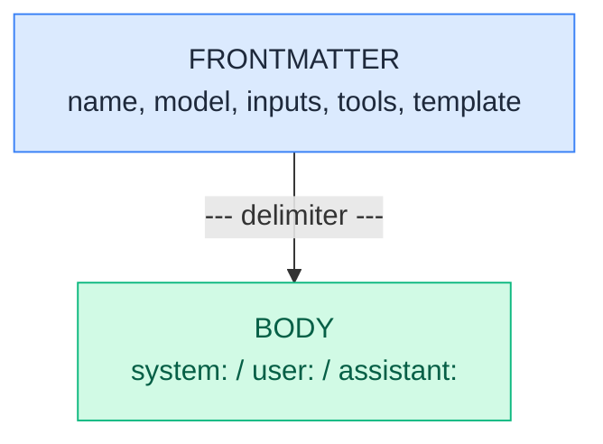

import { Aside, Tabs, TabItem } from '@astrojs/starlight/components';

A `.prompty` file is a plain-text asset that pairs **configuration** with
**prompt instructions** in a single, portable file. The top half is YAML
frontmatter; the bottom half is a markdown body that becomes the
`instructions` property on the loaded `Prompty`.

## File Structure Overview

Every `.prompty` file follows the same two-part layout:

```text
---          ← frontmatter start
(YAML)       ← configuration: model, inputs, tools, template …
---          ← frontmatter end
(Markdown)   ← body: role markers + template syntax → instructions
```

The loader splits the file at the `---` delimiters, parses the YAML into
typed Prompty schema objects, and assigns the markdown body to
`agent.instructions`.



After loading, each section maps to a typed property on the `Prompty` object:

| File Section | Prompty Property | Description |
|---|---|---|
| `name`, `description` | `.name`, `.description` | Identity fields |
| `metadata` | `.metadata` | Authors, tags, version, etc. |
| `model` | `.model` | Model ID, provider, connection, options |
| `inputs` | `.inputs` | Input property definitions |
| `outputs` | `.outputs` | Output schema for structured output |
| `tools` | `.tools` | Tool definitions (function, MCP, OpenAPI) |
| `template` | `.template` | Renderer format + parser config |
| Markdown body | `.instructions` | The prompt text with role markers |

## Frontmatter Properties

The YAML frontmatter maps directly to the Prompty schema's
[`Prompty`](/reference/prompty/) type. Here is a summary — see the
[Schema Reference](/reference/) for the full specification of every
property.

### Identity

| Property      | Type     | Description                    |
| ------------- | -------- | ------------------------------ |
| `name`        | `string` | Unique name for the prompt     |
| `displayName` | `string` | Human-readable label           |
| `description` | `string` | What this prompt does          |

### Metadata

Arbitrary key-value pairs. Common conventions:

```yaml
metadata:
  authors: [alice, bob]
  tags: [customer-support, v2]
  version: "1.0"
```

### Model

Configures the LLM to call. Full form:

```yaml
model:
  id: gpt-4o
  provider: foundry          # or "openai"
  apiType: chat            # chat | responses | embedding | image
  connection:
    kind: key
    endpoint: ${env:AZURE_OPENAI_ENDPOINT}
    apiKey: ${env:AZURE_OPENAI_API_KEY}
  options:
    temperature: 0.7
    maxOutputTokens: 1000
```

Or the **shorthand** — just a model name:

```yaml
model: gpt-4o
```

This expands to `{ id: "gpt-4o" }` with provider and connection
inherited from defaults or environment.

### Input &amp; Output Schema

Define the inputs your template expects and the structure of outputs.
Both `inputs` and `outputs` accept a **list of properties** or a
**name-keyed dictionary** — three equivalent forms are supported.

#### Form 1: Named List (recommended)

Each property is an object with an explicit `name` field:

```yaml
inputs:
  - name: question
    kind: string
    description: The user's question
    required: true
  - name: language
    kind: string
    default: English
```

This is the most explicit form and the one used throughout these docs.

#### Form 2: Dictionary

Property names are the YAML keys; no `name` field needed:

```yaml
inputs:
  question:
    kind: string
    description: The user's question
    required: true
  language:
    kind: string
    default: English
```

#### Form 3: Scalar Shorthand

When a property is just a default value, you can write the value directly.
The loader infers `kind` from the scalar type:

```yaml
inputs:
  question: What is the meaning of life?   # → kind: string, default: "What is..."
  maxResults: 10                            # → kind: integer, default: 10
  temperature: 0.7                          # → kind: float, default: 0.7
  verbose: false                            # → kind: boolean, default: false
```

**Kind inference rules:**

| Scalar Type | Inferred `kind` |
|-------------|-----------------|
| String      | `string`        |
| Integer     | `integer`       |
| Float       | `float`         |
| Boolean     | `boolean`       |
| List        | `array`         |
| Dict/Map    | `object`        |

<Aside type="tip">
  All three forms produce the same `list[Property]` after loading. Mix-and-match
  is not supported within a single `inputs` block — pick one form per file.
</Aside>

#### Outputs

`outputs` follows the same syntax. Define outputs when you want
[structured output](/core-concepts/structured-output/) (the executor
converts them to `response_format`):

```yaml
outputs:
  - name: answer
    kind: string
  - name: confidence
    kind: float
```

#### Property Fields

| Field        | Type      | Default  | Description                              |
|--------------|-----------|----------|------------------------------------------|
| `name`       | `string`  | —        | Property name (required in list form)     |
| `kind`       | `string`  | —        | Type: `string`, `integer`, `float`, `boolean`, `array`, `object`, `thread`, `image`, `file`, `audio` |
| `description`| `string`  | —        | Human-readable description                |
| `required`   | `boolean` | `false`  | Whether the input must be provided        |
| `default`    | `any`     | —        | Default value when input is not provided  |
| `example`    | `any`     | —        | Example value (documentation/tooling only — **never** used at runtime) |
| `enumValues` | `any[]`   | —        | Allowed values (enum constraint)          |

<Aside type="caution">
  `example` is for documentation and tooling only. The runtime **never** uses
  `example` as a fallback — if you want a value used when the input is omitted,
  set `default`.
</Aside>

### Tools

A list of tool definitions the model can call:

<Tabs>
  <TabItem label="Function Tool">
    ```yaml
    tools:
      - name: get_weather
        kind: function
        description: Get the current weather
        parameters:
          - name: city
            kind: string
            required: true
    ```
  </TabItem>
  <TabItem label="MCP Tool">
    ```yaml
    tools:
      - name: filesystem
        kind: mcp
        serverName: filesystem-server
        connection:
          kind: reference
    ```
  </TabItem>
  <TabItem label="OpenAPI Tool">
    ```yaml
    tools:
      - name: weather_api
        kind: openapi
        specification: ./weather.openapi.json
        connection:
          kind: key
          endpoint: https://api.weather.com
    ```
  </TabItem>
  <TabItem label="Custom Tool">
    ```yaml
    tools:
      - name: my_tool
        kind: my_provider
        connection:
          kind: key
          endpoint: https://custom.example.com
        options:
          setting: value
    ```
  </TabItem>
</Tabs>

### Template

Configures the rendering engine and the message parser.

Since Jinja2 and the Prompty chat parser are the defaults, you can often
**omit `template` entirely**. When you do need to set it, string values
work at every level — `format: jinja2` expands to `format: { kind: jinja2 }`:

```yaml
# Minimal — only needed when changing away from defaults
template:
  format: mustache            # string shorthand for { kind: mustache }
```

```yaml
# parser defaults to prompty — only specify it to override
template:
  format: jinja2
  parser: prompty             # already the default, can be omitted
```

```yaml
# Full explicit form — use when you need extra options
template:
  format:
    kind: jinja2
    strict: true
  parser:
    kind: prompty
    options:
      trimWhitespace: true
```

<Aside type="note" title="Template defaults">
  When `template` is omitted entirely, the runtime defaults to
  `format: jinja2` + `parser: prompty`. You only need a `template`
  block if you want Mustache or non-default parser options.
</Aside>

## The Markdown Body

Everything below the closing `---` is the **body**. The loader assigns
it to `agent.instructions`. At runtime the body flows through two
stages:

1. **Renderer** — expands template variables (`{{name}}`) using the
   inputs you provide.
2. **Parser** — splits the rendered text on **role markers** into a
   `list[Message]` ready for the LLM.

## Role Markers

Role markers are keywords on their own line followed by a colon. The
parser recognises three roles:

| Marker       | Resulting `role`  |
| ------------ | ----------------- |
| `system:`    | `system`          |
| `user:`      | `user`            |
| `assistant:` | `assistant`       |

Everything after a marker (until the next marker or end-of-file) becomes
the `content` of that message.

```text
system:
You are an AI assistant who helps people find information.

user:
{{question}}

assistant:
Let me help with that.

user:
{{followUp}}
```

<Aside type="tip">
  If the body contains **no role markers**, the entire text is treated as
  a single `system` message.
</Aside>

## Template Syntax

The default renderer is **Jinja2**. You can also use **Mustache** by
setting `template.format.kind: mustache`.

<Tabs>
  <TabItem label="Jinja2 (default)">
    ```text
    system:
    You are helping {{firstName}} {{lastName}}.

    
    Here is some context:
    {{ context }}
    

    
    - {{ item }}
    

    user:
    {{question}}
    ```
  </TabItem>
  <TabItem label="Mustache">
    ```text
    system:
    You are helping {{firstName}} {{lastName}}.

    {{#context}}
    Here is some context:
    {{context}}
    {{/context}}

    {{#history}}
    - {{.}}
    {{/history}}

    user:
    {{question}}
    ```
  </TabItem>
</Tabs>

## Variable References in Frontmatter

Frontmatter values can reference external data using `${protocol:value}`
syntax. The loader resolves these at load time before the YAML is parsed
into typed objects.

### Environment Variables

```yaml
# Required — errors if AZURE_OPENAI_ENDPOINT is not set
endpoint: ${env:AZURE_OPENAI_ENDPOINT}

# With a fallback default value
region: ${env:AZURE_REGION:eastus}
```

### File References

```yaml
# Load a JSON file inline (path relative to the .prompty file)
connection: ${file:shared/azure-connection.json}
```

<Aside type="danger" title="Missing references">
  `${env:VAR}` without a default raises a `ValueError` if the variable
  is not set. `${file:path}` raises `FileNotFoundError` if the file
  does not exist. This is intentional — fail fast rather than silently
  inject empty values.
</Aside>

## Shorthand Syntax Reference

Prompty supports compact shorthands across several properties. Every shorthand
expands to the full structured form during loading — the two are always
equivalent.

### Model Shorthand

A plain string becomes `Model(id: <string>)`:

```yaml
# Shorthand — just the model name
model: gpt-4o

# Equivalent full form
model:
  id: gpt-4o
```

### Input Shorthand (Scalar → Property)

A scalar value under `inputs` (dict form) becomes a typed `Property` with
`default` set and `kind` inferred:

```yaml
# Shorthand
inputs:
  firstName: Jane
  maxResults: 10
  verbose: true

# Equivalent full form
inputs:
  - name: firstName
    kind: string
    default: Jane
  - name: maxResults
    kind: integer
    default: 10
  - name: verbose
    kind: boolean
    default: true
```

### Tool Parameters

FunctionTool `parameters` follow the same `Property` list or dict syntax as
`inputs` — there is no extra `properties:` wrapper:

```yaml
# List form
tools:
  - name: get_weather
    kind: function
    parameters:
      - name: city
        kind: string
        required: true

# Dict form (also valid)
tools:
  - name: get_weather
    kind: function
    parameters:
      city:
        kind: string
        required: true
```

### Template Shorthand

String values work at every level inside `template`:

```yaml
# String shorthand — format and parser accept plain strings
template:
  format: jinja2              # → { kind: jinja2 }
  parser: prompty             # → { kind: prompty }  (the default — can be omitted)
```

Since parser defaults to `prompty`, the shortest explicit form is:

```yaml
template:
  format: mustache            # only needed to change away from jinja2
```

<Aside type="caution" title="Deprecated: template as string">
  The v1 form `template: jinja2` (a bare string for the entire property)
  emits a `DeprecationWarning` and will be removed in a future version.
  Use the structured object form shown above instead.
</Aside>

The loader auto-migrates old v1 files that use the string form.

## Complete Example

Here is a full `.prompty` file using all the features described above:

```yaml
---
name: customer-support
displayName: Customer Support Agent
description: Answers customer questions using context from their account.
metadata:
  authors: [support-team]
  tags: [production, customer-facing]
  version: "2.1"

model:
  id: gpt-4o
  provider: foundry
  apiType: chat
  connection:
    kind: key
    endpoint: ${env:AZURE_OPENAI_ENDPOINT}
    apiKey: ${env:AZURE_OPENAI_API_KEY}
  options:
    temperature: 0.3
    maxOutputTokens: 2000

inputs:
  - name: customerName
    kind: string
    description: Full name of the customer
    required: true
  - name: question
    kind: string
    description: The customer's question
    required: true
  - name: orderHistory
    kind: array
    description: Recent orders for context
    default: []

outputs:
  - name: answer
    kind: string
  - name: sentiment
    kind: string
    enumValues: [positive, neutral, negative]

tools:
  - name: lookup_order
    kind: function
    description: Look up an order by ID
    parameters:
      - name: orderId
        kind: string
        required: true

template:
  format: jinja2
---
system:
You are a customer support agent for Contoso. Be helpful, concise,
and empathetic. Always greet the customer by name.

You have access to the following order history:

- Order #{{ order.id }}: {{ order.status }} ({{ order.date }})


user:
Hi, my name is {{customerName}}. {{question}}
```

Run it with the Prompty runtime:

<Tabs>
  <TabItem label="Python">
    ```python
    import prompty

    # Load + render + parse + execute + process in one call
    result = prompty.run(
        "customer-support.prompty",
        inputs={
            "customerName": "Jane Doe",
            "question": "Where is my order #12345?",
            "orderHistory": [
                {"id": "12345", "status": "shipped", "date": "2025-01-15"},
                {"id": "12300", "status": "delivered", "date": "2025-01-02"},
            ],
        },
    )
    ```
  </TabItem>
  <TabItem label="TypeScript">
    ```typescript
    import { invoke } from "@prompty/core";
    import "@prompty/foundry"; // registers "azure" provider

    // Load + render + parse + execute + process in one call
    const result = await invoke("customer-support.prompty", {
      inputs: {
        customerName: "Jane Doe",
        question: "Where is my order #12345?",
        orderHistory: [
          { id: "12345", status: "shipped", date: "2025-01-15" },
          { id: "12300", status: "delivered", date: "2025-01-02" },
        ],
      },
    });
    ```
  </TabItem>
  <TabItem label="C#">
    ```csharp
    using Prompty.Core;

    // Load + render + parse + execute + process in one call
    var result = await Pipeline.InvokeAsync("customer-support.prompty", new()
    {
        ["customerName"] = "Jane Doe",
        ["question"] = "Where is my order #12345?",
        ["orderHistory"] = new[]
        {
            new { id = "12345", status = "shipped", date = "2025-01-15" },
            new { id = "12300", status = "delivered", date = "2025-01-02" },
        },
    });
    ```
  </TabItem>
</Tabs>
