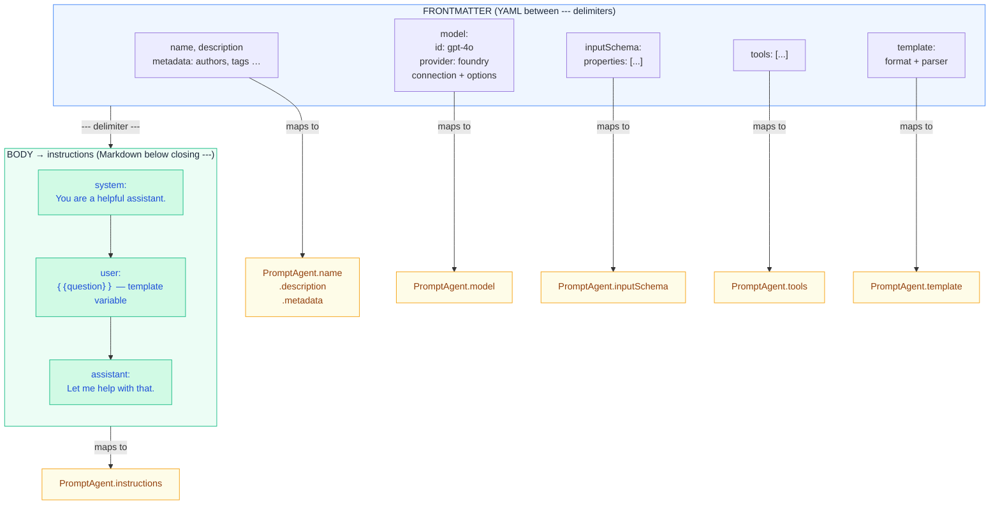

import { Aside, Tabs, TabItem } from '@astrojs/starlight/components';

A `.prompty` file is a plain-text asset that pairs **configuration** with
**prompt instructions** in a single, portable file. The top half is YAML
frontmatter; the bottom half is a markdown body that becomes the
`instructions` property on the loaded `PromptAgent`.

## File Structure Overview

Every `.prompty` file follows the same two-part layout:

```text
---          ← frontmatter start
(YAML)       ← configuration: model, inputs, tools, template …
---          ← frontmatter end
(Markdown)   ← body: role markers + template syntax → instructions
```

The loader splits the file at the `---` delimiters, parses the YAML into
typed AgentSchema objects, and assigns the markdown body to
`agent.instructions`.



## Frontmatter Properties

The YAML frontmatter maps directly to
[AgentSchema](https://microsoft.github.io/AgentSchema/) `PromptAgent`
fields. Here is a summary — see the **Schema Reference** page for the
full specification of every property.

### Identity

| Property      | Type     | Description                    |
| ------------- | -------- | ------------------------------ |
| `name`        | `string` | Unique name for the prompt     |
| `displayName` | `string` | Human-readable label           |
| `description` | `string` | What this prompt does          |

### Metadata

Arbitrary key-value pairs. Common conventions:

```yaml
metadata:
  authors: [alice, bob]
  tags: [customer-support, v2]
  version: "1.0"
```

### Model

Configures the LLM to call. Full form:

```yaml
model:
  id: gpt-4o
  provider: foundry          # or "openai"
  apiType: chat            # chat | responses | embedding | image
  connection:
    kind: key
    endpoint: ${env:AZURE_OPENAI_ENDPOINT}
    apiKey: ${env:AZURE_OPENAI_API_KEY}
  options:
    temperature: 0.7
    maxOutputTokens: 1000
```

Or the **shorthand** — just a model name:

```yaml
model: gpt-4o
```

This expands to `{ id: "gpt-4o" }` with provider and connection
inherited from defaults or environment.

### Input &amp; Output Schema

Define the inputs your template expects and the structure of outputs:

```yaml
inputSchema:
  properties:
    - name: question
      kind: string
      description: The user's question
      required: true
    - name: language
      kind: string
      default: English

outputSchema:
  properties:
    - name: answer
      kind: string
    - name: confidence
      kind: float
```

Each property has a `kind` (`string`, `integer`, `float`, `boolean`,
`array`, `object`, `thread`), optional `description`, `default`,
`required`, and `enumValues` fields.

### Tools

A list of tool definitions the model can call:

<Tabs>
  <TabItem label="Function Tool">
    ```yaml
    tools:
      - name: get_weather
        kind: function
        description: Get the current weather
        parameters:
          properties:
            - name: city
              kind: string
              required: true
    ```
  </TabItem>
  <TabItem label="MCP Tool">
    ```yaml
    tools:
      - name: filesystem
        kind: mcp
        serverName: filesystem-server
        connection:
          kind: reference
    ```
  </TabItem>
  <TabItem label="OpenAPI Tool">
    ```yaml
    tools:
      - name: weather_api
        kind: openapi
        specification: ./weather.openapi.json
        connection:
          kind: key
          endpoint: https://api.weather.com
    ```
  </TabItem>
  <TabItem label="Custom Tool">
    ```yaml
    tools:
      - name: my_tool
        kind: my_provider
        connection:
          kind: key
          endpoint: https://custom.example.com
        options:
          setting: value
    ```
  </TabItem>
</Tabs>

### Template

Configures the rendering engine and the message parser.

**Shorthand (recommended)** — string values work at every level.
`format: jinja2` expands to `format: { kind: jinja2 }`, and
`parser: prompty` expands to `parser: { kind: prompty }`:

```yaml
template:
  format: jinja2
  parser: prompty
```

**Full form** — use if you prefer explicit nesting:

```yaml
template:
  format:
    kind: jinja2     # or "mustache"
  parser:
    kind: prompty    # role-marker parser
```

<Aside type="note" title="Template defaults">
  If `template` is omitted entirely, the runtime defaults to Jinja2 rendering
  with the Prompty chat parser (`format: jinja2`, `parser: prompty`).
</Aside>

## The Markdown Body

Everything below the closing `---` is the **body**. The loader assigns
it to `agent.instructions`. At runtime the body flows through two
stages:

1. **Renderer** — expands template variables (`{{name}}`) using the
   inputs you provide.
2. **Parser** — splits the rendered text on **role markers** into a
   `list[Message]` ready for the LLM.

## Role Markers

Role markers are keywords on their own line followed by a colon. The
parser recognises three roles:

| Marker       | Resulting `role`  |
| ------------ | ----------------- |
| `system:`    | `system`          |
| `user:`      | `user`            |
| `assistant:` | `assistant`       |

Everything after a marker (until the next marker or end-of-file) becomes
the `content` of that message.

```text
system:
You are an AI assistant who helps people find information.

user:
{{question}}

assistant:
Let me help with that.

user:
{{followUp}}
```

<Aside type="tip">
  If the body contains **no role markers**, the entire text is treated as
  a single `user` message.
</Aside>

## Template Syntax

The default renderer is **Jinja2**. You can also use **Mustache** by
setting `template.format.kind: mustache`.

<Tabs>
  <TabItem label="Jinja2 (default)">
    ```text
    system:
    You are helping {{firstName}} {{lastName}}.

    
    Here is some context:
    {{ context }}
    

    
    - {{ item }}
    

    user:
    {{question}}
    ```
  </TabItem>
  <TabItem label="Mustache">
    ```text
    system:
    You are helping {{firstName}} {{lastName}}.

    {{#context}}
    Here is some context:
    {{context}}
    {{/context}}

    {{#history}}
    - {{.}}
    {{/history}}

    user:
    {{question}}
    ```
  </TabItem>
</Tabs>

## Variable References in Frontmatter

Frontmatter values can reference external data using `${protocol:value}`
syntax. The loader resolves these at load time before the YAML is parsed
into typed objects.

### Environment Variables

```yaml
# Required — errors if AZURE_OPENAI_ENDPOINT is not set
endpoint: ${env:AZURE_OPENAI_ENDPOINT}

# With a fallback default value
region: ${env:AZURE_REGION:eastus}
```

### File References

```yaml
# Load a JSON file inline (path relative to the .prompty file)
connection: ${file:shared/azure-connection.json}
```

<Aside type="danger" title="Missing references">
  `${env:VAR}` without a default raises a `ValueError` if the variable
  is not set. `${file:path}` raises `FileNotFoundError` if the file
  does not exist. This is intentional — fail fast rather than silently
  inject empty values.
</Aside>

## Shorthand Syntax

Prompty supports a compact shorthand for the `model` property:

```yaml
# Shorthand — just the model name
model: gpt-4o

# Equivalent full form
model:
  id: gpt-4o
```

<Aside type="caution" title="template shorthand is not supported">
  Unlike `model`, the `template` property does **not** accept a string
  shorthand in v2. Always use the structured object form:

  ```yaml
  # ✗ Not valid in v2
  template: jinja2

  # ✓ Correct
  template:
    format:
      kind: jinja2
    parser:
      kind: prompty
  ```

  The loader will auto-migrate old v1 files that use the string form,
  but will emit a `DeprecationWarning`.
</Aside>

## Complete Example

Here is a full `.prompty` file using all the features described above:

```yaml
---
name: customer-support
displayName: Customer Support Agent
description: Answers customer questions using context from their account.
metadata:
  authors: [support-team]
  tags: [production, customer-facing]
  version: "2.1"

model:
  id: gpt-4o
  provider: foundry
  apiType: chat
  connection:
    kind: key
    endpoint: ${env:AZURE_OPENAI_ENDPOINT}
    apiKey: ${env:AZURE_OPENAI_API_KEY}
  options:
    temperature: 0.3
    maxOutputTokens: 2000

inputSchema:
  properties:
    - name: customerName
      kind: string
      description: Full name of the customer
      required: true
    - name: question
      kind: string
      description: The customer's question
      required: true
    - name: orderHistory
      kind: array
      description: Recent orders for context
      default: []

outputSchema:
  properties:
    - name: answer
      kind: string
    - name: sentiment
      kind: string
      enumValues: [positive, neutral, negative]

tools:
  - name: lookup_order
    kind: function
    description: Look up an order by ID
    parameters:
      properties:
        - name: orderId
          kind: string
          required: true

template:
  format:
    kind: jinja2
  parser:
    kind: prompty
---
system:
You are a customer support agent for Contoso. Be helpful, concise,
and empathetic. Always greet the customer by name.

You have access to the following order history:

- Order #{{ order.id }}: {{ order.status }} ({{ order.date }})


user:
Hi, my name is {{customerName}}. {{question}}
```

Run it with the Prompty runtime:

<Tabs>
  <TabItem label="Python">
    ```python
    import prompty

    # Load + render + parse + execute + process in one call
    result = prompty.run(
        "customer-support.prompty",
        inputs={
            "customerName": "Jane Doe",
            "question": "Where is my order #12345?",
            "orderHistory": [
                {"id": "12345", "status": "shipped", "date": "2025-01-15"},
                {"id": "12300", "status": "delivered", "date": "2025-01-02"},
            ],
        },
    )
    ```
  </TabItem>
  <TabItem label="TypeScript">
    ```typescript
    import { execute } from "@prompty/core";
    import "@prompty/foundry"; // registers "azure" provider

    // Load + render + parse + execute + process in one call
    const result = await execute("customer-support.prompty", {
      inputs: {
        customerName: "Jane Doe",
        question: "Where is my order #12345?",
        orderHistory: [
          { id: "12345", status: "shipped", date: "2025-01-15" },
          { id: "12300", status: "delivered", date: "2025-01-02" },
        ],
      },
    });
    ```
  </TabItem>
</Tabs>
