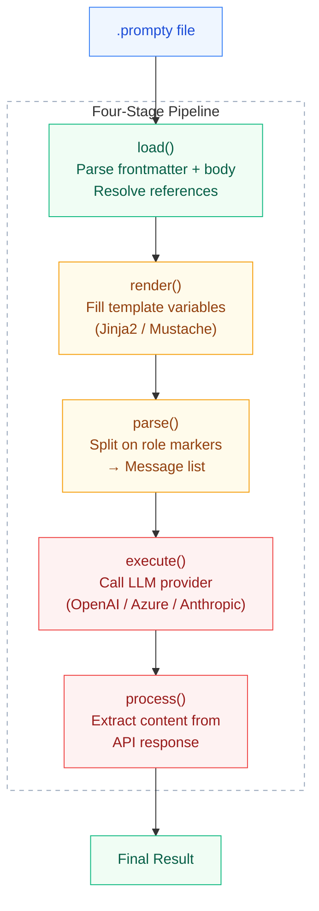
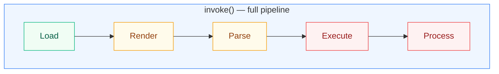

import { Aside, Tabs, TabItem } from '@astrojs/starlight/components';

## Overview

Prompty processes `.prompty` files through a **four-stage pipeline**. Each stage
is defined by a protocol/interface — concrete implementations are discovered at
runtime via a registry. This design means you can swap any stage without touching
the others: use a different template engine, a custom parser, or your own LLM
provider.



| Step | Function | What happens |
|------|----------|--------------|
| **Load** | `load()` | Parses the `.prompty` file — splits YAML frontmatter from the markdown body, resolves `${env:}` / `${file:}` references, and returns a typed `Prompty` object. |
| **Render** | `render()` | Fills in template variables (Jinja2 or Mustache) using the provided inputs. Produces a single string with role markers still embedded. |
| **Parse** | `parse()` | Splits the rendered string on role markers (`system:`, `user:`, `assistant:`) into a structured `list[Message]`. |
| **Execute** | `execute()` | Sends the messages to the LLM provider (OpenAI, Azure, Anthropic) via the appropriate SDK. Returns the raw API response. |
| **Process** | `process()` | Extracts clean output from the raw response — a string for chat, vectors for embeddings, a URL for images, or parsed JSON for structured output. |

---

## Stage 1: Renderer

The **Renderer** takes a `Prompty` object and a dictionary of inputs, then renders the
template (the `instructions` field) with those values. The result is a single rendered
string containing role markers and filled-in variables.

| Property | Value |
|---|---|
| **Registration key** | `agent.template.format.kind` |
| **Built-in implementations** | `Jinja2Renderer` (`"jinja2"`), `MustacheRenderer` (`"mustache"`) |
| **Input** | `Prompty` + `dict` of inputs |
| **Output** | `str` — rendered template |

The renderer also handles **thread markers** — when an input has `kind: thread`, the
renderer emits special nonce markers that the pipeline later expands into `Message`
objects for conversation history.

<Tabs>
  <TabItem label="Jinja2 (default)">
    ```text
    system:
    You are an AI assistant helping {{ firstName }}.

    user:
    {{ question }}
    ```
  </TabItem>
  <TabItem label="Mustache">
    ```text
    system:
    You are an AI assistant helping {{firstName}}.

    user:
    {{question}}
    ```
  </TabItem>
</Tabs>

---

## Stage 2: Parser

The **Parser** takes the rendered string and splits it into a structured list of
messages using **role markers** — lines ending with a colon that indicate who is
speaking.

| Property | Value |
|---|---|
| **Registration key** | `agent.template.parser.kind` |
| **Built-in implementations** | `PromptyChatParser` (`"prompty"`) |
| **Input** | `str` — rendered template |
| **Output** | `list[Message]` — structured message objects |

Recognized role markers:

```text
system:      → { role: "system",    content: "..." }
user:        → { role: "user",      content: "..." }
assistant:   → { role: "assistant", content: "..." }
```

<Aside type="tip">
If no role marker appears at the start, the entire content is treated as a single
`user` message.
</Aside>

---

## Stage 3: Executor

The **Executor** takes the list of messages and calls the LLM provider. It handles
**API type dispatch** — routing to the appropriate SDK method based on
`agent.model.apiType`.

| Property | Value |
|---|---|
| **Registration key** | `agent.model.provider` |
| **Built-in implementations** | `OpenAIExecutor` (`"openai"`), `FoundryExecutor` (`"foundry"`, aliased as `"azure"`) |
| **Input** | `list[Message]` + `Prompty` (for config) |
| **Output** | Raw SDK response object |

**API type dispatch:**

| `apiType` | SDK method | Use case |
|---|---|---|
| `"chat"` (default) | `chat.completions.create()` | Conversational prompts |
| `"embedding"` | `embeddings.create()` | Text → vector embeddings |
| `"image"` | `images.generate()` | DALL-E image generation |
| `"responses"` | `responses.create()` | OpenAI Responses API (latest features) |

<Aside type="note">
The executor also wires up **structured output** when `agent.outputs` is defined —
converting the schema to OpenAI's `response_format` parameter so the LLM returns JSON
matching your schema.
</Aside>

---

## Stage 4: Processor

The **Processor** takes the raw SDK response and extracts clean, usable content.
What "clean" means depends on the response type.

| Property | Value |
|---|---|
| **Registration key** | `agent.model.provider` |
| **Built-in implementations** | `OpenAIProcessor` (`"openai"`), `FoundryProcessor` (`"foundry"`, aliased as `"azure"`) |
| **Input** | Raw SDK response + `Prompty` |
| **Output** | Processed result (string, list, dict, parsed JSON, etc.) |

**Processing by response type:**

| Response type | Output |
|---|---|
| Chat completion | `str` — the message content |
| Embedding | `list[float]` or `list[list[float]]` |
| Image | `str` — URL or base64 data |
| Streaming | `PromptyStream` / `AsyncPromptyStream` iterator |
| Structured output | Parsed `dict` matching `outputs` |

---

## Convenience Functions

You don't always need the full pipeline. Prompty provides convenience functions
that map to specific stage groupings:



The individual functions map to subsets of this pipeline:

| Function | Stages | Description |
|---|---|---|
| `render()` | Renderer only | Fill template variables → rendered string |
| `parse()` | Parser only | Split role markers → `Message[]` |
| `prepare()` | Render + Parse | Render, parse, and expand thread markers |
| `run()` | Execute + Process | Send to LLM and extract result |
| `invoke()` | All five stages | Load → Render → Parse → Execute → Process |

### Using the convenience functions

<Tabs>
  <TabItem label="Python">
    ```python
    from prompty import load, prepare, invoke
    from prompty.core.pipeline import render, parse, run, process

    agent = load("chat.prompty")
    inputs = {"firstName": "Jane", "question": "What is AI?"}

    # Stage 1 only — render the template
    rendered = render(agent, inputs)

    # Stage 2 only — parse rendered string into messages
    messages = parse(agent, rendered)

    # Stages 1 + 2 — render, parse, and expand threads
    messages = prepare(agent, inputs)

    # Stages 3 + 4 — execute LLM call and process response
    result = run(agent, messages)

    # Full pipeline — load + prepare + run
    result = invoke("chat.prompty", inputs=inputs)
    ```
  </TabItem>
  <TabItem label="Python (async)">
    ```python
    from prompty import load_async, prepare_async, invoke_async
    from prompty.core.pipeline import render_async, parse_async, run_async

    agent = await load_async("chat.prompty")
    inputs = {"firstName": "Jane", "question": "What is AI?"}

    rendered = await render_async(agent, inputs)
    messages = await parse_async(agent, rendered)
    messages = await prepare_async(agent, inputs)
    result   = await run_async(agent, messages)
    result   = await invoke_async("chat.prompty", inputs=inputs)
    ```
  </TabItem>
  <TabItem label="TypeScript">
    ```typescript
    import { load, prepare, invoke } from "@prompty/core";
    import { render, parse, run, process } from "@prompty/core";
    import "@prompty/openai"; // registers provider

    const agent = load("chat.prompty");
    const inputs = { firstName: "Jane", question: "What is AI?" };

    // Stage 1 only — render the template
    const rendered = await render(agent, inputs);

    // Stage 2 only — parse rendered string into messages
    const messages = await parse(agent, rendered);

    // Stages 1 + 2 — render, parse, and expand threads
    const prepared = await prepare(agent, inputs);

    // Stages 3 + 4 — execute LLM call and process response
    const result = await run(agent, prepared);

    // Full pipeline — load + prepare + run
    const output = await invoke("chat.prompty", { inputs });
    ```
  </TabItem>
  <TabItem label="C#">
    ```csharp
    using Prompty.Core;

    var agent = PromptyLoader.Load("chat.prompty");
    var inputs = new Dictionary<string, object>
    {
        ["firstName"] = "Jane",
        ["question"] = "What is AI?"
    };

    // Stage 1 only — render the template
    var rendered = await Pipeline.RenderAsync(agent, inputs);

    // Stage 2 only — parse rendered string into messages
    var messages = await Pipeline.ParseAsync(agent, rendered);

    // Stages 1 + 2 — render, parse, and expand threads
    var prepared = await Pipeline.PrepareAsync(agent, inputs);

    // Stages 3 + 4 — execute LLM call and process response
    var result = await Pipeline.RunAsync(agent, prepared);

    // Full pipeline — load + prepare + run
    var output = await Pipeline.InvokeAsync("chat.prompty", inputs);
    ```
  </TabItem>
  <TabItem label="Rust">
    ```rust
    use serde_json::json;

    let agent = prompty::load("chat.prompty")?;
    let inputs = json!({"firstName": "Jane", "question": "What is AI?"});

    // Stage 1 only — render the template
    let rendered = prompty::render(&agent, Some(&inputs)).await?;

    // Stage 2 only — parse rendered string into messages
    let messages = prompty::parse(&agent, &rendered).await?;

    // Stages 1 + 2 — render, parse, and expand threads
    let messages = prompty::prepare(&agent, Some(&inputs)).await?;

    // Stages 3 + 4 — execute LLM call and process response
    let result = prompty::run(&agent, &messages).await?;

    // Full pipeline — load + prepare + run
    let output = prompty::invoke_from_path("chat.prompty", Some(&inputs)).await?;
    ```
  </TabItem>
</Tabs>

<Aside type="tip">
  Most users only need **`invoke()`**— it handles the full pipeline from file to
  result. Use the granular functions when you need to inspect or modify intermediate
  outputs (e.g., editing messages before sending them to the LLM).
</Aside>

---

## Invoker Registration

Each runtime discovers stage implementations through a **registry**. The mechanism
varies by language, but the concept is the same: register implementations by key,
and the pipeline looks them up at runtime.

### How each runtime registers invokers

<Tabs>
  <TabItem label="Python">
    Python uses **entry points** — the same mechanism that powers CLI tools and
    pytest plugins. Each implementation registers itself under a group name in
    `pyproject.toml`. The discovery module caches lookups so entry points are
    resolved once per key.

    ```toml
    # pyproject.toml
    [project.entry-points."prompty.renderers"]
    jinja2 = "prompty.renderers.jinja2:Jinja2Renderer"
    mustache = "prompty.renderers.mustache:MustacheRenderer"

    [project.entry-points."prompty.parsers"]
    prompty = "prompty.parsers.prompty:PromptyChatParser"

    [project.entry-points."prompty.executors"]
    openai = "prompty.providers.openai.executor:OpenAIExecutor"
    foundry = "prompty.providers.foundry.executor:FoundryExecutor"
    azure = "prompty.providers.foundry.executor:FoundryExecutor"
    anthropic = "prompty.providers.anthropic.executor:AnthropicExecutor"

    [project.entry-points."prompty.processors"]
    openai = "prompty.providers.openai.processor:OpenAIProcessor"
    foundry = "prompty.providers.foundry.processor:FoundryProcessor"
    azure = "prompty.providers.foundry.processor:FoundryProcessor"
    anthropic = "prompty.providers.anthropic.processor:AnthropicProcessor"
    ```

    <Aside type="caution">
      After changing entry points in `pyproject.toml`, reinstall the package
      for the new registrations to take effect: `uv pip install -e ".[dev,all]"`
    </Aside>
  </TabItem>
  <TabItem label="TypeScript">
    TypeScript uses **explicit registration** via function calls. Built-in
    renderers and parsers auto-register when `@prompty/core` is imported.
    Provider packages register their executors and processors at import time.

    ```typescript
    // @prompty/core auto-registers at import:
    // registerRenderer("jinja2", new NunjucksRenderer())
    // registerRenderer("mustache", new MustacheRenderer())
    // registerParser("prompty", new PromptyChatParser())

    // Provider packages register on import:
    import "@prompty/openai";
    // → registerExecutor("openai", new OpenAIExecutor())
    // → registerProcessor("openai", new OpenAIProcessor())

    // Manual registration for custom implementations:
    import { registerExecutor, registerProcessor } from "@prompty/core";
    registerExecutor("my-provider", new MyExecutor());
    registerProcessor("my-provider", new MyProcessor());
    ```
  </TabItem>
  <TabItem label="C#">
    C# uses a **fluent builder pattern** inspired by ASP.NET's service
    registration. `PromptyBuilder` auto-registers the built-in renderers
    and parser. Provider packages add extension methods.

    ```csharp
    using Prompty.Core;
    using Prompty.OpenAI;     // AddOpenAI() extension
    using Prompty.Foundry;    // AddFoundry() extension
    using Prompty.Anthropic;  // AddAnthropic() extension

    // Register everything with the fluent builder
    new PromptyBuilder()
        .AddOpenAI()
        .AddFoundry()
        .AddAnthropic();

    // What the builder does under the hood:
    // PromptyBuilder() registers:
    //   InvokerRegistry.RegisterRenderer("jinja2", new Jinja2Renderer())
    //   InvokerRegistry.RegisterRenderer("mustache", new MustacheRenderer())
    //   InvokerRegistry.RegisterParser("prompty", new PromptyChatParser())
    //
    // .AddOpenAI() registers:
    //   InvokerRegistry.RegisterExecutor("openai", new OpenAIExecutor())
    //   InvokerRegistry.RegisterProcessor("openai", new OpenAIProcessor())
    ```

    You can also register custom implementations directly:

    ```csharp
    InvokerRegistry.RegisterExecutor("my-provider", new MyExecutor());
    InvokerRegistry.RegisterProcessor("my-provider", new MyProcessor());
    ```
  </TabItem>
  <TabItem label="Rust">
    Rust uses **explicit registration** via function calls at startup. Built-in
    renderers and parsers auto-register when `prompty::register_defaults()` is
    called. Provider crates register their executors and processors via their
    own `register()` function.

    ```rust
    // Register built-in renderers + parsers
    prompty::register_defaults();

    // Provider crates register on call:
    prompty_openai::register();    // → registers "openai" executor + processor
    prompty_foundry::register();   // → registers "foundry" executor + processor
    prompty_anthropic::register(); // → registers "anthropic" executor + processor

    // Manual registration for custom implementations:
    prompty::register_executor("my-provider", MyExecutor::new());
    prompty::register_processor("my-provider", MyProcessor::new());
    ```
  </TabItem>
</Tabs>

### Registration groups

| Group | Resolved from | Example keys |
|---|---|---|
| Renderers | `agent.template.format.kind` | `jinja2`, `mustache` |
| Parsers | `agent.template.parser.kind` | `prompty` |
| Executors | `agent.model.provider` | `openai`, `foundry`, `azure`, `anthropic` |
| Processors | `agent.model.provider` | `openai`, `foundry`, `azure`, `anthropic` |

---

## Custom Implementations

You can write your own implementation for any stage by implementing the corresponding
protocol and registering it as an entry point.

### 1. Implement the protocol

Each protocol defines `sync` and `async` methods. Here's an example custom executor:

<Tabs>
  <TabItem label="Python">
    ```python
    from __future__ import annotations

    from prompty.core.types import Message

    class AnthropicExecutor:
        """Executor for the Anthropic Claude API."""

        def execute(self, agent, messages: list[Message]) -> object:
            import anthropic
            client = anthropic.Anthropic()
            return client.messages.create(
                model=agent.model.id,
                messages=[{"role": m.role, "content": m.content} for m in messages],
            )

        async def execute_async(self, agent, messages: list[Message]) -> object:
            import anthropic
            client = anthropic.AsyncAnthropic()
            return await client.messages.create(
                model=agent.model.id,
                messages=[{"role": m.role, "content": m.content} for m in messages],
            )
    ```
  </TabItem>
  <TabItem label="TypeScript">
    ```typescript
    import type { Prompty, Message } from "@prompty/core";
    import Anthropic from "@anthropic-ai/sdk";

    export class AnthropicExecutor {
      async execute(agent: Prompty, messages: Message[]): Promise<unknown> {
        const client = new Anthropic();
        return client.messages.create({
          model: agent.model.id,
          messages: messages.map(m => ({ role: m.role, content: m.content })),
        });
      }
    }
    ```
  </TabItem>
  <TabItem label="C#">
    ```csharp
    using Prompty.Core;

    public class AnthropicExecutor : IExecutor
    {
        public async Task<object> ExecuteAsync(
            Prompty agent, IList<Message> messages)
        {
            // Use your preferred Anthropic .NET SDK
            var client = new AnthropicClient(agent.Model.Connection.ApiKey);
            return await client.Messages.CreateAsync(new()
            {
                Model = agent.Model.Id,
                Messages = messages.Select(m =>
                    new { Role = m.Role, Content = m.Content }).ToList(),
            });
        }
    }
    ```
  </TabItem>
  <TabItem label="Rust">
    ```rust
    use prompty::types::Message;
    use async_trait::async_trait;

    pub struct AnthropicExecutor;

    #[async_trait]
    impl prompty::Executor for AnthropicExecutor {
        async fn execute(
            &self,
            agent: &prompty::Prompty,
            messages: &[Message],
        ) -> Result<serde_json::Value, Box<dyn std::error::Error>> {
            // Call your LLM API here
            todo!()
        }
    }

    pub struct AnthropicProcessor;

    #[async_trait]
    impl prompty::Processor for AnthropicProcessor {
        async fn process(
            &self,
            agent: &prompty::Prompty,
            response: serde_json::Value,
        ) -> Result<serde_json::Value, Box<dyn std::error::Error>> {
            // Extract content from the API response
            todo!()
        }
    }
    ```
  </TabItem>
</Tabs>

### 2. Register the implementation

<Tabs>
  <TabItem label="Python">
    In your package's `pyproject.toml`:

    ```toml
    [project.entry-points."prompty.executors"]
    anthropic = "my_package.executor:AnthropicExecutor"
    ```
  </TabItem>
  <TabItem label="TypeScript">
    Register at module load time:

    ```typescript
    import { registerExecutor } from "@prompty/core";
    import { AnthropicExecutor } from "./executor.js";

    registerExecutor("anthropic", new AnthropicExecutor());
    ```
  </TabItem>
  <TabItem label="C#">
    Add an extension method on `PromptyBuilder`:

    ```csharp
    public static class PromptyBuilderExtensions
    {
        public static PromptyBuilder AddAnthropic(this PromptyBuilder builder)
        {
            InvokerRegistry.RegisterExecutor("anthropic", new AnthropicExecutor());
            InvokerRegistry.RegisterProcessor("anthropic", new AnthropicProcessor());
            return builder;
        }
    }
    ```

    Then use it:

    ```csharp
    new PromptyBuilder()
        .AddAnthropic();
    ```
  </TabItem>
  <TabItem label="Rust">
    Register at startup via a `register()` function in your crate:

    ```rust
    pub fn register() {
        prompty::register_executor("anthropic", AnthropicExecutor);
        prompty::register_processor("anthropic", AnthropicProcessor);
    }
    ```

    Then call it at application startup:

    ```rust
    prompty::register_defaults();
    my_crate::register();
    ```
  </TabItem>
</Tabs>

### 3. Use it

After installing/registering the provider, any `.prompty` file with `model.provider: "anthropic"` will
automatically route to your executor.

```yaml
model:
  id: claude-sonnet-4-20250514
  provider: anthropic
  connection:
    kind: key
    apiKey: ${env:ANTHROPIC_API_KEY}
```

<Tabs>
  <TabItem label="Python">
    ```python
    from prompty import invoke

    result = invoke("claude-chat.prompty", inputs={"question": "Hello!"})
    ```
  </TabItem>
  <TabItem label="TypeScript">
    ```typescript
    import { invoke } from "@prompty/core";
    import "@my-package/anthropic"; // registers executor + processor

    const result = await invoke("claude-chat.prompty", { inputs: { question: "Hello!" } });
    ```
  </TabItem>
  <TabItem label="C#">
    ```csharp
    using Prompty.Core;
    using MyPackage.Anthropic; // provides .AddAnthropic()

    new PromptyBuilder().AddAnthropic();

    var result = await Pipeline.InvokeAsync("claude-chat.prompty",
        new() { ["question"] = "Hello!" });
    ```
  </TabItem>
  <TabItem label="Rust">
    ```rust
    use serde_json::json;

    prompty::register_defaults();
    prompty_anthropic::register();

    let inputs = json!({"question": "Hello!"});
    let result = prompty::invoke_from_path("claude-chat.prompty", Some(&inputs)).await?;
    ```
  </TabItem>
</Tabs>

## Next Steps

- [Custom Providers](/how-to/custom-providers/) — step-by-step guide to building your own executor and processor
- [Tools & Tool Calling](/core-concepts/tools/) — how tools integrate into the pipeline
- [API Reference](/api-reference/) — full function signatures for `render`, `parse`, `prepare`, and `run`
