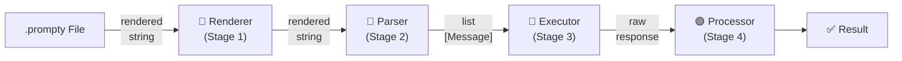
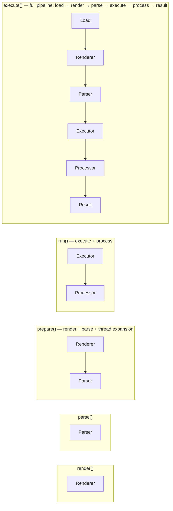

import { Aside, Tabs, TabItem } from '@astrojs/starlight/components';

## Overview

Prompty processes `.prompty` files through a **four-stage pipeline**. Each stage
is defined by a protocol — concrete implementations are discovered at runtime via
Python entry points (or TypeScript imports). This design means you can swap any
stage without touching the others: use a different template engine, a custom
parser, or your own LLM provider.



---

## Stage 1: Renderer

The **Renderer** takes a `PromptAgent` and a dictionary of inputs, then renders the
template (the `instructions` field) with those values. The result is a single rendered
string containing role markers and filled-in variables.

| Property | Value |
|---|---|
| **Registration key** | `agent.template.format.kind` |
| **Built-in implementations** | `Jinja2Renderer` (`"jinja2"`), `MustacheRenderer` (`"mustache"`) |
| **Input** | `PromptAgent` + `dict` of inputs |
| **Output** | `str` — rendered template |

The renderer also handles **thread markers** — when an input has `kind: thread`, the
renderer emits special nonce markers that the pipeline later expands into `Message`
objects for conversation history.

<Tabs>
  <TabItem label="Jinja2 (default)">
    ```text
    system:
    You are an AI assistant helping {{ firstName }}.

    user:
    {{ question }}
    ```
  </TabItem>
  <TabItem label="Mustache">
    ```text
    system:
    You are an AI assistant helping {{firstName}}.

    user:
    {{question}}
    ```
  </TabItem>
</Tabs>

---

## Stage 2: Parser

The **Parser** takes the rendered string and splits it into a structured list of
messages using **role markers** — lines ending with a colon that indicate who is
speaking.

| Property | Value |
|---|---|
| **Registration key** | `agent.template.parser.kind` |
| **Built-in implementations** | `PromptyChatParser` (`"prompty"`) |
| **Input** | `str` — rendered template |
| **Output** | `list[Message]` — structured message objects |

Recognized role markers:

```text
system:      → { role: "system",    content: "..." }
user:        → { role: "user",      content: "..." }
assistant:   → { role: "assistant", content: "..." }
```

<Aside type="tip">
If no role marker appears at the start, the entire content is treated as a single
`user` message.
</Aside>

---

## Stage 3: Executor

The **Executor** takes the list of messages and calls the LLM provider. It handles
**API type dispatch** — routing to the appropriate SDK method based on
`agent.model.apiType`.

| Property | Value |
|---|---|
| **Registration key** | `agent.model.provider` |
| **Built-in implementations** | `OpenAIExecutor` (`"openai"`), `AzureExecutor` (`"azure"`) |
| **Input** | `list[Message]` + `PromptAgent` (for config) |
| **Output** | Raw SDK response object |

**API type dispatch:**

| `apiType` | SDK method | Use case |
|---|---|---|
| `"chat"` (default) | `chat.completions.create()` | Conversational prompts |
| `"embedding"` | `embeddings.create()` | Text → vector embeddings |
| `"image"` | `images.generate()` | DALL-E image generation |
| `"responses"` | `responses.create()` | OpenAI Responses API (latest features) |

<Aside type="note">
The executor also wires up **structured output** when `agent.outputSchema` is defined —
converting the schema to OpenAI's `response_format` parameter so the LLM returns JSON
matching your schema.
</Aside>

---

## Stage 4: Processor

The **Processor** takes the raw SDK response and extracts clean, usable content.
What "clean" means depends on the response type.

| Property | Value |
|---|---|
| **Registration key** | `agent.model.provider` |
| **Built-in implementations** | `OpenAIProcessor` (`"openai"`), `AzureProcessor` (`"azure"`) |
| **Input** | Raw SDK response + `PromptAgent` |
| **Output** | Processed result (string, list, dict, parsed JSON, etc.) |

**Processing by response type:**

| Response type | Output |
|---|---|
| Chat completion | `str` — the message content |
| Embedding | `list[float]` or `list[list[float]]` |
| Image | `str` — URL or base64 data |
| Streaming | `PromptyStream` / `AsyncPromptyStream` iterator |
| Structured output | Parsed `dict` matching `outputSchema` |

---

## Convenience Functions

You don't always need the full pipeline. Prompty provides convenience functions
that map to specific stage groupings:



### Using the convenience functions

<Tabs>
  <TabItem label="Python">
    ```python
    from prompty import load, prepare, execute
    from prompty.core.pipeline import render, parse, run, process

    agent = load("chat.prompty")
    inputs = {"firstName": "Jane", "question": "What is AI?"}

    # Stage 1 only — render the template
    rendered = render(agent, inputs)

    # Stage 2 only — parse rendered string into messages
    messages = parse(agent, rendered)

    # Stages 1 + 2 — render, parse, and expand threads
    messages = prepare(agent, inputs)

    # Stages 3 + 4 — execute LLM call and process response
    result = run(agent, messages)

    # Full pipeline — load + prepare + run
    result = execute("chat.prompty", inputs=inputs)
    ```
  </TabItem>
  <TabItem label="Python (async)">
    ```python
    from prompty import load_async, prepare_async, execute_async
    from prompty.core.pipeline import render_async, parse_async, run_async

    agent = await load_async("chat.prompty")
    inputs = {"firstName": "Jane", "question": "What is AI?"}

    rendered = await render_async(agent, inputs)
    messages = await parse_async(agent, rendered)
    messages = await prepare_async(agent, inputs)
    result   = await run_async(agent, messages)
    result   = await execute_async("chat.prompty", inputs=inputs)
    ```
  </TabItem>
  <TabItem label="TypeScript">
    ```typescript
    import { load, prepare, execute } from "@prompty/core";
    import { render, parse, run, process } from "@prompty/core";
    import "@prompty/openai"; // registers provider

    const agent = load("chat.prompty");
    const inputs = { firstName: "Jane", question: "What is AI?" };

    // Stage 1 only — render the template
    const rendered = await render(agent, inputs);

    // Stage 2 only — parse rendered string into messages
    const messages = await parse(agent, rendered);

    // Stages 1 + 2 — render, parse, and expand threads
    const prepared = await prepare(agent, inputs);

    // Stages 3 + 4 — execute LLM call and process response
    const result = await run(agent, prepared);

    // Full pipeline — load + prepare + run
    const output = await execute("chat.prompty", { inputs });
    ```
  </TabItem>
</Tabs>

<Aside type="tip">
  Most users only need **`execute()`** — it handles the full pipeline from file to
  result. Use the granular functions when you need to inspect or modify intermediate
  outputs (e.g., editing messages before sending them to the LLM).
</Aside>

---

## Entry-Point Discovery

The Python runtime discovers stage implementations using **Python entry points** —
the same mechanism that powers CLI tools and pytest plugins. Each implementation
registers itself under a group name in `pyproject.toml`.

### Registration groups

| Group | Resolved from | Example keys |
|---|---|---|
| `prompty.renderers` | `agent.template.format.kind` | `jinja2`, `mustache` |
| `prompty.parsers` | `agent.template.parser.kind` | `prompty` |
| `prompty.executors` | `agent.model.provider` | `openai`, `azure` |
| `prompty.processors` | `agent.model.provider` | `openai`, `azure` |

### Built-in entry points

These are registered in Prompty's own `pyproject.toml`:

```toml
[project.entry-points."prompty.renderers"]
jinja2 = "prompty.renderers.jinja2:Jinja2Renderer"
mustache = "prompty.renderers.mustache:MustacheRenderer"

[project.entry-points."prompty.parsers"]
prompty = "prompty.parsers.prompty:PromptyChatParser"

[project.entry-points."prompty.executors"]
openai = "prompty.providers.openai.executor:OpenAIExecutor"
azure = "prompty.providers.azure.executor:AzureExecutor"

[project.entry-points."prompty.processors"]
openai = "prompty.providers.openai.processor:OpenAIProcessor"
azure = "prompty.providers.azure.processor:AzureProcessor"
```

The discovery module (`core/discovery.py`) caches lookups, so entry points are only
resolved once per key. Call `clear_cache()` if you need to reset after dynamic registration.

---

## Custom Implementations

You can write your own implementation for any stage by implementing the corresponding
protocol and registering it as an entry point.

### 1. Implement the protocol

Each protocol defines `sync` and `async` methods. Here's an example custom executor:

<Tabs>
  <TabItem label="Python">
    ```python
    from __future__ import annotations

    from prompty.core.types import Message

    class AnthropicExecutor:
        """Executor for the Anthropic Claude API."""

        def execute(self, agent, messages: list[Message]) -> object:
            import anthropic
            client = anthropic.Anthropic()
            return client.messages.create(
                model=agent.model.id,
                messages=[{"role": m.role, "content": m.content} for m in messages],
            )

        async def execute_async(self, agent, messages: list[Message]) -> object:
            import anthropic
            client = anthropic.AsyncAnthropic()
            return await client.messages.create(
                model=agent.model.id,
                messages=[{"role": m.role, "content": m.content} for m in messages],
            )
    ```
  </TabItem>
  <TabItem label="TypeScript">
    ```typescript
    import type { Prompty, Message } from "@prompty/core";
    import Anthropic from "@anthropic-ai/sdk";

    export class AnthropicExecutor {
      async execute(agent: Prompty, messages: Message[]): Promise<unknown> {
        const client = new Anthropic();
        return client.messages.create({
          model: agent.model.id,
          messages: messages.map(m => ({ role: m.role, content: m.content })),
        });
      }
    }
    ```
  </TabItem>
</Tabs>

### 2. Register the entry point

In your package's `pyproject.toml`:

```toml
[project.entry-points."prompty.executors"]
anthropic = "my_package.executor:AnthropicExecutor"
```

### 3. Use it

After installing the package, any `.prompty` file with `model.provider: "anthropic"` will
automatically route to your executor.

```yaml
model:
  id: claude-sonnet-4-20250514
  provider: anthropic
  connection:
    kind: key
    apiKey: ${env:ANTHROPIC_API_KEY}
```

<Aside type="caution">
  After changing entry points in `pyproject.toml`, you must reinstall the package
  for the new registrations to take effect: `uv pip install -e ".[dev,all]"`
</Aside>
