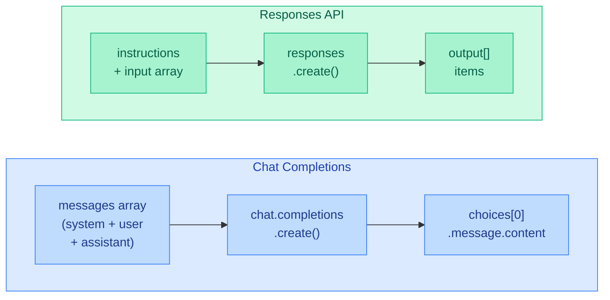
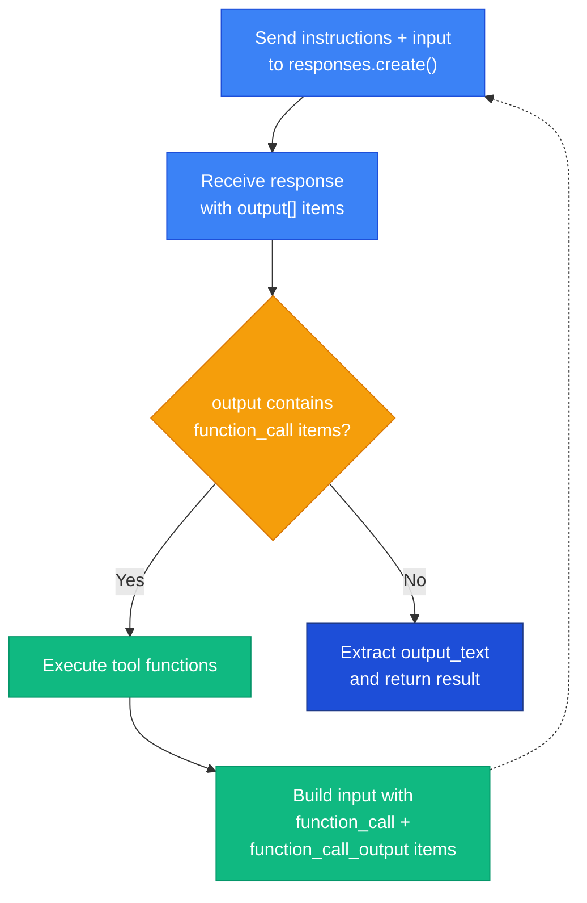

import { Aside, Tabs, TabItem } from '@astrojs/starlight/components';

## Overview

The **Responses API** is OpenAI's newer API surface — an alternative to Chat
Completions. It uses a different wire format: system messages become an
`instructions` parameter, user and assistant messages become an `input` array,
tools use a flat structure, and structured output is configured via `text.format`
instead of `response_format`.

To use it, set `apiType: responses` in your `.prompty` file. No code changes are
needed — the runtime handles the wire format conversion automatically.



<Aside type="caution">
  The Responses API is only available for **OpenAI** and **Microsoft Foundry**
  providers. It is **not supported** by Anthropic. Use `apiType: chat` (the
  default) for maximum provider compatibility.
</Aside>

---

## Basic Configuration

Set `apiType: responses` in the `model` section of your `.prompty` frontmatter:

```yaml title="my-prompt.prompty"
---
name: responses-example
model:
  id: gpt-4o
  provider: openai
  apiType: responses
  connection:
    kind: key
    apiKey: ${env:OPENAI_API_KEY}
  options:
    temperature: 0.7
    maxOutputTokens: 1000
inputSchema:
  properties:
    question:
      kind: string
      default: What is Prompty?
template:
  format:
    kind: jinja2
  parser:
    kind: prompty
---
system:
You are a helpful assistant.

user:
{{question}}
```

For Microsoft Foundry:

```yaml title="foundry-responses.prompty"
---
name: foundry-responses
model:
  id: gpt-4o
  provider: foundry
  apiType: responses
  connection:
    kind: key
    endpoint: ${env:AZURE_AI_PROJECT_ENDPOINT}
    apiKey: ${env:AZURE_AI_PROJECT_KEY}
---
system:
You are a helpful assistant.

user:
{{question}}
```

---

## Usage

The Responses API is transparent to your calling code. The same `execute()` and
`execute_async()` functions work — the runtime dispatches to `responses.create()`
based on the `apiType` in the `.prompty` file.

<Tabs>
<TabItem label="Python">
```python
from prompty import execute, execute_async

# Sync
result = execute("my-prompt.prompty", inputs={"question": "Hello!"})
print(result)  # "Hi there! How can I help?"

# Async
result = await execute_async("my-prompt.prompty", inputs={"question": "Hello!"})
print(result)
```
</TabItem>
<TabItem label="TypeScript">
```typescript
import { execute } from "@prompty/core";
import "@prompty/openai"; // or "@prompty/foundry"

const result = await execute("my-prompt.prompty", { question: "Hello!" });
console.log(result); // "Hi there! How can I help?"
```
</TabItem>
</Tabs>

---

## How It Differs from Chat Completions

Under the hood, the runtime converts your messages to a different wire format
when `apiType: responses` is set. You don't need to handle this yourself — but
understanding the differences helps when debugging.

### Request Format

| Aspect | Chat Completions | Responses API |
|---|---|---|
| API call | `client.chat.completions.create()` | `client.responses.create()` |
| System messages | In `messages` array with `role: system` | Separate `instructions` parameter |
| User/assistant messages | In `messages` array | In `input` array |
| Tool definitions | Nested: `{type: "function", function: {name, parameters}}` | Flat: `{type: "function", name, parameters}` |
| Structured output | `response_format` parameter | `text.format` parameter |
| Max tokens option | `max_completion_tokens` | `max_output_tokens` |

### Response Format

| Aspect | Chat Completions | Responses API |
|---|---|---|
| Response object | `object: "chat.completion"` | `object: "response"` |
| Content location | `choices[0].message.content` | `output[]` items or `output_text` |
| Tool calls | `choices[0].message.tool_calls` | `output[]` items with `type: "function_call"` |
| Finish indicator | `finish_reason: "stop"` | No `function_call` items in `output` |

### Wire Format Example

Here's what the runtime sends for a simple prompt with `apiType: responses`:

```json title="Responses API request"
{
  "model": "gpt-4o",
  "instructions": "You are a helpful assistant.",
  "input": [
    { "role": "user", "content": "What is Prompty?" }
  ],
  "max_output_tokens": 1000,
  "temperature": 0.7
}
```

Compare with the equivalent Chat Completions request:

```json title="Chat Completions request"
{
  "model": "gpt-4o",
  "messages": [
    { "role": "system", "content": "You are a helpful assistant." },
    { "role": "user", "content": "What is Prompty?" }
  ],
  "max_completion_tokens": 1000,
  "temperature": 0.7
}
```

---

## Tool Calling

Tool calling works with the Responses API through the same `execute_agent()` /
`executeAgent()` functions used for Chat Completions. The agent loop
automatically detects the Responses API response format and handles it
correctly.

### Prompty File with Tools

```yaml title="responses-agent.prompty"
---
name: weather-agent
model:
  id: gpt-4o
  provider: openai
  apiType: responses
  connection:
    kind: key
    apiKey: ${env:OPENAI_API_KEY}
  options:
    temperature: 0
inputSchema:
  properties:
    question:
      kind: string
      default: What's the weather?
tools:
  - name: get_weather
    kind: function
    description: Get the current weather for a city
    parameters:
      properties:
        - name: city
          kind: string
          description: City name
          required: true
    strict: true
template:
  format:
    kind: jinja2
  parser:
    kind: prompty
---
system:
You are a helpful assistant with access to weather tools.

user:
{{question}}
```

### Running the Agent Loop

<Tabs>
<TabItem label="Python">
```python
import prompty

def get_weather(city: str) -> str:
    return f"72°F and sunny in {city}"

agent = prompty.load("responses-agent.prompty")
result = prompty.execute_agent(
    agent,
    inputs={"question": "What's the weather in Seattle?"},
    tools={"get_weather": get_weather},
    max_iterations=10,
)
print(result)  # "It's currently 72°F and sunny in Seattle!"
```
</TabItem>
<TabItem label="TypeScript">
```typescript
import { load, executeAgent } from "@prompty/core";
import "@prompty/openai";

function getWeather(city: string): string {
  return `72°F and sunny in ${city}`;
}

const agent = await load("responses-agent.prompty");
const result = await executeAgent(agent, {
  inputs: { question: "What's the weather in Seattle?" },
  tools: { get_weather: getWeather },
  maxIterations: 10,
});
console.log(result);
```
</TabItem>
</Tabs>

### How Tool Calls Work with the Responses API

The Responses API uses a different format for tool calls than Chat Completions.
The runtime handles this automatically, but here's what happens under the hood:



<Aside type="note">
  The Responses API requires that **original `function_call` items** are included
  in the `input` alongside `function_call_output` items when returning tool
  results. The runtime handles this automatically — each tool call's original
  `function_call` item is preserved and sent back with its corresponding
  `function_call_output` result.
</Aside>

The wire format for tool interactions differs from Chat Completions:

| Step | Chat Completions | Responses API |
|---|---|---|
| Tool call from LLM | `message.tool_calls[]` with `id`, `function.name`, `function.arguments` | `output[]` item with `type: "function_call"`, `call_id`, `name`, `arguments` |
| Tool result to LLM | Message with `role: "tool"` and `tool_call_id` | `function_call_output` input item with `call_id` and `output` |
| Context preservation | Assistant message with `tool_calls` | Original `function_call` items re-sent in `input` |

---

## Structured Output

When `outputSchema` is defined, the runtime converts it to the Responses API's
`text.format` parameter (instead of Chat Completions' `response_format`). The
processor automatically parses the JSON response.

```yaml title="structured-responses.prompty"
---
name: weather-report
model:
  id: gpt-4o
  provider: openai
  apiType: responses
  connection:
    kind: key
    apiKey: ${env:OPENAI_API_KEY}
outputSchema:
  properties:
    - name: city
      kind: string
      description: The city name
    - name: temperature
      kind: integer
      description: Temperature in Fahrenheit
    - name: conditions
      kind: string
      description: Current weather conditions
template:
  format:
    kind: jinja2
  parser:
    kind: prompty
---
system:
Return the current weather for the requested city.

user:
Weather in {{city}}?
```

<Tabs>
<TabItem label="Python">
```python
from prompty import execute

result = execute("structured-responses.prompty", inputs={"city": "Seattle"})

# result is already a parsed dict
print(result["city"])         # "Seattle"
print(result["temperature"])  # 62
print(result["conditions"])   # "Partly cloudy"
print(type(result))           # <class 'dict'>
```
</TabItem>
<TabItem label="TypeScript">
```typescript
import { execute } from "@prompty/core";
import "@prompty/openai";

const result = await execute("structured-responses.prompty", { city: "Seattle" });

// result is already a parsed object
console.log(result.city);         // "Seattle"
console.log(result.temperature);  // 62
console.log(result.conditions);   // "Partly cloudy"
```
</TabItem>
</Tabs>

The runtime sends structured output as `text.format` instead of `response_format`:

```json title="Responses API structured output"
{
  "model": "gpt-4o",
  "instructions": "Return the current weather for the requested city.",
  "input": [{ "role": "user", "content": "Weather in Seattle?" }],
  "text": {
    "format": {
      "type": "json_schema",
      "name": "weather_report",
      "strict": true,
      "schema": {
        "type": "object",
        "properties": {
          "city": { "type": "string", "description": "The city name" },
          "temperature": { "type": "integer", "description": "Temperature in Fahrenheit" },
          "conditions": { "type": "string", "description": "Current weather conditions" }
        },
        "required": ["city", "temperature", "conditions"],
        "additionalProperties": false
      }
    }
  }
}
```

---

## Provider Support

Not all providers support every API type. Here's what's available:

| Provider | `apiType: chat` | `apiType: responses` | `apiType: embedding` | `apiType: image` |
|---|:---:|:---:|:---:|:---:|
| OpenAI | ✅ | ✅ | ✅ | ✅ |
| Microsoft Foundry | ✅ | ✅ | ✅ | ❌ |
| Anthropic | ✅ | ❌ | ❌ | ❌ |

---

## When to Use Responses API vs Chat Completions

| Use Case | Recommendation |
|---|---|
| Maximum provider compatibility | `apiType: chat` (default) |
| OpenAI or Foundry only, want the latest API features | `apiType: responses` |
| Anthropic models | `apiType: chat` (only option) |
| Existing prompts that work fine | Keep `apiType: chat` |
| Starting a new project on OpenAI | Either works — `responses` is newer |

<Aside type="tip">
  You can switch between `apiType: chat` and `apiType: responses` by changing a
  single line in your `.prompty` file. Your calling code (`execute()`,
  `execute_agent()`, etc.) stays exactly the same — the runtime handles the wire
  format differences automatically.
</Aside>
