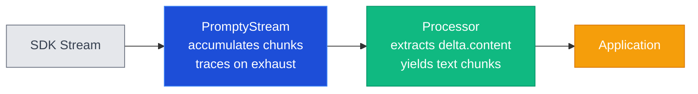

import { Aside, Tabs, TabItem } from '@astrojs/starlight/components';

## Overview

Streaming lets you receive LLM output **as it is generated**, chunk by chunk,
instead of waiting for the entire response to complete. This is essential for
chat interfaces where perceived latency matters — the user sees tokens appear
in real time.

Prompty wraps the raw SDK stream in a **`PromptyStream`** (or
`AsyncPromptyStream`) that accumulates chunks for tracing, then hands them to
the **Processor** which extracts usable content deltas and yields them to your
application.



---

## Enabling Streaming

Set `stream: true` in the model's `additionalProperties` inside the options
block. You can do this in the `.prompty` file or override it at runtime.

### In the `.prompty` file

```yaml
---
name: streaming-chat
model:
  id: gpt-4o-mini
  provider: openai
  apiType: chat
  connection:
    kind: key
    endpoint: ${env:OPENAI_API_BASE:https://api.openai.com/v1}
    apiKey: ${env:OPENAI_API_KEY}
  options:
    temperature: 0.7
    additionalProperties:
      stream: true
---
system:
You are a helpful assistant.

user:
{{question}}
```

### At runtime

<Tabs>
  <TabItem label="Python">
    ```python
    from prompty import load

    agent = load("chat.prompty")

    # Enable streaming by mutating options before execution
    agent.model.options.additionalProperties["stream"] = True
    ```
  </TabItem>
  <TabItem label="TypeScript">
    ```typescript
    import { load } from "@prompty/core";

    const agent = load("chat.prompty");

    // Enable streaming by mutating options before execution
    agent.model.options!.additionalProperties!.stream = true;
    ```
  </TabItem>
</Tabs>

<Aside type="tip">
  The `additionalProperties` dict on `ModelOptions` passes through to the
  underlying SDK call. Any key the SDK accepts (like `stream`, `logprobs`,
  `n`) can be set here.
</Aside>

---

## Consuming Streams

<Tabs>
  <TabItem label="Python">
    ```python
    from prompty import load, run, process

    agent = load("chat.prompty")
    agent.model.options.additionalProperties["stream"] = True

    # run with raw=True returns the PromptyStream
    stream = run(agent, inputs={"question": "Tell me a joke"}, raw=True)

    # process yields text chunks
    for chunk in process(agent, stream):
        print(chunk, end="", flush=True)
    print()  # newline after stream completes
    ```
  </TabItem>
  <TabItem label="Python (async)">
    ```python
    import asyncio
    from prompty import load_async, run_async, process_async

    async def main():
        agent = await load_async("chat.prompty")
        agent.model.options.additionalProperties["stream"] = True

        stream = await run_async(
            agent, inputs={"question": "Tell me a joke"}, raw=True
        )

        async for chunk in process_async(agent, stream):
            print(chunk, end="", flush=True)
        print()

    asyncio.run(main())
    ```
  </TabItem>
  <TabItem label="TypeScript">
    ```typescript
    import { load, run, process } from "@prompty/core";

    const agent = load("chat.prompty");
    agent.model.options!.additionalProperties!.stream = true;

    // run with raw: true returns the PromptyStream
    const stream = await run(agent, { question: "Tell me a joke" }, { raw: true });

    // process yields text chunks
    for await (const chunk of await process(agent, stream)) {
      process.stdout.write(String(chunk));
    }
    console.log();
    ```
  </TabItem>
</Tabs>

---

## What the Processor Handles

The streaming processor does more than just forward chunks. It handles several
edge cases from the OpenAI streaming protocol:

| Scenario | Behavior |
|---|---|
| **Content deltas** | Each `delta.content` string is yielded directly to the caller. |
| **Tool-call deltas** | Argument fragments are accumulated across chunks. A complete `ToolCall` object is yielded when the stream ends. |
| **Refusal** | If `delta.refusal` is present the processor raises a `ValueError` with the refusal text. |
| **Empty / heartbeat chunks** | Chunks with no content, tool-call, or refusal data are silently skipped. |

<Aside type="caution">
  When the model returns tool calls in a streaming response, you will **not**
  see individual argument fragments. The processor accumulates them internally
  and yields a single `ToolCall` at the end of the stream. This matches the
  non-streaming behavior.
</Aside>

---

## Streaming + Tracing

A common concern with streaming is losing observability — if chunks are
consumed lazily, when does the trace fire?

Prompty solves this with the **`PromptyStream`** wrapper:

1. The executor wraps the raw SDK iterator in a `PromptyStream`.
2. As your application (or the processor) iterates, each chunk is forwarded
   **and** appended to an internal accumulator.
3. When the iterator is **exhausted**, `PromptyStream` flushes the complete
   accumulated response to the active tracer.

```
iterate chunk 1  →  yield + accumulate
iterate chunk 2  →  yield + accumulate
iterate chunk 3  →  yield + accumulate
       ...
StopIteration    →  flush accumulated data to tracer ✓
```

<Aside type="note">
  No trace data is lost. The full response is captured exactly as if you had
  used a non-streaming call — the trace just fires at the end of iteration
  rather than when the API call returns.
</Aside>

The same applies to `AsyncPromptyStream` for async iteration.

---

## Streaming + Agent Mode

When using `execute_agent()`, the runtime runs a tool-calling loop:
call the LLM, execute any requested tools, append results, repeat.

Streaming still works inside the agent loop. The executor does **not** disable
streaming — instead it consumes the stream through the processor internally to
detect tool calls:

1. The LLM streams a response with `tool_calls` deltas.
2. The processor accumulates fragments and yields a `ToolCall`.
3. The agent loop executes the tool function and appends the result.
4. The loop re-calls the LLM (still streaming).
5. When the model finally returns a content-only response, those chunks are
   forwarded to your application as normal text deltas.

<Aside type="tip">
  From your application's perspective, the agent loop is transparent — you
  iterate the final stream of text chunks the same way you would for a simple
  chat completion. The tool-call rounds happen behind the scenes.
</Aside>
